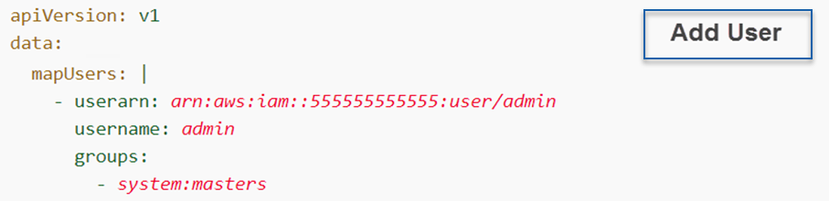

CIS-CAT Pro Assessor Configuration Guide
========================================

Introduction
------------
Utilizing the CIS-CAT Pro Assessor CLI, users are capable of performing both host-based (local) assessments, as well as remote-based assessments.  In order to perform assessments of remote endpoints, certain configurations must be made.  The intent of this document is to serve as a guide for enabling systems for remote-based assessments using CIS-CAT Pro Assessor.

System Recommendations
------------

The host system is the machine where CIS-CAT Pro Assessor v4 resides. Most operating system can support CIS-CAT Pro Assessor v4 provided the system can run Java Runtime Environment (JRE). See below for an example server specifications.

CIS-CAT Pro Assessor v4 is a Java application and requires an available Java Runtime Environment (JRE) to execute on the host system. To allow the greatest flexibility for configuring server performance, CIS recommends installing CIS-CAT Pro Assessor v4 on a host separate from hosts supporting CIS-CAT Pro Dashboard or CIS-CAT Pro Assessor v4 Service. It is possible to have multiple installations of CIS-CAT Pro Assessor on separate host systems, but each CIS-CAT Pro Assessor host system must have access to a JRE. 

**Required**:

- Compatible version of JRE present on host or accessed via network share
- Any JRE version from 8 to 14 is supported
- 64-bit Java recommended for faster performance
- Java versions 9+ will receive “WARNING: An illegal reflective access operation has occurred”. This can be ignored and will not halt the assessment.
- OpenJDK (free and open-source) implementations are supported. We have found this [website](https://adoptopenjdk.net/) easy to navigate. The official source is [OpenJDK](https://openjdk.java.net).
- Remote scanning requires unrestricted access from the CIS-CAT host system to the assessed target system

**Recommended Minimum**:

Depending on your organization's use of CIS-CAT Pro Assessor, the actual server specifications mentioned below could vary.

- 2 GHz dual processor
- 4 GB of RAM

## Deployment ##
CIS-CAT Pro Assessor v4 requires only a Java Runtime Environment (JRE) at or above version 1.8, in order to execute.  Navigate to CIS WorkBench to [download the latest version.](https://workbench.cisecurity.org/files) Extract the bundle to a location where use of admin or elevated privileges can be utilized to execute command line options or scripts.

There are many ways to implement routine scanning with CIS-CAT Pro. The selected method of scanning will determine where Java needs to be installed.

JRE is required to be installed on the CIS-CAT Pro host system when scanning via:

- [Remote scanning](https://ccpa-docs.readthedocs.io/en/latest/Configuration%20Guide/#sessions) (a system outside of a domain and not physically present on the CIS-CAT Pro system)
- Local scanning (the system where CIS-CAT Pro is physically present)

JRE is required to be installed on a shared network location when scanning via:

- [Centralized scanning for Windows](https://ccpa-docs.readthedocs.io/en/latest/Configuration%20Guide/#centralized-windows) (systems within the same network)
- [Centralized scanning for Linux](#assessCentalizedLinux) (systems within the same network)

Properties
--------
A number of different system properties exist to provide additional functionality.  These properties are found in a file named `assessor-cli.properties`, located in the application's `config` folder.  For any property value updates to take effect, the CIS-CAT Pro Assessor application must be re-started. All settings are optional for most Assessor activities. However, as use of CIS-CAT Pro expands, certain settings will be mandatory. For example, if utilizing CIS-CAT Pro Dashboard, it is required that the `ciscat.post.parameter.ccpd.token` is set.

| Property Name          | Data Type   |   Description |
| -----------------------| ---------- | ------------- |
| **Define Behavior When Benchmark Content Fails Validation** |  |  |
| validate.xml.schema                  | `true/false`    | Configuration of `true` results in schema validation of benchmark/datastream files. On validation failure, assessment process halts with exit with a code of 500. Configuration of `false` will not result in formal validation, but errors in the structure will result in an exception. |
| **Define Assessor Behavior When Signed Benchmark Content Has Been Altered** |  |  |
| exit.on.invalid.signature | `true/false`      | Detects alteration in signed benchmark/datastream files prior to assessment. When set to `true`, and signature is found to be invalid, the assessment process will stop. When set to `false`, a notification appears if signature is found invalid and assessment continues without intervention.|
| **Define Behavior When Benchmark Does Not Match Operating System** |  |  |
| ignore.platform.mismatch     | `true/false`      | **As Needed**. For both `true` and `false` when an operating system benchmark is selected, the target system's operating system will be compared to that of the selected benchmark. When set to `true` and a mismatch is detected, the assessment will continue without intervention but may result in errors or multiple failed results. When set to `false` and a mismatch is detected, a message "The checklist does not match the target platform" is displayed on the command line. The assessment continues without intervention, and all results will be "Not Applicable" with a score of 0%. |
| **CIS-CAT Pro Dashboard Parameters** |  |  |
| ciscat.post.parameter.ccpd.token | `string` | **Mandatory**. Allows for the inclusion of a CIS-CAT Pro Dashboard-generated bearer token, to upload ARF reports. |
| ciscat.post.parameter.report.name | `string` | Allows for the customization of the CIS-CAT POST parameter for the Report Name.  To POST assessment reports to the CIS-CAT Pro Dashboard, the value of this property must be set to "report-name". |
| ciscat.post.parameter.report.body | `string` | Allows for the customization of the CIS-CAT POST parameter for the Report Body.  To POST assessment reports to the CIS-CAT Pro Dashboard, the value of this property must be set to "ciscat-report". |
| ciscat.zip.post.files | `true/false` | **Highly Recommended**. Allows for assessment reports to be zipped/compressed when they are sent to the Dashboard via a POST request.  This property is only supported with Dashboard version 1.1.9 or higher. |
| **Set VMWare Command Timeout** |  |  |
| esxi.max.wait | `numeric - milliseconds` | Sets the Maximum Wait time (time out) in milliseconds for each PowerCLI command to execute. Used only when assessing with a VMWare Benchmark. Default value is 30 seconds. May reduce overall assessment time where organizations do not have settings configured on the VM. |
| **Define CSV Output Header Information** |  |  |
| include.csv.remediation | `true/false` | Controls whether remediation text is generated in the CSV-formatted assessment report. |
| include.csv.headers | `true/false` | Controls whether a row of column headers is generated in the CSV-formatted assessment report. |
| include.csv.target_ip | `true/false` | Controls whether the target IP address is generated in the CSV-formatted assessment report. |
| include.csv.scoring | `true/false` | Controls whether the overall scoring information is generated in the CSV-formatted assessment report. |
| include.csv.rule.scoring | `true/false` | Controls whether individual rule scoring information is generated in the CSV-formatted assessment report. |
| **Set Proxy Information - Facilitates Vulnerability Definition Update** |  |  |
| vulnerability.proxy.host | `string` | Manual configuration of a proxy host when downloading vulnerability definitions. |
| vulnerability.proxy.port | `string` | Manual configuration of a proxy port when downloading vulnerability definitions |
| **Exclude Mounted File Systems from Assessment** |  |  |
| excluded.filesystems | `string` | **As Needed**. A comma-delimited list of filesystem names/mount points to exclude from any full-filesystem searches on Linux.  Linux assessments where user home directories exist on an auto-mounted, large storage drive, will experience longer assessment duration as some benchmarks check will take longer to complete. |
| **Customize HTML Output Graphics** |  |  |
| custom.html.coverpage.background | `string` | The name of the graphics file, saved to the "custom" folder, to be used as the HTML report's cover page background. |
| custom.html.coverpage.logo | `string` | The name of the graphics file, saved to the "custom" folder, to be used as the HTML report's cover page organizational logo. |
| custom.html.coverpage.subtitle.background | `string` | The name of the graphics file, saved to the "custom" folder, to be used as the HTML report's cover page subtitle background. |
| include.default.html.coverpage.footer | `true/false` | This property specifies whether or not the default footer is displayed on the coverpage of the HTML report.  If this property is not set or is commented out, the default value of "true" will be used for this property. If you want to display a custom graphic for the coverpage footer, utilize the custom.html.coverpage.footer property. |
| custom.html.coverpage.footer | `string` | This property specifies the name of the graphics file, saved to the "custom" folder, to be generated as the footer of the HTML coverpage. Note that default coverpage footer covers an area of approximately 725x64 px. |
| custom.html.css | `string` | The name of the CSS file, saved to the "custom" folder, which overrides the HTML report's styling. |

#Remote Assessment - Sessions#
--------
CIS-CAT Pro Assessor v4's remote assessment capability depends on the configuration of "sessions"; connection parameters used to create a secure connection to the remote endpoint.  A session configuration requires a number of entries, which will vary depending on the connection type. This connection is not necessary when selecting the centralized (in-network) method of assessment.

**Connection Types**

A number of different connection types exist to allow for maximum flexibility and coverage for the assessment of various endpoints, ranging from the local host to remote Windows, Unix, Linux, and Apple OSX endpoints, as well as Cisco network devices.

| Type                   | Value      |   Description |
| -----------------------| ---------- | ------------- |
| Local                  | `local`    | Usage of a "local" session is for a host-based assessment, mimicing the functionality of CIS-CAT Pro v3.  Standalone or command-line applications (such as CIS-CAT Pro Assessor CLI) may use the local session to continue host-based assessments of benchmarks and/or OVAL definitions. |
| SSH (Unix, Linux, Apple OSX) | `ssh`      | The "ssh" session type represents a connection to a remote Unix, Linux, or Apple OSX endpoint, via SSH (obviously).  SSH connections can be established a number of different ways, including `username/password`, `username/path to a private key file`, `username/private key file protected with a passphrase`, `username/private key file + credentials to use for sudo`.|
| Windows                | `windows`  | The "windows" session type represents a WinRM connection to a remote Microsoft Windows environment.  Both workstations and servers are supported with this connection type and can currently be established using `username/password` authentication.|
| Cisco IOS              | `ios`      | The "ios" session type handles the specific case for the assessment of Cisco IOS network devices.  Depending on the specific configuration when the "ios" session type is used, CIS-CAT Pro Assessor will either establish a SSH connection using `username/password` or `username/path to a private key` authentication, or will create a modified local session, collecting information from an exported configuration file.|

**Sessions Configuration Properties**
A number of configuration properties exist, and will vary based on the session type.

| Property   | Description |
| ---------- | ----------- |
| `type`     | The `type` property MUST be configured to one of the connection types specified above (`local`, `ssh`, `windows`, or `ios`).|
| `host`     | The `host` property is required for any remote connection, and can be either the hostname or IP address (v4 or v6) of the endpoint to be assessed.  Examples include `1.2.3.4` or `CIS-CAT-TEST`.    The `host` property is not needed when assessing against exported network device configuration files.   The `host` property is not needed when the session type is `local`.|
| `port`     | The `port` property is required for any remote connection.  When using the `ssh` connection type, the default value for the `port` property would be `22`.  When using the `windows` connection type, the defaut WinRM ports are `5985` for HTTP and `5986` for HTTPS.    The `port` property is not needed when assessing against exported network device configuration files.   The `port` property is not needed when the session type is `local`.|
| `user`     | The `user` property represents an administrator-level username, used to log on to the remote endpoint.  This can be a domain user or a local administrator on the remote endpoint, or a privileged user when logging on to Cisco network devices.   The `user` property is not needed when assessing against exported network device configuration files.   The `user` property is not needed when the session type is `local`.|
| `cred`     | The `cred` property represents the credentials for the `user`, in order to log on to the remote endpoint.  Note that this is not encrypted, so users must take great care in safeguarding the sessions configuration file(s).    **NOTE**: When executing CIS-CAT Pro Assessor CLI, if a given session's configuration specifies neither the `cred` nor the `identity` property, the user will be prompted to enter credentials manually.  This **will block** assessment against other configured sessions until credentials are entered.    The `cred` property is not needed when assessing against exported network device configuration files.   The `cred` property is not needed when the session type is `local`.|
| `identity` | The `identity` property represents the full path to a private key file used for authentication to a remote endpoint.  **NOTE**: When executing CIS-CAT Pro Assessor CLI, if a given session's configuration specifies neither the `cred` nor the `identity` property, the user will be prompted to enter credentials manually.  This **will block** assessment against other configured sessions until credentials are entered.    The `identity` property is not needed when assessing against exported network device configuration files.   The `identity` property is not needed when the session type is `local`.|
| `identityPassphrase` | The `identityPassphrase` property is optional and should be used in conjunction with the `identity` property, when that key is protected with a passphrase.|
| `enable`   | The `enable` property is used only in network device sessions (`ios`) and represents the credentials needed to enter "privileged EXEC" mode; required for obtaining the full output of the `show tech-support` command.    The `enable` property is not needed when assessing against exported network device configuration files.   The `enable` property is not needed when the session type is `local`.|
| `tech`     | The `tech` property is REQUIRED when assessing the exported configuration of a network device.  This property specifies the full path to the exported configuration file.    When assessing non-network device endpoints, or assessing a network devices' current running configuration via SSH, the `tech` property is unnecessary.   The `tech` property is not needed when the session type is `local`.|
| `tmp`| The `tmp` property allows users to configure the location of the temporary "ephemeral" directory on the target host.  The "ephemeral" directory is named `ccpa-temp-TIMESTAMP` and is created as a sub-folder of the directory specified in this setting.  For example, if `tmp` is specified as `C:\Temp`, the "ephemeral" directory will be created at `C:\Temp\ccpa-temp-TIMESTAMP`.  **NOTE**: When specifying a value for `tmp`, this directory MUST ALREADY EXIST on the target endpoint.  In the above example, if the `C:\Temp` folder does not exist, the connection from CIS-CAT Pro Assessor v4 will not succeed.  If this property is left blank or not included, the Assessor will use the default "temp" folder as defined for the operating system, such as `/tmp` or `C:\Windows\Temp`.|

**Examples**
The examples below provide insight into the creation of a `sessions.properties` file, which can then be consumed by CIS-CAT Pro Assessor CLI to provide connection configurations when assessing a particular benchmark.  By default, CIS-CAT Pro Assessor CLI will ALWAYS attempt to load a default configuration file located in the application's `config` folder, named `sessions.properties`.

#### Microsoft Windows Sessions ####
-----------------------------------------

For example, if CCPA is installed at `C:\CIS\Assessor-CLI`, a file named `C:\CIS\Assessor-CLI\config\sessions.properties` will be searched for and loaded (if found).  If no `sessions.properties` files are found or specified, a default `local` session will be used.

Configure a session for the local Microsoft Windows host, defining a custom "temp" folder:

    session.1.type=local
	# Note that specifying Windows directory paths require a double-backslash "\\" as the path separator
    session.1.tmp=C:\\Temp

Configure a remote Windows session using a username/password:

    session.2.type=windows
    session.2.host=123.255.198.9
    session.2.port=5986
    session.2.user=Administrator1
    session.2.cred=s3cr3t3r!

Configure a remote Windows session using a username, but requiring manual password entry:

    session.3.type=windows
    session.3.host=100.50.25.75
    session.3.port=5986
    session.3.user=Administrator1

Configure a remote Cisco IOS session using a username/password:

    session.4.type=ios
    session.4.host=9.8.7.6
    session.4.port=22
    session.4.user=admin
    session.4.cred=s3cr3t3r!
    session.4.enable=3nab!3d

Configure a remote Cisco IOS session using a username/private key:

    session.5.type=ios
    session.5.host=9.8.7.6
    session.5.port=22
    session.5.user=admin
    # Note that specifying Windows directory paths require a double-backslash "\\" as the path separator
    session.5.identity=C:\\CIS\\cisco-ios.ppk
    session.5.enable=3nab!3d

Configure a Cisco IOS session pointing to an exported configuration file:

    session.6.type=ios
	session.6.tech=C:\\CiscoFiles\\configuration.cfg

#### Linux Sessions ####
------------------------

Configure a remote Linux session using a username/private key:

    session.7.type=ssh
    session.7.host=ubuntu-test.example.org
    session.7.port=22
    session.7.user=ec2-user
    session.7.identity=/home/myuser/cis/pkey.pem

#### MacOS Sessions ####
--------------------------

Configure a remote Linux session using a username/private key:

    session.8.type=ssh
    session.8.host=ubuntu-test.example.org
    session.8.port=22
    session.8.user=ec2-user
    session.8.identity=/Users/myuser/cis/pkey.pem

Remote Setup - Microsoft Windows
----------------------------------------
CIS-CAT Pro Assessor v4 utilizes the SMB protocol for file manipulation and uses WinRM for process execution during a remote assessment.  Once connected to a remote Windows endpoint, CIS-CAT Pro Assessor establishes an "ephemeral" directory to host scripts required for the collection of system characteristics from the endpoint.  Once the collection/assessment has completed and the session disconnected, the "ephemeral" directory is removed from the endpoint.

CIS-CAT Pro Assessor v4 supports authentication to remote Windows endpoints using either local or domain accounts.  When authenticating with domain accounts, the new-style domain syntax, e.g. **`ciscatuser@example.org`** must be used, and **NOT** the old-style domain syntax, such as `DOMAIN\User`.

The Assessor accesses the administrative shares on the remote host, which are only accessible for users that are part of the **Administrators** group on that host, or are configured as domain administrators.

When configuring WinRM for an environment, members must consider the following:

- **Will the configuration be done manually or through group policy?**
- **Will the Assessor access endpoints using WinRM over HTTP or HTTPS?** (see [Security Considerations](#security-considerations))
- **Will the Assessor authenticate to remote endpoints using a local administrator account or domain account?** (see [Security Considerations](#security-considerations))

### Security Considerations ###
The answers to two of the above questions have security implications:

- If the Assessor will access remote endpoints using **WinRM over HTTP**, each endpoint must be configured to "Allow Unencrypted Traffic";
- If the Assessor will authenticate to remote endpoints using a **local administrator account**, each endpoint must disable the "Apply UAC restrictions to local accounts on network logons" configuration.

The majority of CIS benchmarks for Microsoft Windows operating systems contain recommendations that affect enabling remote assessment in CIS-CAT Pro.  If users plan to utilize remote assessment in their environment for Microsoft Windows operating systems, we recommend considering the risks of making deviations from the recommended CIS Benchmark setting.  Each notation below applies to the Level 1 Profile.

Please note the actual text of each benchmark recommendation may vary from the text noted in the table. 

| Usage | Recommendation | CIS Benchmark Value | Relaxed Value |
|-------|----------------|---------------------|---------------|
| WinRM over HTTP | Ensure 'Allow unencrypted traffic' is set to 'Disabled' | Disabled | Enabled |
| Authenticating with local administrator account | Ensure 'Apply UAC restrictions to local accounts on network logons' is set to 'Enabled'| Enabled | Disabled|

Each of these configurations represents a deviation from the CIS benchmark recommendations.

If a member organization has accepted the risk of remote configuration assessment and system values have been set to enable a remote connection, the assessment report will show a failure for the deviated settings. The failed recommendations may be handled in the CIS-CAT Pro Dashboard as exceptions with organization-provided rationale.

Because of these recommendations and potential for deviation, CIS recommends configuring WinRM over HTTPS and utilizing domain accounts when performing remote assessments.

CIS Benchmark Level 2 profiles are designed toward host-based assessments.  If selecting to remotely assess endpoints, an organization may choose to adopt Level 1 policies or tailor Level 2 policies as needed to enable remote scanning.

Finally, note that the CIS Microsoft Windows Benchmarks are written assuming Active Directory domain-joined systems using Group Policy, and not necessarily standalone/workgroup systems.  Adjustments/tailoring to some recommendations will be needed to maintain functionality when implementing CIS Benchmark recommendations on standalone systems.

### An Example Flowchart ###
The following flowchart outlines the decision-making process when configuring and environment for remote assessment using CIS-CAT Pro Assessor v4:

### Windows Firewall Configuration ###
CIS-CAT Pro Assessor v4 uses both the SMB and WinRM protocols in order to enable file manipulation and process execution, respectively.  As such, to connect to the remote host using SMB, ensure the host is reachable on port `445`.  To enable connection to the remote host using WinRM, ensure the host is reachable on either port `5985` (for WinRM over HTTP) or port `5986` (for WinRM over HTTPS).

Users can enable these firewall rules simply using PowerShell and the script provided with the CIS-CAT Pro Assessor v4 application bundle.  The bundle will contain a `setup` folder, in which will be locate the **`CISCAT_Pro_Assessor_v4_Firewall_SMB_WinRM.ps1`** script.  Execute this script in PowerShell to configure the Windows Firewall.

#### Configure WinRM over HTTPS ####
In order for CIS-CAT Pro Assessor to access the remote Windows host using WinRM over HTTPS, an HTTPS WinRM Listener must be configured using the thumbprint of a certificate for that host.

Users can attempt to find an existing certificate thumbprint for the remote host using PowerShell.  In the following commands, assume `HOSTNAME` is the DNS name of the remote Windows host:

    PS C:\Windows\system32> Get-childItem cert:\LocalMachine\My\ | Select-String -pattern HOSTNAME

If a certificate exists on the system, the PowerShell command will yield results similar to the following:

    [Subject]
       CN=HOSTNAME
    
     [Issuer]
       CN=HOSTNAME
    
     [Serial Number]
       527E7AF9142D96AD49A10469A264E766
    
     [Not Before]
       5/23/2011 10:23:33 AM
    
     [Not After]
       5/20/2021 10:23:33 AM
    
     [Thumbprint]
       5C36B638BC31F505EF7F693D9A60C01551DD486F

If a valid certificate is found, a couple of options are available depending on the Windows version being configured.  For Windows Server 2012 and higher, HTTPS listeners may be created without needing to know the hostname or thumbprint.  Therefore, if the certificate is found, users can issue the following `winrm` command to configure the HTTPS listener:

	winrm quickconfig -transport:https -force

Alternatively, users can manually create the HTTPS WinRM listener as follows:

	winrm create winrm/config/Listener?Address=*+Transport=HTTPS @{Hostname="HOSTNAME"; CertificateThumbprint="THUMBPRINT"}

Where `HOSTNAME` is either the DNS name or FQDN of the remote host, such as `WINSERVER1` or `winserver1.domain.com`, respectively, and `THUMBPRINT` is the certificate thumbprint found in PowerShell, for example `5C36B638BC31F505EF7F693D9A60C01551DD486F`

If no results are returned, members may create a self-signed certificate using PowerShell and a script provided with the CIS-CAT Pro Assessor v4 application bundle.  The bundle will contain a `setup` folder, in which will be located the **`CISCAT_Pro_Assessor_v4_SelfSignedCertificate.ps1`** script.  Execute this script in PowerShell to configure the self-signed certificate and create the WinRM HTTPS listener.

### WinRM Configuration ###
In order for CIS-CAT Pro Assessor to connect to a remote Windows host, a number of configurations must be applied to those hosts.  This configuration can be applied either manually or through Group Policy.

#### Group Policy Configuration ####
The WinRM service can be configured using Group Policy in two ways.  In domain environments, policies are maintained on the Domain Controller's Group Policy Management Console (GPMC).  Group Policy administrators can access the GPMC by clicking the Start menu and typing "Group Policy Management".  Once displayed in the available applications menu, right-click and select "Run as Administrator".  Once opened, the member should first create a new Group Policy Object, followed by right-clicking on the GPO and selecting "Edit".  In standalone (non-domain) environments, local administrators can edit the endpoint's Local Group Policy Object in a similar fashion.  To start the Local Group Policy editor, click the Start menu and type “gpedit.msc”.  Right-click and run it as an Administrator.  Alternatively, you can add the local Group Policy Object Editor to the Microsoft Management Console as a snap-in component:

1. Open the Start menu and enter **mmc**.  Right-click and run this application as an Administrator.
2. Select **File** and **Add/Remove Snap-ins**.
3. Under **Available Snap-ins**, select **Group Policy Object Editor** and click the **Add >** button.
4. In the wizard, make sure it’s choosing “Local Computer” and click **Finish**.
5. Click **OK**.

Once the Group Policy Object has been opened for editing, navigate to 

    Computer Configuration\Policies\Administrative Templates\Windows Components\Windows Remote Management (WinRM)\WinRM Service

Configure the following settings:

- **Allow remote server management through WinRM**:  
	- **Select "Enabled"**: Manages whether the Windows Remote Management (WinRM) service automatically listens on the network for requests. 
	- **Enter an asterisk  in either the IPv4 or IPv6 Filter**: If the filter is left blank, the service does not listen on any addresses. The service listens on the addresses specified by the IPv4 and IPv6 filters. The IPv4 filter specifies one or more ranges of IPv4 addresses, and the IPv6 filter specifies one or more ranges of IPv6addresses. If specified, the service enumerates the available IP addresses on the computer and uses only addresses that fall within one of the filter ranges.
Use an asterisk ( * ) to indicate that the service listens on all available IP addresses on the computer. When * is used, other ranges in the filter are ignored. 
- **Allow unencrypted traffic**: 
	- **Select "Enabled"**
		- **NOTE** This configuration is only required when using *WinRM over HTTP*.  See the [Security Considerations](#security-considerations) above for more information.  This setting is **NOT REQUIRED** when using *WinRM over HTTPS*.

If the Assessor will authenticate to remote endpoints using a **local administrator account** (See the [Security Considerations](#security-considerations) above for more information), navigate to:

    Computer Configuration\Policies\Administrative Templates\SCM: Pass the Hash Mitigations

If this group policy setting is not available, it may need to be downloaded and imported into the GPMC.  The administrative template (ADMX) files can be downloaded from either [here](http://blogs.technet.com/b/secguide/archive/2014/08/13/security-baselines-for-windows-8-1-windows-server-2012-r2-and-internet-explorer-11-final.aspx) or [here](https://blogs.technet.microsoft.com/secguide/2017/08/30/security-baseline-for-windows-10-creators-update-v1703-final/).

Once downloaded and made available in the GPMC, configure the following:

- **Apply UAC restrictions to local accounts on network logons**:  Set to `Disabled`
	- This setting controls whether local accounts can be used for remote administration via network logon (e.g., NET USE, connecting to C$, etc.). 
	- Configuring this setting to `Disabled` allows local accounts to have full administrative rights when authenticating via network logon, by 
	- configuring the `LocalAccountTokenFilterPolicy` registry value to 1.
	- Local accounts are at high risk for credential theft when the same account and password is configured on multiple systems.  Again, see the Security Considerations above to determine if local accounts are necessary to perform remote assessment with CIS-CAT Pro Assessor.

#### Manual Configuration ####
Configuring WinRM manually is not a complicated task, but does involve a number of commands on each endpoint that will be assessed remotely.  CIS recommends configuring endpoints via Group Policy in a domain environment, but manual configuration can be useful for testing environments.

##### Enable WinRM #####
On the remote Windows host, open a Command Prompt using the "Run as Administrator" option.  Enter the following command to enable the default configuration for WinRM:

	winrm quickconfig

A confirmation prompt may be presented to the user.  If so, type `Y` and hit `Enter`.  Performing the `quickconfig` will start the Windows Remote Management service, configure an HTTP listener and create exceptions in the Windows Firewall for the WinRM service.

If users intend to connect to remote endpoints using WinRM over HTTP (and not HTTPS), then WinRM must be configured to "Allow unencrypted traffic":

	winrm set winrm/config/service @{AllowUnencrypted="true"}

**NOTE** This configuration is only required when using *WinRM over HTTP*.  See the Security Considerations above for more information.  This setting is **NOT REQUIRED** when using *WinRM over HTTPS*.

##### Review WinRM Configuration Settings #####
Enter the following command to review the WinRM configuration settings:

	winrm get winrm/config/winrs

If you experience errors running an assessment over WinRM (e.g., out-of-memory errors), you may need to update the default **MaxMemoryPerShellMB** configuration setting in order to increase the maximum amount of memory available.  The following sample command updates this setting to 1 GB (1024 MB):

winrm set winrm/config/winrs @{MaxMemoryPerShellMB="1024"} 

##### Disable UAC remote restrictions #####
To better protect those users who are members of the local Administrators group, Microsoft implemented UAC restrictions on the network. This mechanism helps prevent against "loopback" attacks. This mechanism also helps prevent local malicious software from running remotely with administrative rights.

When a user who is a member of the local administrators group on the target remote computer establishes a remote administrative connection by using the `net use * \\remotecomputer\Share$` command, for example, they will not connect as a full administrator. The user has no elevation potential on the remote computer, and the user cannot perform administrative tasks. If the user wants to administer the workstation with a Security Account Manager (SAM) account, the user must interactively log on to the computer that is to be administered with Remote Assistance or Remote Desktop, if these services are available.

To disable UAC remote restrictions, follow these steps: 

- Click Start, click Run, type **regedit**, and then press **ENTER**.
- Locate and then click the following registry subkey:

	`HKEY_LOCAL_MACHINE\SOFTWARE\Microsoft\Windows\CurrentVersion\Policies\System`
- If the `LocalAccountTokenFilterPolicy` registry entry does not exist, follow these steps: 
	- On the Edit menu, point to **New**, and then click **DWORD Value**.
	- Type **LocalAccountTokenFilterPolicy**, and then press **ENTER**.
- Right-click **LocalAccountTokenFilterPolicy**, and then click **Modify**.
- In the Value data box, type **1**, and then click **OK**.
- Exit Registry Editor.

In Windows domain environments, this setting can be configured through [Group Policy](#gpo), however, the Group Policy Object is not a standard policy and must be downloaded and installed separately.  Generally, if an environment has installed the Microsoft Security Compliance Manager (SCM), the GPO is included there and can be exported.

Otherwise, the Group Policy Objects can be found either [here](http://blogs.technet.com/b/secguide/archive/2014/08/13/security-baselines-for-windows-8-1-windows-server-2012-r2-and-internet-explorer-11-final.aspx) or [here](https://blogs.technet.microsoft.com/secguide/2017/08/30/security-baseline-for-windows-10-creators-update-v1703-final/).

Remote Setup - Unix/Linux/OSX
-------------------------------------
CIS-CAT Pro Assessor assesses remote Unix/Linux/OSX targets via SSH connections.  Ensure the target system can be accessed via SSH and that the user connecting to the remote target is either the `root` user or a user granted privileges to execute commands using `sudo`.

### A Note on the `/tmp` Partition ###
By default, CIS-CAT Pro Assessor v4 will attempt to create the "ephemeral" directory in the default temporary directory based on the operating system to which the Assessor is connecting.  For many Unix/Linux systems, this temporary directory is `/tmp`.  However, recommendations in many CIS Unix/Linux benchmarks suggest mounting the `/tmp` partition with the `noexec` option.  Mounting the partition with `noexec` disallows the execution of scripts from that partition, even if the `+x` permissions are enabled.  When CIS-CAT Pro Assessor v4 then uses the default `/tmp` folder to create the "ephemeral" directory, none of the application's scripts can be executed, due to the `noexec` mount option.

It is *highly recommended* that, when the `/tmp` partition is mounted with the `noexec` option, that users configure the `sessions.properties` or `assessor-config.xml` files to customize the `tmp` setting to an existing directory on the target endpoint which will allow for script execution.  Not doing so will result in numerous incorrect assessment results.

Remote/Local Setup - Cisco Network Device
-------------------------------------------
CIS-CAT Pro Assessor v4 can assess either the current running configuration of a Cisco network device, or an exported configuration file.

**Connecting to a Device**

CIS-CAT Pro Assessor assesses Cisco network device targets via SSH connections.  Ensure the target system can be accessed via SSH and that the user connecting to the remote target is a privileged user.  When connecting to Cisco devices, CIS-CAT Pro Assessor will be configured to enter "privileged EXEC" mode, so any user connecting to the Cisco device via SSH must be granted appropriate permission to do so.

**Exported Configuration File**

CIS-CAT Pro Assessor can also assess an exported configuration file; the output of the `show tech-support` command.  The output from the `show tech-support` command is very long. To better manage this output, you can redirect the output to a file (for example, `show tech-support > *filename*` ) in the local writable storage file system or the remote file system.

You can use one of the following redirection methods:

	> filename —Redirects the output to a file.
	>> filename —Redirects the output to a file in append mode.

This example shows how to redirect the technical support information to a file:

	switch# show tech-support > bootflash:TechSupport.txt

Once the exported configuration file is available to CIS-CAT Pro Assessor, the assessment can be performed against it.  See the example above entitled "Configure a Cisco IOS session pointing to an exported configuration file" to configure the appropriate Assessor "session".

Database Assessment
-------------------------------
Assessing database benchmarks in CIS-CAT Pro Assessor v4 uses the same JDBC connection mechanism as previous versions.  Database benchmarks will require a user to enter the JDBC connection string, or utilize the `assessor-cli.properties` file to set the appropriate value for assessment.

**Oracle Database**

The JDBC string parameter is the connection string used to connect to and authenticate to the Oracle Database service and instance that CIS-CAT will assess.  The Oracle JDBC driver has the ability to connect to Oracle database instances using either the SID or Service Name.

When connecting to an Oracle database using the SID, the format of the JDBC connection string is:

	jdbc:oracle:thin:[username]/[password]@[hostname]:[port]:[SID]

For example:

	jdbc:oracle:thin:sys as sysdba/pa55w0rd!@servername:1521:ORCL

When connecting to an Oracle database using the Service Name, the format of the JDBC connection string is:

	jdbc:oracle:thin:[username]/[password]@//[hostname]:[port]/[service_name]

For example:

	jdbc:oracle:thin:sys as sysdba/pa55w0rd!@//servername:1521/SERVICE_NAME

The following table describes the components of the Oracle JDBC connection string.

| Property Name | Property Description |
|---------------|----------------------|
| username      | A valid username who can connect to the database instance.  This user should have sufficient privileges to `SELECT` from the various tables and views indicated in the specific Oracle benchmark, or be granted `SYSDBA` privileges. |
| password      | The credentials for the specified `username` to connect to the database instance. |
| hostname      | The name of the server (or it's IP address) hosting the database.|
| port          | The port number on which the database is listening.  By default, Oracle databases are configured to listen on port 1521.|
| SID           | The database SID.|
| Service Name  | The database Service Name.|

**Oracle MySQL Database**

Oracle MySQL database support is implemented using the MariaDB JDBC driver.  The format for the MariaDB JDBC connection string for MySQL is:

	jdbc:mysql://<host>:<port>/<database>?<key1>=<value1>&<key2>=<value2>...

Consider a MySQL database instance with the following information:

| Property Name | Property Value |
|---------------|----------------------|
| Server Name   | CIS-SERVER |
| Database Name | TestDB |
| Database Port | 3306 |
| Username      | db_user |
| Credentials   | db_pass |

When configuring the JDBC connection string in CIS-CAT Pro Assessor, the above information would yield:

	jdbc:mysql://CIS-SERVER:3306/TestDB?user=db_user&password=db_pass

Notable optional parameters involve ensuring JDBC connections are made via SSL:

| Property Name          | Property Description |
|------------------------|----------------------|
| user                   | The database username. |
| password               | The credentials for the specified `user` to connect to the database instance. |
| useSSL                 | Force the usage of SSL on the connection. |
| trustServerCertificate | When using SSL, do *not* verify the server's certificate.|
| serverSslCert          | Server's certificate in DER form, or server's CA certificate. Can be used in one of 3 forms:   `serverSslCert=/path/to/cert.pem`:  full path to certificate    `serverSslCert =classpath:relative/cert.pem`:  relative to current classpath    or as verbatim DER-encoded certificate string, starting with  `------BEGIN CERTIFICATE-----`|

**NOTES**

- The default port number for MySQL is 3306
- The full set of connection properties/optional URL parameters supported by MariaDB can be found at [https://mariadb.com/kb/en/mariadb/about-the-mariadb-java-client/](https://mariadb.com/kb/en/mariadb/about-the-mariadb-java-client/)

**Mongo Database**

The MongoDB benchmark requires one interactive property for the location of the MongoDB configuration file. This value allows for a user-supplied running configuration file for assessment.

	default value is:/etc/mongod.conf

| Property Name | Property Value |
|---------------|----------------------|
| MongoDB config file location   | /etc/mongod.conf |

To verify the MongoDB running configuration file, connect to the MongoDB instance using MongoDB client with valid username/password and execute this command:

	db.runCommand( { getCmdLineOpts: 1 } )

The response will contain MongoDB running configuration file location. For example:

	"config" : "/user/data/mongod.conf",	

**PostgreSQL Database**

CIS-CAT Pro Assessor has implemented support for assessments against PostgreSQL database instances using the PostgreSQL JDBC driver.  The format for the PostgreSQL JDBC connection string is:

	jdbc:postgresql://<host>:<port>/<database>?<key1>=<value1>&<key2>=<value2>...

Consider a PostgreSQL database instance with the following information:

| Property Name | Property Value |
|---------------|----------------------|
| Server Name   | CIS-POSTGRESQL |
| Database Name | PostgreSQL-DB |
| Database Port | 5432 (the default) |
| Username      | db_user |
| Credentials   | db_pass |

When configuring the JDBC connection string in CIS-CAT Pro Assessor, the above information would yield:

	jdbc:postgresql://CIS-POSTGRESQL:5432/PostgreSQL-DB?user=db_user&password=db_pass

If CIS-CAT Pro Assessor is connecting to PostgreSQL on the default port (5432), it can be omitted from the connection string:

	jdbc:postgresql://CIS-POSTGRESQL/PostgreSQL-DB?user=db_user&password=db_pass

Notable optional parameters involve ensuring JDBC connections are made via SSL:

| Property Name          | Property Description |
|------------------------|----------------------|
| user                   | The database username. |
| password               | The credentials for the specified `user` to connect to the database instance. |
| ssl                 | A boolean value (`true` or `false`), to force the usage of SSL on the connection. |

For example, in order to force the database connection to require SSL, the connection string would look like:

	jdbc:postgresql://CIS-POSTGRESQL/PostgreSQL-DB?user=db_user&password=db_pass&ssl=true

**NOTES**

- The default port number for PostgreSQL is 5432
- The full set of connection properties/optional URL parameters supported by PostgreSQL can be found at [https://jdbc.postgresql.org/documentation/head/connect.html](https://jdbc.postgresql.org/documentation/head/connect.html)

**Microsoft SQL Server**

Microsoft SQL Server database support is implemented using the jTDS open source JDBC driver.  The jTDS driver provides support for SQL Server 6.5, 7, 2000, 2005, 2008, and 2012.

The format of the jTDS JDBC URL for MS SQL Server is:

	jdbc:jtds:sqlserver://<server>[:<port>][/<database>][;<property>=<value>]

Properties required for the database connection can be provided as `<property>=<value>` pairs, separated by a semi-colon `;`

Consider a Microsoft SQL Server database instance with the following information:

| Property Name                     | Property Value |
|-----------------------------------|----------------------|
| Server Name                       | CIS-SERVER |
| Database Name                     | TestDB |
| Database Port                     | 1433 |
| Windows Domain                    | WIN-DOMAIN |
| Windows Domain User/Password      | jsmith/qw3rty |
| SQL Server Database User/Password | db_user/db_pass |
| Instance Name                     | InstanceName |

**Windows Authentication**

Windows Authentication Mode allows a user to connect to a SQL Server instance through a Microsoft Windows user account.  This mode allows domain user account information to be supplied in order to establish a connection.  The following JDBC connection string would be valid for establishing a connection using the above example information:

	jdbc:jtds:sqlserver://CIS-SERVER:1433/TestDB;domain=WIN-DOMAIN;user=jsmith;password=qw3rty;instance=InstanceName

Windows Authentication Mode may also be used against databases running on machines not joined to a domain (standalone servers).  When authenticating with Microsoft Windows user accounts to non-domain joined servers, substitute in the computer name for the domain.  For example, if the name of the standalone server is `SQLSERVER`, the JDBC connection string would look as such:

	jdbc:jtds:sqlserver://CIS-SERVER:1433;DatabaseName=TestDB;domain=SQLSERVER;user=jsmith;password=qw3rty;instance=InstanceName

**NOTE**:  When connecting to a SQL Server using Windows Authentication, a common error message indicates that “the user is attempting to log in from an untrusted domain” (or similar message).  In order to resolve this issue, add the **`useNTLMv2=true`** property/value:

	jdbc:jtds:sqlserver://CIS-SERVER:1433;DatabaseName=TestDB;domain=SQLSERVER;user=jsmith;password=qw3rty;instance=InstanceName;useNTLMv2=true

**SQL Server Authentication**

SQL Server Authentication provides the ability for connections to a database instance to be made using trusted username and password information, allowing SQL Server to perform the authentication itself by checking to see if a SQL Server login account has been setup and if the password matches one previously recorded for that user.  The following JDBC URLs would be valid for establishing a connection using the above example information:

	jdbc:jtds:sqlserver://CIS-SERVER:1433/TestDB;user=db_user;password=db_pass;instance=InstanceName

or

	jdbc:jtds:sqlserver://CIS-SERVER:1433;DatabaseName=TestDB;user=jsmith;password=qw3rty;instance=InstanceName

**NOTES**:

- The default port number for MS SQL Server databases is `1433`.
- The full set of connection properties supported by jTDS can be found at [http://jtds.sourceforge.net/faq.html#urlFormat](http://jtds.sourceforge.net/faq.html#urlFormat).

Kubernetes Assessment
----------------------------------

Assessing with the Kubernetes benchmark in CIS-CAT Pro Assessor v4 works like any other local assessment of a Linux benchmark. However, CIS-CAT Pro Assessor v4 must be located on the server being assessed (master or worker node) to perform the assessment, as this benchmark is limited to local assessments only. 

If using a configuration XML file for the assessment, be sure to use the "local" session type.

Note that CIS Kubernetes versions 1.6.1 and higher have introduced profile levels specific to Master and Work Nodes. Please use the profile that is representative of your configuration.

**Example methods for executing a Kubernetes assessment**

Execute an assessment on command line on local machine where Kubernetes exists using interactive mode:

	> ./Assessor-CLI.sh -i

Execute an assessment on command line on local machine where Kubernetes exists using the relative path to the benchmark file, selecting a specific profile by name:

	> ./Assessor-CLI.sh -b benchmarks/CIS_Kubernetes_Benchmark_v1.6.1-xccdf.xml

Execute an assessment on command line on local machine where Kubernetes exists using information found in a saved configuration XML file. See sample configuration file below:

	> ./Assessor-CLI.sh -cfg /CIS/kubernetes_assessment-configuration.xml

Sample configuration file HTML report generation::

	<?xml version="1.0" encoding="UTF-8" standalone="yes"?>
	<configuration xmlns="http://cisecurity.org/ccpa/config">
    <starting_dir>/CIS/CIS-CAT_Software/Assessor/Assessor-CLI</starting_dir>
    <vulnerability_definitions download="false"/>
    <sessions test="false">
        <session id="Kube1">
            <type>local</type>
            <tmp_path/>
        </session>
    </sessions>
    <assessments quiet="false">
        <benchmark profile="Level 1" session-ref="Kube1" xccdf="/CIS/CIS-CAT_Software/Assessor-v4.0.22/Assessor-CLI/benchmarks/CIS_Kubernetes_Benchmark_v1.5.1-xccdf.xml"/>
    </assessments>
    <reports html="true">
        <reports_dir>/CIS/CIS-CAT_Software/Assessor-v4.0.22/Assessor-CLI/reports</reports_dir>
    </reports>
	</configuration>

Amazon Elastic Kubernetes Service (EKS) Assessment
----------------------------------
Assessing with the Amazon Elastic Kubernetes Service (EKS) benchmark in CIS-CAT Pro Assessor v4 requires the use of the AWS CLI to authenticate and connect to the EKS cluster.  This CIS Benchmark only runs on a Linux operating system.
The Amazon EKS benchmark will authenticate and target a specific cluster with AWS CLI, and then submit kubelet and kubectl commands to the cluster to perform the assessment. The commands are present within the Benchmark content.
This benchmark is only run as a local assessment, as local AWS CLI and Kubernetes commands are used to perform the assessment.

**Summary**

- Authentication method selected
	- AWS CLI authentication
	- Kubernetes AWS IAM Authenticator
- AWS CLI installed, if this authentication method selected
	- Latest version of AWS CLI v2 recommended
	- If AWS CLI v1 utilized, version 1.16.156+ required
- Configure aws-auth.yml with authentication
- Kubeconfig file pointed to desired EKS cluster
- Port 8080 (and any other needed ports) opened
- [kubectl installed](https://kubernetes.io/docs/tasks/tools/install-kubectl/)
- CIS-CAT Pro Assessor v4 bundle extracted locally on a Linux environment 
 
This documentation provides instructions for use of AWS CLI. See below for information on the IAM Authenticator.

**Configure AWS CLI Authentication**

To authenticate, AWS CLI must have a user or role configured.  No IAM permissions are needed for the assessment itself, only to authenticate.

The user or role must be granted the eks:DescribeCluster permission, which is utilized for the update-kubeconfig command to target the specific cluster for assessment.

**Configure Kubernetes Role Based Access Control (RBAC) System**

The AWS CLI permissions are only used for authentication.  All permissions for interacting with your Amazon EKS cluster’s Kubernetes API is managed through the native Kubernetes Role Based Access Control (RBAC) system. See [EKS Cluster access](https://aws.amazon.com/premiumsupport/knowledge-center/amazon-eks-cluster-access/) for more information.

The following Roles are required to allow CIS-CAT Pro Assessor v4 to submit `kubelet` and `kubect`l commands to the cluster for automated assessments.

|Default Cluster Role          |	Default Cluster Role Binding|	   Description|
|------------------------------|--------------------------------|-----------------|
|**system:kube-controller-manager**|**system:kube-controller-manager** user|Allows access to the resources required by the controller manager component. The permissions required by individual controllers are detailed in the controller roles.
|**system:kubelet-api-admin**|	None|	Allows full access to the kubelet API.|

To add a user or role to the aws-auth.yml (required only when user/role performing assessment is not cluster creator as creators are granted system:masters permissions):

- Determine whether permissions will be applied to a user or role
- Make note of the user or role ARN selected
- Login as the administrator of the cluster (only cluster admin can perform below commands)
- Edit aws-auth file with the command: `kubectl edit -n kube-system configmap/aws-auth`.
- Add a user OR a role to aws-auth.yml file, save and exit file.
	- Only one addition is required, user or role
	- See AWS documentation (https://docs.aws.amazon.com/eks/latest/userguide/add-user-role.html) on applying a default or adding a user or role
	- See examples below
	

	

	

**Prepare the Environment and AWS CLI**

CIS-CAT Pro Assessor v4 must be extracted locally on a server (EC2 or another server) that has access to the EKS cluster servers. An automated assessment using the CIS Amazon EKS Benchmark must be performed as a local assessment or “local” session type. CIS-CAT Pro Assessor will run various kubectl and kubelet commands to perform the assessment. When utilizing CIS-CAT Pro Assessor v4’s supporting  files for this Benchmark, ensure configuration and session files contain a “local” session. Assessments can also be initiated using commands or the v4 GUI (coming soon) as a local assessment.

Ensure security groups provide access to port 8080 from the server where CIS-CAT Pro Assessor v4 locally resides. Other ports may also need to be opened depending on each organization’s specific configuration.

It is also required that kubectl is installed. See [Kubernetes documentation](https://kubernetes.io/docs/tasks/tools/install-kubectl/) for more information.

Point AWS CLI to the desired EKS cluster for assessment using the following command: where name value of the cluster being assessed is the variable:

`aws eks update-kubeconfig --name <Target Cluster Name>`

**Use AWS IAM Authenticor**

If unable to utilize AWS CLI v1.16.156 or later, it is also possible to utilize the AWS IAM Authenticator.  Review AWS documentation for downloading and preparing the [aws-iam-authenticator](
https://docs.aws.amazon.com/eks/latest/userguide/install-aws-iam-authenticator.html).

Once the IAM authenticator is downloaded and installed, manually prepare the kubeconfig file. The kubeconfig file is automatically created as part of AWS CLI, but must be created manually when using the authenticator.  See AWS documentation on [creating the kubeconfig file](
https://docs.aws.amazon.com/eks/latest/userguide/create-kubeconfig.html#create-kubeconfig-manually).

**Example method for executing an Amazon Elastic Kubernetes Service (EKS) assessment****

As mentioned above, the Amazon Elastic Kubernetes Service (EKS) benchmark must always be executed as a “local” session type. The session type specifies the method assessor needs to use to execute the assessment and not the physical position of the cluster. 

If using a sessions.properties file or assessor-config.xml file, ensure that the session type is “local”. 

Execute an assessment on the command line:

	> ./Assessor-CLI.sh -b benchmarks/CIS_Amazon_Elastic_Kubernetes_Service_(EKS)_Benchmark_v1.0.1-xccdf.xml`

VMware ESXi Assessment
----------------------------------
Assessing with the VMWare ESXi benchmark in CIS-CAT Pro Assessor v4 requires use of a connection string to connect to the ESXi/vSphere host. The VMWare benchmark will require entry of the connection string on the command line or setting of the string in advance in the `assessor-cli.properties` file or configuration XML file. Additional requirements necessary for the host of CIS-CAT Pro when assessing with the VMWare benchmark are listed below.

**Requirements**

- PowerShell installed
	- VMware.VimAutomation.Core module required as cmdlets for managing vSphere are needed
- PowerCLI 6.5.1+ installed

Older versions of powerCLI will receive a warning printed in the assessor-cli.log when older, deprecated versions are encountered. 
On failure, the first line of the above example will show a result of "2" and will indicate that the version check has failed. A failure to connect and execute commands will result in "unknown" assessment results indicating that CIS-CAT Pro Assessor was unable to collect the system's state information.

A version comparison result of "-1", indicates that the version check resulted in an "unrecognized format". Since the version could not fully be determined, accuracy of the results should be analyzed.

**Connection Strings**

If no connection strings are set in the configuration file or `assessor-cli.properties` file, the user will be prompted to enter connection information for the ESXi host. The format of this connection string is user/password@host. See the example below:

	root/qu3rty@192.168.41.60

**Assessment Duration**

The VMWare benchmark will execute 40 to 60 commands to collect state information. In cases where particular settings are not configured on the VM, the assessor will attempt to collect state information up to the max wait time. If unsuccessful, the assessor will continue to the next check. The default max wait time is set to 30 seconds (30000ms) in the `assessor-cli.properties` file. This can be modified to serve organizational requirements. For more information, see the `assessor-cli.properties` file or the ["Properties"](https://ccpa-docs.readthedocs.io/en/latest/Configuration%20Guide/#properties) section in this guide.

**Connections and Certificates**

It is required to utilize a local "session" type for the configuration assessment. The connection strings can be placed in a configuration xml, entered on command line or only one string can be placed in the assessor-cli.properties file. If the connection string is not defined in either file, the command line will prompt the user to enter the information.

If CIS-CAT Pro Assessor is unable to connect to the ESXi host, this information will be available in the CIS-CAT Pro log (assessor-cli.log), if generated. The log may indicate that an error has occurred with a certificate. If this error is present, run the following command to verify the status of a certificate.

    Get-PowerCLIConfiguration

If a certificate validation is set to ignore, the result of the above command would be `InvalidCertificateAction = Ignore` for the scope of the `Session`.

The certificate must be ignored for an assessment to execute. Setting this option to `Ignore` should be reviewed against organizational policies. 

To modify the setting, run the following command:

    Set-PowerCLIConfiguration -InvalidCertificateAction Ignore -Confirm:$false

**Example methods for executing a VMWare assessment**

Execute a single assessment on command line with connection string specified for the VMWare ESXi:

	> Assessor-CLI.bat -b benchmarks\CIS_VMware_ESXi_6.7_Benchmark_v1.1.0-xccdf.xml -D xccdf_org.cisecurity.benchmarks_value_esxi.connection=root/password@192.168.41.60

It is also possible to add the connection string, represented after the -D option above, to the assessor-cli.properties file. However, only one of these can be added. To complete multiple assessments, use a configuration.XML file or use multiple commands.

Execute multiple assessments on command line on the local machine using information found in a saved configuration XML file. See sample configuration file below:

	> Assessor-CLI.bat -cfg C:\CIS\vmware_assessment-configuration.xml

Example configuration file with specified profiles and HTML report generation:

Below is an example of multiple VMWare assessments. It is important to note that the Session type should be `local` even though the connection will not physically be local.

	<?xml version="1.0" encoding="UTF-8" standalone="yes"?>
	<configuration xmlns="http://cisecurity.org/ccpa/config">
    <starting_dir>C:\CIS\CIS-CAT_Software\Assessor-v4.0.22\Assessor-CLI</starting_dir>
    <vulnerability_definitions download="false"/>
    <sessions test="false">
        <session id="vmware1">
            <type>local</type>
            <tmp_path/>
        </session>
        <session id="vmware2">
            <type>local</type>
            <tmp_path/>
        </session>
    </sessions>
    <assessments quiet="false">
        <benchmark profile="Level 1 (L1) - Corporate/Enterprise Environment (general use)" session-ref="vmware1" xccdf="C:\CIS\CIS-CAT_Software\Assessor-v4.0.22\Assessor-CLI\benchmarks\CIS_VMware_ESXi_6.7_Benchmark_v1.1.0-xccdf.xml">
            <interactive_values>
                <value id="xccdf_org.cisecurity.benchmarks_value_esxi.connection">root/password@192.168.41.60</value>
            </interactive_values>
        </benchmark>
        <benchmark profile="Level 1 (L1) - Corporate/Enterprise Environment (general use)" session-ref="vmware2" xccdf="C:\CIS\CIS-CAT_Software\Assessor-v4.0.22\Assessor-CLI\benchmarks\CIS_VMware_ESXi_6.7_Benchmark_v1.1.0-xccdf.xml">
            <interactive_values>
                <value id="xccdf_org.cisecurity.benchmarks_value_esxi.connection">root/password@192.168.41.50</value>
            </interactive_values>
        </benchmark>
    </assessments>
    <reports html="true">
        <reports_dir>C:\CIS\CIS-CAT_Software\Assessor-v4.0.22\Assessor-CLI\reports</reports_dir>
    </reports>
	</configuration>

Extra configuration Options
---------------------------

	-sessions, --sessions <SESSIONS.PROPERTIES>
The `-sessions` option allows users to configure multiple endpoints for assessment of a benchmark.  The `sessions.properties` file configures CIS-CAT Pro Assessor for the assessment of remote endpoints by specifying remote hosts, ports, and credentials which the application will use for connection, collection and evaluation of benchmark recommendations and/or vulnerabilities.  See "Remote Assessment Capability" below for more information.

If no `sessions.properties` file exists or no connections are configured in the file, CIS-CAT Pro Assessor CLI will assess the local machine.

# Centralized - Windows #

It is possible to assess a population of Microsoft Windows targets in an automated manner without installing CIS-CAT or the JRE on each target. The following diagram depicts this deployment pattern:

**CIS Host Server**

The *CIS Host Server* is where the CIS-CAT bundle, Java Runtime Environment, and Reports are placed. Targets within the Workstations Group will access these resources to perform a self-assessment using CIS-CAT.

**Workstations Group**

The *Workstations Group* represents a population of Microsoft Windows targets to be assessed with CIS-CAT. The Domain Administrator will create Group Policy that causes devices in this group to invoke CIS-CAT via a Scheduled Task.  In order to maintain a secure configuration of the CIS Host Server, authenticated users should only be allowed to execute the “cis-cat-centralized.bat” and "cis-cat-centralized-ccpd.bat" files.

**Prerequisites**

1. All targets must be joined to an Active Directory Domain
2. All targets must have read access to the *CIS-CAT Share* hosted off of the *CIS Host Server*

**Setup**

Perform the following steps to cause the *Workstations Group* to execute the CIS-CAT instance on the *CIS Host Server*.

**Create CIS Share on the CIS Hosting Server**

1. Create a shared folder on the *CIS Host Server* named **CIS**. Share permissions on the CIS folder should allow the Authenticated Users group the ability to both **Read** and **Change** information in the folder. To configure the permissions on the CIS share, right-click on the CIS folder and select “Properties”. Click on the “Sharing” tab, and select “Advanced Sharing”:

From the “Advanced Sharing” popup, select “Permissions”:

On the “Permissions” popup, grant **Change** and **Read** to the Authenticated Users group:

2. Unzip the CIS-CAT bundle within the **CIS** folder on the *CIS Host Server* and move the Assessor-CLI folder to the root of the **CIS** folder.
3. Create the following directories beneath the CIS folder on the *CIS Host Server*:
	- Java
	- Java64
	- Reports 
4. To copy the java runtime (JRE) to the CIS folder do the following:
	- Browse to the location where Java is installed, by default Java is located at “%ProgramFiles%\Java”.
	- Copy the 32-bit JRE that applies to the targets you will be evaluating, such as jre1.8.0_201, to the Java folder created above
	- Copy the 64-bit JRE that applies to the targets you will be evaluating, such as jre1.8.0_201, to the Java64 folder created above
5. Move the Assessor-CLI\misc\Windows\cis-cat-centralized.bat file or the Assessor-CLI\misc\Windows\cis-cat-centralized-ccpd.bat file to the root of the CIS folder, depending on whether you want to write the assessment reports to the *CIS Host Server* or configure the centralized script to send the assessment reports directly to a CIS-CAT Pro Dashboard (CCPD).
6. Share the **CIS** folder as CIS.

The resulting directory structure should be as follows:

	- CIS\Assessor-CLI
	- CIS\Assessor-CLI\benchmarks
	- CIS\Assessor-CLI\config
	- CIS\Assessor-CLI\lib
	- CIS\Assessor-CLI\licenses
	- CIS\Assessor-CLI\misc
	- CIS\Assessor-CLI\reports
	- CIS\Assessor-CLI\sce
	- CIS\Assessor-CLI\scripts
	- CIS\Assessor-CLI\setup
	- CIS\Assessor-CLI\Assessor-CLI.jar
	- CIS\cis-cat-centralized.bat or CIS\cis-cat-centralized-ccpd.bat
	- CIS\Java
	- CIS\Java64
	- CIS\Reports

**Security Considerations**

The CIS\Reports folder will contain reports that detail configuration related vulnerabilities for each system evaluated by CIS-CAT. As such, “Authenticated Users” should **only** be granted “Write” and “List Folder Contents” access to the contents of this folder, and read access to the CIS\Reports folder should be restricted to only those personnel who are necessary to the appropriate functioning of the *CIS Host Server*:

Permissions which should be applied within the **CIS** folder on the *CIS Host Server*:

|File or Folder                   |Permissions                                        |
|---------------------------------|---------------------------------------------------|
|CIS                              |Permissions on the shared folder                   |
|CIS\cis-cat-centralized.bat **or** CIS\cis-cat-centralized-ccpd.bat |**Execute** to “Authenticated Users” |
|CIS\Assessor-CLI (folder) |**List Folder Contents**, **Read**, and **Read & Execute** to "Authenticated Users" |
|CIS\Java (folder) |**Read** and **Read & Execute** to “Authenticated Users” |
|CIS\Java64 (folder) |**Read** and **Read & Execute** to “Authenticated Users” |
|CIS\Reports (folder) |**List Folder Contents** and **Write** to “Authenticated Users” |

Additionally, Write, Modify, Read and Execute permissions on the above resources should be limited to only those users necessary to the appropriate functioning of the *CIS Host Server*.

**Update cis-cat-centralized.bat**

Once the **CIS** folder is setup on the *CIS Hosting Server*, a few modifications must be made to either `cis-cat-centralized.bat` or `cis-cat-centralized-ccpd.bat`. If you want to write the assessment reports to the *CIS Host Server*, utilize the `cis-cat-centralized.bat` script and modify it as directed in this section.  If you want to send the assessment reports directly to a CIS-CAT Pro Dashboard (CCPD), skip this section and go to the **"Update cis-cat-centralized-ccpd.bat"** section, instead. 

	SET NetworkShare=\\NETWORK_SHARE\CIS
Replace `NETWORK_SHARE` with the fully qualified domain name or IP address of the CIS-CAT Host Server.

	SET JavaPath=Java\jre
	SET JavaPath64=Java64\jre
Note that the 32-bit and 64-bit JRE paths are those installed in step 4 under the **Create CIS Share on the CIS Hosting Server** section above.

	SET JavaMaxMemoryMB=2048
Indicate the maximum amount of memory CIS-CAT will allocate for execution.  The default is 2048 MB.  When executing with 32-bit versions of the JRE, this value should be set to a maximum of 1024 MB. This value may need to be lower depending on other processes running on the machine.  64-bit JRE’s may allocate as much memory as is required, limited by the available memory of machines invoking CIS-CAT.

	SET CisCatPath=Assessor-CLI
Set the CisCatPath value to the location, relative to the network share, of the installed version of CIS-CAT.  For example, the value above indicates the path to CIS-CAT is `\\NETWORK_SHARE\CIS\Assessor-CLI`.

	SET ReportsPath=Reports
Set the ReportsPath value to the location, relative to the network share, of the folder to which CIS-CAT reports are written.  For example, the value above indicates `\\NETWORK_SHARE\CIS\Reports` as the location to which reports are written.

	SET CISCAT_OPTS=-html -txt -csv
Finally, set the various reporting options to be used when launching CIS-CAT.

* `-html` indicates generation of the CIS-CAT XML report.
* `-txt` indicates generation of the CIS-CAT Text report.
* `-csv` indicates generation of the CIS-CAT CSV report.
* `-narf` indicates that CIS-CAT should NOT generate an Asset Reporting Format (ARF) report.

Another option offered by the script is the ability to automatically detect the Operating System of the system that is being assessed.

	SET AUTODETECT=1

Setting AUTODETECT=1 will cause this script to detect the following:

1.	Which CIS Windows Benchmark to run
2.	Which Benchmark Profile to select
3.	Which JRE to leverage (32- or 64-bit). Defaults to 32-bit

**Configuration Note:**  The “cis-cat-centralized.bat” script sets local environment variables denoting file system paths and folder names.  The tool has been enhanced to now handle spaces in file paths.

Near line 780 of the “cis-cat-centralized.bat” script, the following code section illustrates the configuration of the CIS-CAT command-line for execution.

	Put all the options together and form the CIS-CAT command-line
	
	SET FULL_CISCAT_CMD=%mJavaPath%\bin\java.exe -Xmx%JavaMaxMemoryMB%M -jar %mCisCatPath%\Assessor-CLI.jar %CISCAT_OPTS% -b %mCisCatPath%\benchmarks\%Benchmark%
	
	ECHO	  Benchmark:	%Benchmark%
	ECHO	 Profile(s):	%Profiles%
	ECHO.
	ECHO Starting Assessment(s)...
	FOR %%P IN (%Profiles%) DO (
		ECHO  + %FULL_CISCAT_CMD% -p "%%P" -r "%mReportsPath%"
		ECHO  + Running Profile %%P...
		ECHO.
		ECHO [[ CIS-CAT ASSESSMENT START ]]
		IF %DEBUG%==1 ECHO CMDLINE = %FULL_CISCAT_CMD% -p "%%P" -r "%mReportsPath%" >> %DebugLogFile%
		%FULL_CISCAT_CMD% -p "%%P" -r "%mReportsPath%" 
		ECHO [[  CIS-CAT OUTPUT END  ]]
		ECHO.
	)

When spaces are included in any path names for environment variables, they must be surrounded with quotes to enable the full path to be discovered, for example:

	SET FULL_CISCAT_CMD=”%mJavaPath%\bin\java.exe” -Xmx%JavaMaxMemoryMB%M -jar “%mCisCatPath%\CISCAT.jar” -a 
	-s %CISCAT_OPTS% -b “%mCisCatPath%\benchmarks\%Benchmark%”

**Update cis-cat-centralized-ccpd.bat**

If you want to send the assessment reports directly to a CIS-CAT Pro Dashboard (CCPD) you have already setup, you must use the `cis-cat-centralized-ccpd.bat` file instead of the `cis-cat-centralized.bat` file.  Modify the `cis-cat-centralized-ccpd.bat` file as follows: 

	SET NetworkShare=\\CisHostServer\CIS
Replace `CisHostServer` with the fully qualified domain name or IP address of the CIS-CAT Host Server.

	SET JavaPath=Java\jre
	SET JavaPath64=Java64\jre
Note that the 32-bit and 64-bit JRE paths are those installed in step 4 under the **Create CIS Share on the CIS Hosting Server** section above.

	SET JavaMaxMemoryMB=2048
Indicate the maximum amount of memory CIS-CAT will allocate for execution.  The default is 2048 MB.  When executing with 32-bit versions of the JRE, this value should be set to a maximum of 1024 MB.  This value may need to be lower depending on other processes running on the machine. 64-bit JRE’s may allocate as much memory as is required, limited by the available memory of machines invoking CIS-CAT.

	SET CisCatPath=Assessor-CLI
Set the CisCatPath value to the location, relative to the network share, of the installed version of CIS-CAT.  For example, the value above indicates the path to CIS-CAT is `\\NETWORK_SHARE\CIS\Assessor-CLI`.

	SET CCPDUrl=http://[YOUR-SERVER]/CCPD/api/reports/upload
Set the URL for the CIS-CAT Pro Dashboard API to which CIS-CAT assessment reports will be uploaded.  The resource for CIS-CAT Pro Dashboard upload is **ALWAYS** mapped to the `/api/reports/upload` location, so the path to the application is all that should be modified here.  For example: http://applications.example.org/CCPD/api/reports/upload.

	SET CISCAT_OPTS=-nrf -ui
These options ensure only the ARF report file format is generated by the assessment process and SSL certificate warnings/errors are ignored when uploading the generated ARF assessment reports to the designated Dashboard.

	SET AUTHENTICATION_TOKEN=[Generate_An_Authentication_Token_In_CCPD]
To generate the token, please follow the instructions at [Establish authentication with Assessor](https://cis-cat-pro-dashboard.readthedocs.io/en/stable/source/Dashboard%20Deployment%20Guide%20for%20Windows/#establishAuthWithAssessor) section from the Dashboard Deployment guide.

Replace **[Generate_An_Authentication_Token_In_CCPD]** with the Authentication Token generated by an "API" user in the CIS-CAT Pro Dashboard to which the CIS-CAT assessment reports will be uploaded to.

**Validate the Install**

To test the setup, log into one of the target systems in the Workstation Group as a user capable of executing commands from an elevated command prompt, such as a domain admin.  Execute one of the following commands **from an elevated command prompt**, depending on which **.bat** file you intend to use (**cis-cat-centralized.bat** or **cis-cat-centralized-ccpd.bat**):

	C:\>\\CIS_HOST_SERVER\CIS\cis-cat-centralized.bat
	
	C:\>\\CIS_HOST_SERVER\CIS\cis-cat-centralized-ccpd.bat

Note that the **“CIS_HOST_SERVER”** value should be substituted with the actual name or IP of the machine configured as the CIS Host Server.

If successful, the above command will run an auto-assessment and result in output similar to the following:

**Configuring the Scheduled Task via Group Policy**

A task should be scheduled to have each target system invoke either the cis-cat-centralized.bat or cis-cat-centralized-ccpd.bat batch script on a regular basis to run assessments against those systems. The cis-cat-centralized-ccpd.bat script includes additional options to automatically POST assessment reports to the CIS-CAT Pro Dashboard (CCPD).

Various products and tools can be utilized to schedule this task. In a Windows environment, tasks are often scheduled using the Group Policy feature of Windows. For example, refer to an unofficial site ([https://www.faqforge.com/windows-server-2016/configure-scheduled-task-item-using-group-policy/](https://www.faqforge.com/windows-server-2016/configure-scheduled-task-item-using-group-policy/)) on instructions to schedule a task using Group Policy.

Ensure that the user selected to run the task has the highest privilege. When scheduling the task, refer to the fully qualified domain name or IP address of the CIS-CAT Pro Assessor Host Server. See the below example:

`/c \\<CisHostServer>\CIS\cis-cat-centralized.bat`

**Bandwidth Considerations**

Through the deployment and testing of the CIS-CAT Centralized workflow, bandwidth utilization can reach approximately 300 MB of data for each machine invoking CIS-CAT.  This bandwidth utilization is the cost of invoking CIS-CAT over the network.

# Centralized - Unix/Linux  #

The Centralized assessment method is an in-domain or in-network configuration assessment. In cases where organizational policy restricts use of remote assessments, the centralized method may be a possible solution for configuration assessments. This method also has the benefit of allowing installation of CIS-CAT Pro Assessor v4 and a suitable JRE on a network location vs. each target.

The CIS-CAT Pro Assessor v4 bundle is set up at a centralized file share location (referred to as the *CIS Host Server* in this document) that is accessible by target computers to be assessed. Either the `cis-cat-centralized.sh` script or the `cis-cat-centralized-ccpd.sh` script is prepared on that centralized file share.  The target computers then access and run the prepared centralized script to perform a local assessment over the network connection.
 

**Key steps to begin setup:**

1. Identify the host server where CIS-CAT and a JRE will reside
2. Follow the [CIS Host Server Setup](#hostServerSetup)
3. [Prepare the Java Runtime Environment(JRE)](#prepareJRE)
4. Decide if your organization desires reports to automatically upload to CIS-CAT Pro Dashboard
5. [Select the appropriate script](#selectScript) to use (cis-cat-centralized.sh or cis-cat-centralized-ccpd.sh)
6. Modify the selected script
7. Update common script components
	- [Set the benchmark profile](#setBenchmarkProfile)
	- [Customize the default benchmarks and profiles](#customizeDefault)
	- [Define the location of assessor and JRE](#defineAssessorLocation)
1. [Define the report output](#defineReportOutput) for the selected script (cis-cat-centralized.sh or cis-cat-centralized-ccpd.sh)
2. [Validate the install](#validateInstall)
 

**CIS Host Server Setup**

The *CIS Host Server* is where the CIS-CAT Pro Assessor v4 bundle (including any Java Runtime Environments) and possibly the reports are placed.  Configured target machines will access these resources to perform a local assessment using CIS-CAT Pro Assessor v4.
 
The setup for centralized scanning begins with creating a folder on the network file share location to use as the root of the Centralized Assessor.  The below instructions have selected `/cis` as the root for the Centralized assessment process.
 
1. Create a `/cis` root folder on the network file share location
2. Copy the latest CIS-CAT Pro Assessor v4 bundle to `/cis` and extract. The structure should look like:

	`/cis/Assessor-CLI`

2. Decide where assessment reports should output to and select the correct supporting centralized script.
3. Locate the required scripts in the `/cis/Assessor-CLI/misc/Unix-Linux` folder of the CIS-CAT Pro Assessor v4 bundle.
    * cis-cat-centralized.sh **OR** cis-cat-centralized-ccpd.sh
    * detect-os-variant.sh
    * make-jre-directories.sh
    * map-to-benchmark.sh
3. Copy the scripts from `/cis/Assessor-CLI/misc/Unix-Linux` to the root folder, `/cis`.
4. Create JRE sub-folders by executing one of the following commands in `/cis` for the selected script
	
	
	`> ./cis-cat-centralized.sh --make-jre-directories`

	**or**

	`> ./cis-cat-centralized-ccpd.sh --make-jre-directories`

   **The default configuration of the *CIS Host Server* folder structure should now be as follows:**

	/cis
 
	/cis
	/cis/Assessor-CLI
	/cis/cis-cat-centralized.sh                                       <-- Copied from misc/Unix-Linux
	/cis/detect-os-variant.sh                                         <-- Copied from misc/Unix-Linux
	/cis/make-jre-directories.sh                                      <-- Copied from misc/Unix-Linux
	/cis/map-to-benchmark.sh                                          <-- Copied from misc/Unix-Linux
 
	/cis/jres
	/cis/jres/AIX
	/cis/jres/CentOS
	/cis/jres/Debian
	/cis/jres/HPUX
	/cis/jres/Linux
	/cis/jres/OSX
	/cis/jres/RedHat
	/cis/jres/Solaris
	/cis/jres/SUSE
	/cis/jres/Ubuntu

**Prepare JRE Subfolders**

The centralized scripts look for a specific JRE per operating system type. Some users find that some versions of JRE do not operate on some operating systems. Therefore, the script is designed to allow users to specify a JRE version per operating system. It is a requirement to place a JRE version in each of the operating system folders above that represent an operating system that will be scanned to avoid the error of "no Java version found".

1. Download the desired version of Java for each of the operating systems that will be scanned
2. Copy the appropriate JRE into the appropriate folders

 
**Select a Script to Modify**

The choice of which of these two files to use depends on where the assessment reports are to be written.  

Select the `cis-cat-centralized.sh` file to send the assessment reports to a Reports folder on the *CIS Host Server* (or another network location).  

Select the `cis-cat-centralized-ccpd.bat` file to send the assessment reports directly to an installed CIS-CAT Pro Dashboard (CCPD).  

Follow the shared script modifications, and then follow the specific modifications pertinent to the selected script, cis-cat-centralized.sh or cis-cat-centralized-ccpd.sh.

 
**Set the Benchmark Profile**

During a configuration assessment, only one profile can be executed per report. For additional explanation of profiles, see the HTML report explanation.

The script contains a variable called `SSLF` (Specialized Security Limited Functionality). This is a global setting and is mandatory. The variable can be set to "0" or "1". By default, it is set to "0" which correlates to a "Level 1" Benchmark profile.
 
The script can be configured to execute either the “Level 1” or “Level 2” profile (if available).  Setting the value to 0 results in CIS-CAT evaluating the "Level 1" profile, while setting the value to 1 results in CIS-CAT evaluating the “Level 2” profile.
 
The shell script automatically detects the Operating System of the target system that is being assessed. Depending on the version of the OS, the appropriate benchmark and profile are selected for the assessment.
 
The above functionality is achieved within the detect-os-variant.sh and map-to-benchmark.sh scripts. For the Linux distributions that it is possible to detect if the OS is a Workstation or a Server variant the script takes care of the profile selection for the level that was selected above (SSLF). For the ones that the script cannot detect it selects the corresponding “Server” profile with the level again set in the above variable (SSLF).
 
**Examples:**
 
1. Operating system = RHEL 7, Workstation and SSLF is set to ‘0’
    * Benchmark selected = CIS_Red_Hat_Enterprise_Linux_7_Benchmark
	* Profile selected = Level 1 – Workstation
2. Operating system = Debian 9 and SSLF is set to ‘1’
    * Benchmark selected = CIS_Debian_Linux_9_Benchmark
    * Profile selected = Level 2 – Server

 
**Customize the Default Benchmark and Profiles**

By default, the centralized script will assess a target system with the Level 1 profile. This can be customized to be more specific by modifying the appropriate line in the map-to-benchmark.sh script. It is also possible to customize the Benchmark selected for assessment. The profile names must match the Benchmark's profile name. To produce a text file of Benchmarks and profiles, see the [command line option](https://ccpa-docs.readthedocs.io/en/latest/User%20Guide%20for%20CLI/#command-line-options) `-bi` to produce the file.
 
Example for Debian 9:
 
if [ `expr $_VER \>= 9` -eq 1 ]
then

    BENCHMARK="CIS_Debian_Linux_9_Benchmark_v1.0.0-xccdf.xml"
    PROFILE1="Level 1 - Server"
    PROFILE2="Level 2 - Server"
 
You can change PROFILE1="Level 1 - Server" to PROFILE1="Level 1 - Workstation"
 

**Define the Locations of Assessor and JRE**
 
Update the below values to align with the *CIS Host Server* folder structure created as it will be accessed from each server.
 
	CISCAT_DIR=/cis/Assessor-CLI
	JRE_BASE=/network/cis/jres
 
For example, if the network location is mounted to `/network` on each server, the values should be:
 
	CISCAT_DIR=/network/cis/Assessor-CLI
	JRE_BASE=/network/cis/jres

 
**Define the Report Output**

**cis-cat-centralized-ccpd.bat**

If using CIS-CAT Pro Dashboard, modify `cis-cat-centralized-ccpd.bat` to define the location of your installed CIS-CAT Pro Dashboard and entry of the authentication token.

 
Set the CCPD_URL to match the URL for the CIS-CAT Pro Dashboard API URL. This is a location valid only for the API and cannot be browsed.
 
	CCPD_URL=http://[YOUR-SERVER]:[PORT]/CCPD/api/reports/upload
 
CCPD_URL defines the CIS-CAT Pro Dashboard API to which assessment reports will be uploaded to.  The CIS-CAT Pro Dashboard [Linux](https://cis-cat-pro-dashboard.readthedocs.io/en/stable/source/Dashboard%20Deployment%20Guide%20for%20Linux/#component-deployment) and [Windows](https://cis-cat-pro-dashboard.readthedocs.io/en/stable/source/Dashboard%20Deployment%20Guide%20for%20Windows/) deployment guides configure the port as 8080. However, it is possible for the to utilize a port of your choosing, provided proper coordination with Dashboard setup. The port is also unnecessary when utilizing HTTPS protocol (recommended). The resource for CIS-CAT Pro Dashboard upload is **ALWAYS** mapped to the `/api/reports/upload` location, so the path to the application is all that should be modified here.  If you have configured your Dashboard to use HTTPS, you must make sure `https` is used in the value. For example, if we set up our CIS-CAT Pro Dashboard at https://cis.test.com/CCPD, we would update the value to be:
 
	CCPD_URL=https://cis.test.com/CCPD/api/reports/upload
 
Set the authentication token value to the one generated by CIS-CAT Pro Dashboard.
 
	AUTHENTICATION_TOKEN='<Generate_An_Authentication_Token_In_CCPD>'
 
To generate the token, please follow the instructions in [Establish authentication with Assessor](https://cis-cat-pro-dashboard.readthedocs.io/en/stable/source/Dashboard%20Deployment%20Guide%20for%20Linux/#establishAuthWithAssessor) section from the Dashboard Deployment guide. Replace  `<Generate_An_Authentication_Token_In_CCPD>` with the Authentication Token generated by the built-in "API" user in the CIS-CAT Pro Dashboard.
 
**cis-cat-centralized.sh**

 
Define the network location where the configuration assessment report output should be written to.
 
	REPORTS_DIR=/cis/Assessor-CLI/reports
	
 
 For example, if the network location is mounted to `/network` on each server, the values should be:
 
	
	REPORTS_DIR=/network/cis/Assessor-CLI/reports
	

**Validate the Install**

To test the setup, log into one of the target systems that has access to the *CIS Host Server* as either a root user or a user capable of executing commands using sudo.  Execute one of the following commands, depending on which **.sh** file you intend to use (**cis-cat-centralized.sh** or **cis-cat-centralized-ccpd.sh**):

	> /path/to/cis/cis-cat-centralized.sh

	or
	
	> /path/to/cis/cis-cat-centralized-ccpd.sh

Note that `/path/to/cis` represents the file system path to the *CIS Host Server* and should be modified as appropriate before running the command.

If successful, the above command will run an auto-assessment on the target system and indicate successfully completion of the assessment.

The CIS-CAT assessment reports will be stored in the reports location or Dashboard you specified in the `cis-cat-centralized.sh` or `cis-cat-centralized-ccpd.sh` file, respectively.

CIS-CAT users can now integrate the invocation of the **“cis-cat-centralized.sh”** or **“cis-cat-centralized-ccpd.sh”** script into a task scheduling system such as `cron`, to be executed on any schedule deemed prudent for organizational needs.  Configuration of a Unix/Linux-based scheduling tool is beyond the scope of this User’s Guide.

## CIS-CAT Pro Dashboard Integration ##

### Introduction ###

The CIS-CAT Pro Dashboard has the ability to automatically import assessment results from CIS-CAT Pro Assessor. There are a few possible methods to configure the integration of CIS-CAT Pro Assessor and CIS-CAT Pro Dashboard to enable the upload of assessment results to the CIS-CAT Pro Dashboard database. From CIS-CAT Pro Assessor v3 and v4, results reports can be uploaded from a single CIS-CAT assessment (using either the graphical user interface in v3 or command-line user interface in v3 or v4). Additionally, users scanning with the “centralized” method to assess multiple Windows or Unix/Linux targets in v3 or v4 can modify the supporting files to automatically upload the results to CIS-CAT Pro Dashboard.
 
In order for the CIS-CAT Pro Dashboard and CIS-CAT Pro Assessor to communicate and share assessment results, authentication/authorization must be configured. Once the CIS-CAT Pro Dashboard has been installed, follow the instructions to generate an Authentication Token that will be used to validate the authentication in supporting CIS-CAT Pro Assessor files.

In support of SCAP 1.2, CIS-CAT Pro Dashboard can generate assessment results in Asset Reporting Format (ARF). The ARF report supports assessed content created as SCAP 1.2 data-stream collection or XCCDF 1.2-based data streams. CIS Benchmark content is created as XCCDF 1.2-based data streams. 

### Direct command line usage ###
To upload a report to CIS-CAT Pro Dashboard with the command line, a connection between CIS-CAT Pro Assessor and Dashboard needs to be established first.  Please follow the instructions in [Establish authentication with Assessor](https://cis-cat-pro-dashboard.readthedocs.io/en/stable/source/Dashboard%20Deployment%20Guide%20for%20Windows/#establishAuthWithAssessor) section from the Dashboard Deployment guide.

Add the generated token to the assessor-cli.properties file:

	# Allow for a "bearer" token to be generated in CIS-CAT Pro Dashboard, allowing upload of
	# generated ARF reports to the new database application.
	ciscat.post.parameter.ccpd.token=m9i0o2lrqno60dlq49qlln6gqrj2l7kt

Save the property file. 

Execute an assessment against the CIS Microsoft Windows 10 benchmark, using the relative path to the benchmark file, automatically selecting the first profile.  Configure the application to not generate any physical report files, but to upload the results to CIS-CAT Pro Dashboard, ignoring any SSL certificate warnings:

	> Assessor-CLI.bat -b benchmarks\CIS_Microsoft_Windows_10_Enterprise_Release_1703_Benchmark_v1.3.0-xccdf.xml -nrf -u https://ccpd.example.org/CCPD/api/reports/upload -ui

### Windows centralized CIS-CAT Pro Dashboard usage ###
To use `cis-cat-centralized-ccpd.bat` script, please follow [Assessing Multiple Windows Targets](#assessMultipleWindowsTargets).

### Unix/Linux centralized CIS-CAT Pro Dashboard usage ###
To use `cis-cat-centralized-ccpd.sh` script, please follow [Assessing Multiple Unix/Linux Targets](#assessMultipleUnixLinuxTargets).
