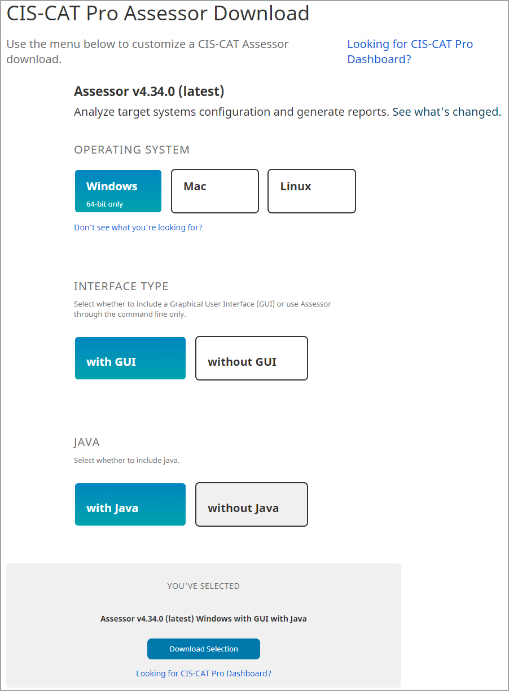
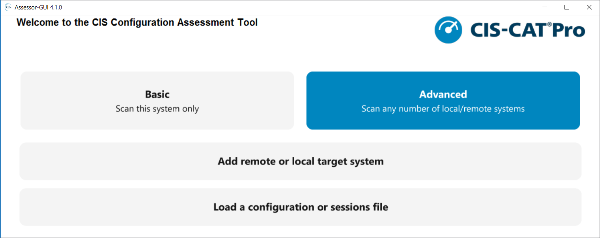

**CIS-CAT Pro Assessor Configuration Guide**

CIS-CAT Pro is a configuration assessment tool. It supports host-based (local) assessments and remote-based assessments.  In order to perform assessments of remote endpoints, the target system must be configured to accept a remote connection.  The Configuration Guide will provide important information for special configurations when assessing certain target systems.

## Obtain CIS-CAT Pro Assessor ##
CIS-CAT Pro Assessor is available to CIS SecureSuite Members. To learn more about becoming a CIS SecureSuite Member, visit our [website](https://www.cisecurity.org/). As a Member, organizations may navigate to [CIS WorkBench](https://workbench.cisecurity.org/dashboard) to obtain the CIS-CAT tools. 

Once logged into to CIS WorkBench, navigate to `Downloads` and select the button `Download CIS-CAT Pro` at the top of the page. 

Select the operating system that will host CIS-CAT Pro Assessor and the preferred interface. **MacOS** users must utilize the Linux version without embedded Java as the embedded Java is not suitable for MacOS.

Below are the possible download bundles:

| Operating System | Interface Type| Java | Requires Host Installed JRE| Description |   Downloaded File Name Example|
| -----------------| -------------| ------| -------------------------- | ----------- | ------------------------------|
| Microsoft Windows | with GUI | with | No | Includes a graphical interface and supports command line (CLI) activities. Embedded java 8 runtime environment (JRE) included and utilized for all Microsoft Windows assessments. Centralized scripts utilize the embedded Java | CIS-CAT-Assessor-windows-GUI-jre-v4.24.0.zip |
| Microsoft Windows | without GUI | with | No | No graphical interface. Supports command line (CLI) activities. Embedded java 8 runtime environment (JRE) included and utilized for all Microsoft Windows assessments. Centralized scripts utilize the embedded Java | CIS-CAT-Assessor-windows-jre-v4.24.0.zip |
| Microsoft Windows | without GUI | without | Yes | Supports command line (CLI) activities, no graphical interface. Requires an installed JRE on the CIS-CAT host. | CIS-CAT-Assessor-windows-v4.24.0 |
| Linux  | without GUI | with | No | Designed for Linux **ONLY** operating systems. Includes only shell scripts for tool operation on Linux. Centralized scripts utilize the embedded Java. **MUST ensure that the jre folder of the build has appropriate read and execute permissions in order for the assessment process to function.** The embedded Java is only suitable for Linux OS, not MacOS. | CIS-CAT-Assessor-linux-jre-v4.24.0 |
| Linux  | without GUI | without | Yes | Designed for Linux and MacOS operating systems. Includes only shell scripts for tool operation on Linux or MacOS. Requires an installed JRE on the CIS-CAT host. **MacOS** users must utilize this version. | CIS-CAT-Assessor-linux-v4.24.0 |

Security
------------

CIS-CAT team utilizes best efforts to ensure that the CIS-CAT product are free from material vulnerabilities resulting from integrated third-party libraries with continuous use of monitoring tools as part of the software build process. The Center for Internet Security performs annual penetration testing on eligible software products, which includes CIS-CAT. CIS-CAT mitigates risks with recommended solutions associated with penetration test findings assessed at and above a Medium.

The Center for Internet Security product engineering practices are SOC 2 certified. SOC 2 is a voluntary compliance standard for service organizations, developed by the American Institute of CPAs (AICPA), which specifies how organizations should manage customer data. The standard is based on the following Trust Services Criteria: security, availability, processing integrity, confidentiality, privacy.

CIS-CAT's engineering team is populated with individuals educated and certified in cyber security best practices. The Center for Internet for Security develops cyber security best practices with our global community of cybersecurity experts. We implement these best practices within the organization.

System Recommendations
------------

The host system is the machine where CIS-CAT Pro Assessor v4 resides. Most operating system can support operations of CIS-CAT Pro Assessor. The application requires a Java Runtime Environment (JRE) to run. Some builds of CIS-CAT now include an embedded JRE. The OS and tool components selected on download will determine whether an installed JRE is necessary for the host machine of CIS-CAT. See the detailed chart above in `Obtain CIS-CAT Pro`.

CIS recommends installing CIS-CAT Pro Assessor v4 on a host separate from hosts supporting CIS-CAT Pro Dashboard. Multiple installations of CIS-CAT Pro Assessor on separate host systems are allowed as there is no limit to installation. Each CIS-CAT Pro Assessor requires a JRE. You may utilize versions of CIS-CAT with embedded JRE per the appropriate operating system. If you wish to maintain your own JRE, please review the Java requirements below. 

**Required**:

- Remote scanning requires unrestricted access from the CIS-CAT host system to the assessed target system
- Windows remote and local assessments require a 64 bit operating system 
- Linux builds **with** embedded Java MUST ensure that the jre folder of the build has appropriate read and execute permissions in order for the assessment process to function.

**Java Requirements**

Java is required for operation of CIS-CAT. However, versions of CIS-CAT can now be downloaded with embedded Java from CIS WorkBench. See available builds on [CIS WorkBench](https://ccpa-docs.readthedocs.io/en/latest/Configuration%20Guide/#obtain-cis-cat-pro-assessor) for CIS-CAT Pro Assessor.

If a version of CIS-CAT is selected that does **NOT** contain embedded Java, the following Java requirements apply:

- JRE or JDK installed on CIS-CAT host machine or CIS-CAT bundle includes embedded Java
	- **If using GUI, JRE is embedded. Host installed Java NOT needed**
	- Stable version 8 or 11 (**Java 17 is NOT** supported) of JRE or JDK (free openJDK also supported) present on host or accessed via network share
	- Non-stable or proprietary Java builds may work in certain environments, however CIS Technical Support cannot assist troubleshooting issues
	- Some Members have experienced issues with proprietary Java versions and headless Java versions
	- 64-bit Java recommended for faster performance
	- Java versions 9+ will receive “WARNING: An illegal reflective access operation has occurred”. This can be ignored and will not halt the assessment.
	- OpenJDK (free and open-source) implementations are supported. We have found this [website](https://adoptopenjdk.net/) easy to navigate. The official source is [OpenJDK](https://openjdk.java.net).

**Recommended Minimum**:

Depending on your organization's use of CIS-CAT Pro Assessor, the actual server specifications mentioned below could vary.

- 2 GHz dual processor
- 4 GB of RAM

Properties
--------
Multiple system properties exist in the file `assessor-cli.properties` (located in `config` folder) to provide additional functionality. For any property value updates to take effect, the CIS-CAT Pro Assessor application must be re-started. 

| Property Name          | Data Type   |   Description |
| -----------------------| ---------- | ------------- |
| **License Files** |  |  |
| ciscat.integration.config | `string` | Sets the filepath to the "dxlclient.config" file used for online license verification. The filepath should include the filename and extension. |
| ciscat.license.filepath | `string` | Sets the filepath to the "license.xml" file used for license verification.  The filepath should include the filename and extension. |
| **Define Default GUI Selections** |  |  |
| gui.auto.detect.benchmark | `true/false` | Determines if GUI should automatically detect the local operating system assessed and provide a suggested Level 1 Benchmark. Default setting is set to 'true'. Supports only local assessments for the following Microsoft Windows: 10 Enterprise, Server 2012r2, Server 2012, Server 2019, Server 2022 |
| gui.default.output.format | `string` | Sets the selected output format(s) for the generated reports, e.g. HTML,csv,txt,arf xml,json. |
| gui.default.report.output.location | `string` | Sets the default selected report output destination path, e.g. C:\\Users\\testuser\\Desktop. The path will be set to this value when an operating system supported for auto detection is not defined and/or detected. If this line is uncommented, ensure it contains a valid value else the field will be set to null. |
| gui.default.dashboardURL | `string` | Sets the URL of CIS-CAT Pro Dashboard for import of results via API. |
| gui.default.report.output.windows10 | `string` | Sets the default selected report output destination path for a Microsoft Windows 10 operating system assessment, e.g. C:\\Users\\testuser\\Desktop. The `gui.auto.detect.benchmark` property must be set to `true` and this operating system must be detected for this path to be set. A Microsoft Windows 11 operating system is not supported and must have the `gui.auto.detect.benchmark` property must be set to `false`. Due to current Microsoft Windows 11 limitations, CIS-CAT will detect a Microsoft Windows 11 system as a Microsoft Windows 10 system. If this line is uncommented, ensure it contains a valid value else the field will be set to null. |
| gui.default.report.output.windows2012 | `string` | Sets the default selected report output destination path for a Microsoft Windows Server 2012 operating system assessment, e.g. C:\\Users\\testuser\\Desktop. The `gui.auto.detect.benchmark` property must be set to `true` and this operating system must be detected for this path to be set. If this line is uncommented, ensure it contains a valid value else the field will be set to null. |
| gui.default.report.output.windows2012r2 | `string` | Sets the default selected report output destination path for a Microsoft Windows Server 2012 r2 operating system assessment, e.g. C:\\Users\\testuser\\Desktop. The `gui.auto.detect.benchmark` property must be set to `true` and this operating system must be detected for this path to be set. If this line is uncommented, ensure it contains a valid value else the field will be set to null. |
| gui.default.report.output.windows2016 | `string` | Sets the default selected report output destination path for a Microsoft Windows Server 2016 operating system assessment, e.g. C:\\Users\\testuser\\Desktop. The `gui.auto.detect.benchmark` property must be set to `true` and this operating system must be detected for this path to be set. If this line is uncommented, ensure it contains a valid value else the field will be set to null. |
| gui.default.report.output.windows2019 | `string` | Sets the default selected report output destination path for a Microsoft Windows Server 2019 operating system assessment, e.g. C:\\Users\\testuser\\Desktop. The `gui.auto.detect.benchmark` property must be set to `true` and this operating system must be detected for this path to be set. If this line is uncommented, ensure it contains a valid value else the field will be set to null. |
| gui.default.report.output.windows2022 | `string` | Sets the default selected report output destination path for a Microsoft Windows Server 2022 operating system assessment, e.g. C:\\Users\\testuser\\Desktop. The `gui.auto.detect.benchmark` property must be set to `true` and this operating system must be detected for this path to be set. If this line is uncommented, ensure it contains a valid value else the field will be set to null. |
| **Define Behavior When Benchmark Content Fails Validation** |  |  |
| validate.xml.schema                  | `true/false`    | Configuration of `true` results in schema validation of benchmark/datastream files. On validation failure, assessment process halts with exit with a code of 500. Configuration of `false` will not result in formal validation, but errors in the structure will result in an exception. |
| **Set Schematrom Validation Behaviour** |  |  |
| validate.xml.schematron | `true/false` | Controls whether assessor will utilize schematron to validate that the OVAL definitions are correctly formed prior to assessment. |
| **Define Assessor Behavior When Signed Benchmark Content Has Been Altered** |  |  |
| exit.on.invalid.signature | `true/false`      | Detects alteration in signed benchmark/datastream files prior to assessment. When set to `true`, and signature is found to be invalid, the assessment process will stop. When set to `false`, a notification appears if signature is found invalid and assessment continues without intervention.|
| **Define Behavior When Benchmark Does Not Match Operating System** |  |  |
| ignore.platform.mismatch     | `true/false`      | **As Needed**. For both `true` and `false` when an operating system benchmark is selected, the target system's operating system will be compared to that of the selected benchmark. When set to `true` and a mismatch is detected, the assessment will continue without intervention but may result in errors or multiple failed results. When set to `false` and a mismatch is detected, a message "The checklist does not match the target platform" is displayed on the command line. The assessment continues without intervention, and all results will be "Not Applicable" with a score of 0%. |
| **CIS-CAT Pro Dashboard Parameters** |  |  |
| ciscat.post.parameter.ccpd.token | `string` | **Mandatory**. Allows for the inclusion of a CIS-CAT Pro Dashboard-generated bearer token, to upload ARF reports. |
| ciscat.post.parameter.report.name | `string` | Allows for the customization of the CIS-CAT POST parameter for the Report Name.  To POST assessment reports to the CIS-CAT Pro Dashboard, the value of this property must be set to "report-name". |
| ciscat.post.parameter.report.body | `string` | Allows for the customization of the CIS-CAT POST parameter for the Report Body.  To POST assessment reports to the CIS-CAT Pro Dashboard, the value of this property must be set to "ciscat-report". |
| ciscat.zip.post.files | `true/false` | **Highly Recommended**. Allows for assessment reports to be zipped/compressed when they are sent to the Dashboard via a POST request.  This property is only supported with Dashboard version 1.1.9 or higher. |
| **Set SCE Script Timeout** |  |  |
| sce.max.wait | `numeric - milliseconds` | Sets the Maximum Wait time (time out) in milliseconds for each SCE script to execute. Used mostly when assessing with a Linux or macOS Benchmark. By default, the setting is not active. May reduce overall assessment time where organizations have mounted drives with millions/billions of files that may require collection/evaluation. Should an evaluation of the system state exceed the specified duration, the recommendation result will be 'Unknown' and score as a failure. |
| **Set VMWare Command Timeout** |  |  |
| esxi.max.wait | `numeric - milliseconds` | Sets the Maximum Wait time (time out) in milliseconds for each PowerCLI command to execute. Used only when assessing with a VMWare Benchmark. Default value is 30 seconds. May reduce overall assessment time where organizations do not have settings configured on the VM. |
| **Define CSV Output Header Information** |  |  |
| include.csv.remediation | `true/false` | Controls whether remediation text is generated in the CSV-formatted assessment report. |
| include.csv.headers | `true/false` | Controls whether a row of column headers is generated in the CSV-formatted assessment report. |
| include.csv.target_ip | `true/false` | Controls whether the target IP address is generated in the CSV-formatted assessment report. |
| include.csv.scoring | `true/false` | Controls whether the overall scoring information is generated in the CSV-formatted assessment report. |
| include.csv.rule.scoring | `true/false` | Controls whether individual rule scoring information is generated in the CSV-formatted assessment report. |
| **Exclude Mounted File Systems from Assessment** |  |  |
| excluded.filesystems | `string` | **As Needed**. A comma-delimited list of filesystem names/mount points to exclude from any full-filesystem searches on Linux.  Linux assessments where user home directories exist on an auto-mounted, large storage drive, will experience longer assessment duration as some benchmarks check will take longer to complete. |
| **Customize HTML Output Graphics** |  |  |
| custom.html.coverpage.background | `string` | The name of the graphics file, saved to the "custom" folder, to be used as the HTML report's cover page background. |
| custom.html.coverpage.logo | `string` | The name of the graphics file, saved to the "custom" folder, to be used as the HTML report's cover page organizational logo. |
| custom.html.coverpage.subtitle.background | `string` | The name of the graphics file, saved to the "custom" folder, to be used as the HTML report's cover page subtitle background. |
| include.default.html.coverpage.footer | `true/false` | This property specifies whether or not the default footer is displayed on the coverpage of the HTML report.  If this property is not set or is commented out, the default value of "true" will be used for this property. If you want to display a custom graphic for the coverpage footer, utilize the custom.html.coverpage.footer property. |
| custom.html.coverpage.footer | `string` | This property specifies the name of the graphics file, saved to the "custom" folder, to be generated as the footer of the HTML coverpage. Note that default coverpage footer covers an area of approximately 725x64 px. |
| custom.html.css | `string` | The name of the CSS file, saved to the "custom" folder, which overrides the HTML report's styling. |

Remote / Local Assessment - Sessions
--------
A local assessment uses the default `sessions.properties` file. CIS-CAT Pro Assessor v4's remote assessment capability can also utilize the Sessions file and requires configuration of each `session` type; connection parameters used to create a secure connection to the remote endpoint.  A session configuration requires a number of entries, which will vary depending on the connection type. This connection is not necessary when selecting the centralized (in-network) method of assessment.

**Connection (Session) Types**

The below connection types support the assessment of various endpoint types. The connection type depends on the technology as well as the connection, local or remote. 

| Type                   | Value      |   Description |
| -----------------------| ---------- | ------------- |
| Local                  | `local`    | Usage of a "local" session is for a host-based assessment.  Standalone or command-line applications (such as CIS-CAT Pro Assessor CLI) may use the local session to continue host-based assessments of benchmarks and/or OVAL definitions. |
| SSH (Unix, Linux, Apple OSX) | `ssh`      | The "ssh" session type represents a connection to a remote Unix, Linux, or Apple OSX endpoint, via SSH.  SSH connections can be established a number of different ways, including `username/password`, `username/path to a private key file`, `username/private key file protected with a passphrase`, `username/private key file + credentials to use for sudo`.|
| Windows                | `windows`  | The `windows` session type represents a WinRM connection to a remote Microsoft Windows environment.  Both workstations and servers are supported with this connection type and can currently be established using `username/password` authentication.|
| Cisco IOS              | `ios`      | The `ios` applies to the assessment of Cisco IOS network devices.  Depending on the specific configuration when the "ios" session type is used, CIS-CAT Pro Assessor will either establish a SSH connection using `username/password` or `username/path to a private key` authentication, or will create a modified local session, collecting information from an exported configuration file.|
| Palo Alto              | `panos`      | The `panos` session type applies to the assessment of Palo Alto network devices.  CIS-CAT Pro Assessor will create a local session, collecting information from an exported configuration file via `configFilePath` element.|

**Sessions Configuration Properties**
A number of configuration properties exist, and will vary based on the session type.

| Property   | Description |
| ---------- | ----------- |
| `type`     | The `type` property MUST be configured to one of the connection types specified above (`local`, `ssh`, `windows`, `ios`, `panos`).|
| `host`     | The `host` property is required for any remote connection, and can be either the hostname or IP address (v4 or v6) of the endpoint to be assessed.  Examples include `1.2.3.4` or `CIS-CAT-TEST`.    The `host` property is not needed when assessing against exported network device configuration files.   The `host` property is not needed when the session type is `local`.|
| `port`     | The `port` property is required for any remote connection.  When using the `ssh` connection type, the default value for the `port` property would be `22`.  When using the `windows` connection type, the defaut WinRM ports are `5985` for HTTP and `5986` for HTTPS.    The `port` property is not needed when assessing against exported network device configuration files.   The `port` property is not needed when the session type is `local`.|
| `user`     | The `user` property represents an administrator-level username, used to log on to the remote endpoint.  This can be a domain user or a local administrator on the remote endpoint, or a privileged user when logging on to Cisco network devices.   The `user` property is not needed when assessing against exported network device configuration files.   The `user` property is not needed when the session type is `local`.|
| `cred`     | The `cred` property represents the credentials for the `user`, in order to log on to the remote endpoint.  Note that this is not encrypted, so users must take great care in safeguarding the sessions configuration file(s).    **NOTE**: When executing CIS-CAT Pro Assessor CLI, if a given session's configuration specifies neither the `cred` nor the `identity` property, the user will be prompted to enter credentials manually.  This **will block** assessment against other configured sessions until credentials are entered.    The `cred` property is not needed when assessing against exported network device configuration files.   The `cred` property is not needed when the session type is `local`.|
| `identity` | The `identity` property represents the full path to a private key file used for authentication to a remote endpoint.  **NOTE**: When executing CIS-CAT Pro Assessor CLI, if a given session's configuration specifies neither the `cred` nor the `identity` property, the user will be prompted to enter credentials manually.  This **will block** assessment against other configured sessions until credentials are entered.    The `identity` property is not needed when assessing against exported network device configuration files.   The `identity` property is not needed when the session type is `local`.|
| `identityPassphrase` | The `identityPassphrase` property is optional and should be used in conjunction with the `identity` property, when that key is protected with a passphrase.|
| `enable`   | The `enable` property is used only in network device sessions (`ios`) and represents the credentials needed to enter "privileged EXEC" mode; required for obtaining the full output of the `show tech-support` command.    The `enable` property is not needed when assessing against exported network device configuration files.   The `enable` property is not needed when the session type is `local`.|
| `tech`     | The `tech` property is REQUIRED when assessing the exported configuration of a Cisco IOS network device.  This property specifies the full path to the exported configuration file.    This property is only valid for Cisco IOS assessments. When assessing a Cisco IOS device online via SSH, the `tech` property is unnecessary.   The `tech` property is not needed when the session type is `local`.|
| `configFilePath`     | The `configFilePath` property is REQUIRED when assessing the exported configuration of a Palo Alto network device.  This property specifies the full path to the exported configuration file.    This property is only valid for Palo Alto assessments (panos).|
| `tmp`| CIS-CAT recommends excluding this property in the session. CIS-CAT will automatically select a temporary location when this property is not set. The `tmp` property allows users to configure the location of the temporary "ephemeral" directory on the target host.  The "ephemeral" directory is named `ccpa-temp-TIMESTAMP` and is created as a sub-folder of the directory specified in this setting.  For example, if `tmp` is specified as `C:\Temp`, the "ephemeral" directory will be created at `C:\Temp\ccpa-temp-TIMESTAMP`.     **NOTE**: A specified value for `tmp` MUST EXIST on the target endpoint with "write" privileges.  In the above example, if the `C:\Temp` folder does not exist, the connection from CIS-CAT Pro Assessor v4 will not succeed.  If this property is left blank or not included, the Assessor will use the default "temp" folder as defined for the operating system, such as `/tmp` or `C:\Windows\Temp`.|

**Examples**
The examples below provide insight into the creation of a `sessions.properties` file, which can then be consumed by CIS-CAT Pro Assessor CLI to provide connection configurations when assessing a particular benchmark.  By default, CIS-CAT Pro Assessor CLI will ALWAYS attempt to load a default configuration file located in the application's `config` folder, named `sessions.properties`.

#### Microsoft Windows Sessions ####
-----------------------------------------

For example, if CCPA is installed at `C:\CIS\Assessor`, a file named `C:\CIS\Assessor\config\sessions.properties` will be searched for and loaded (if found).  If no `sessions.properties` files are found or specified, a default `local` session will be used.

Configure a session for the local Microsoft Windows host, defining a custom "temp" folder:

    session.1.type=local
	# Note that specifying Windows directory paths require a double-backslash "\\" as the path separator
    session.1.tmp=C:\\Temp

Configure a remote Windows session using a username/password:

    session.2.type=windows
    session.2.host=123.255.198.9
    session.2.port=5986
    session.2.user=Administrator1
    session.2.cred=s3cr3t3r!

Configure a remote Windows session using a username, but requiring manual password entry:

    session.3.type=windows
    session.3.host=100.50.25.75
    session.3.port=5986
    session.3.user=Administrator1

#### Cisco IOS Sessions ####
------------------------

Configure a remote Cisco IOS session using a username/password:

    session.4.type=ios
    session.4.host=9.8.7.6
    session.4.port=22
    session.4.user=admin
    session.4.cred=s3cr3t3r!
    session.4.enable=3nab!3d

Configure a remote Cisco IOS session using a username/private key:

    session.5.type=ios
    session.5.host=9.8.7.6
    session.5.port=22
    session.5.user=admin
    # Note that specifying Windows directory paths require a double-backslash "\\" as the path separator
    session.5.identity=C:\\CIS\\cisco-ios.ppk
    session.5.enable=3nab!3d

Configure a Cisco IOS session pointing to an exported configuration file:

    session.6.type=ios
	session.6.tech=C:\\CiscoFiles\\configuration.cfg

#### Palo Alto Sessions ####
------------------------

Configure a Palo Alto session pointing to an exported configuration file:

    session.7.type=panos
	session.7.configFilePath=C:\\PaloFiles\\palo_config.xml

#### Linux Sessions ####
------------------------

Configure a remote Linux session using a username/private key:

    session.7.type=ssh
    session.7.host=ubuntu-test.example.org
    session.7.port=22
    session.7.user=ec2-user
    session.7.identity=/home/myuser/cis/pkey.pem

#### MacOS Sessions ####
--------------------------

Configure a remote MacOS session using a username/private key:

    session.8.type=ssh
    session.8.host=macOS-test.example.org
    session.8.port=22
    session.8.user=ec2-user
    session.8.identity=/Users/ciscatuser/cis/pkey.pem

Remote Setup - Microsoft Windows
----------------------------------------
To remotely assess a Microsoft Windows machine, the endpoint must be prepared to accept a remote request. Remote assessment utilizes the SMB protocol for file manipulation and WinRM for process execution during a remote assessment. CIS-CAT Pro Assessor also uses PowerShell to execute assessment steps for Microsoft Windows technologies. When a connection is established to the endpoint, an "ephemeral", temporary directory is created to host scripts required for the collection of system characteristics. On assessment completion, the temporary directory is deleted.

Requirements for a Microsoft Windows Remote Assessment:

- PowerShell installed
- PowerShell `LanguageMode` is not configured to `ConstrainedLanguage`
	- `ConstrainedLanguage` mode blocks assessor actions as CIS-CAT PowerShell scripts cannot be dot-sourced
	- Verify LanguageMode using this command: `PS> $ExecutionContext.SessionState.LanguageMode`

### Microsoft Windows and CIS Benchmarks ###

CIS Microsoft Windows Benchmarks are designed for systems in an Active Directory domain-joined environment using Group Policy. The CIS Benchmark will verify registry settings set by Group Policy. Local policy settings are stored in different registry settings than Group Policy settings and the assessment results will produce many `Fail` results for standalone systems even where values match the CIS Benchmark recommended value.

### Risk and Remote Assessment with Microsoft Windows ###

CIS recommends utilizing domain accounts when performing remote assessments. See the section below for security considerations when connecting to the endpoint.

CIS Benchmark Level 1 profiles permit remote assessment while CIS Benchmark Level 2 profiles are designed for more restrictive environments and are conducive to host-based (local) assessments. If selecting to remotely assess endpoints on either profile, the risk must be accepted as part the organizational security policies. Level 1 policies or tailor Level 2 policies as needed to perform remote scanning.

In versions of the CIS-CAT Pro Assessor v4.13.0+, CIS recommends connecting via WinRM with communication protocols of HTTP or HTTPS. Connecting via HTTPS requires additional steps as certificate setup is needed. Connecting over HTTP, while it does come with some risk as any remote connections do, can now happen securely with a change to Assessor v4.13.0+. The latest Assessor allows for encryption over HTTP. Using this protocol, steps to prepare the endpoint are streamlined. Read about WinRM security in this [official Microsoft document](https://docs.microsoft.com/en-us/powershell/scripting/learn/remoting/winrmsecurity?view=powershell-7.1) to help your organization decide the best protocol.

### Authentication to the Remote Endpoint ###

Authentication (username for the Session information) to remote Windows endpoints can be established with either local or domain accounts. Domain authentication must be in the following format:

	ciscatuser@example.org

The Assessor accesses the administrative shares on the remote host, which are only accessible for users that are part of the Administrators group (or similar group with administrator privileges) on that host, or are configured as domain administrators.

Authentication can also be done using the local administrator account. This is not recommended and the following security risks should be considered:

- Endpoint must disable the `Apply UAC restrictions to local accounts on network logons` configuration
	- Controls whether local accounts can be used for remote administration via network logon (e.g., NET USE, connecting to C$, etc.). 
- Configuring this setting to Disabled allows local accounts to have full administrative rights when authenticating via network logon, by configuring the `LocalAccountTokenFilterPolicy` registry value to 1.
	- Setting `Apply UAC restrictions to local accounts on network logons` to `disabled` deviates from a CIS Benchmark Level 1 recommendation
- Local accounts are at high risk for credential theft when the same account and password is configured on multiple systems

### Basic Endpoint Configuration Steps for Windows Remote Assessment ###

Preparing an endpoint for a remote configuration assessment is NOT needed when planning to complete a local assessment (CIS-CAT resides on the machine that is assessed) or a network / centralized assessment (CIS-CAT resides on a network share and assessed machines access it from the share). A Microsoft Windows endpoint requires primarily WinRM and SMB enabled. Depending on how the connection is made, a few more requirements are also necessary.

The basic setup is great for testing and trying a remote assessment. However, since CIS Benchmarks are intended for a domain-joined environment, organizations will have Group Policy that overrides local policy. To enable WinRM  and SMB more efficiently and persistently on many endpoints, utilize Group Policy to establish the endpoint configuration.

**Assumptions for basic setup steps:**

- Assessor v4.13.0+ is utilized
- Connection established using HTTP protocol (over port 5985)
- Authentication utilizes domain account credentials that has administrator privileges 

\* **Perform the manual steps on the target endpoint:**
*Steps below will enable WinRM on port 5985 and open SMB on port 445*

- Enable WinRM using quickconfig
	- Open command prompt using “Run as Administrator”
	- At command prompt enter: `winrm quickconfig`
	- At confirmation prompt, type `Y` and hit Enter
	- At second confirmation prompt, type `Y` and hit Enter

\* See [Group Policy section](#gpo) below to learn about how to configure Group policy to prepare the endpoint.

#### Advanced Endpoint Configuration Steps for Windows Remote Assessment ####

If required by organizational policy, remote connections for Microsoft Windows endpoints using WinRM over HTTPS protocol is also possible.

Follow the steps below:

- Open port 445 (SMB) and 5986 (HTTPS) and configure firewall exceptions
	- Run included PowerShell script from the Assessor bundle in \Assessor\setup\CISCAT_Pro_Assessor_v4_Firewall_SMB_WinRM.ps1. The script completes the following
		- Opens port 445 (SMB) and configures firewall
		- Opens port 5986 for HTTPS
- HTTPS Listener established using thumbprint of a certificate for the remote system (see below)

Users can attempt to find an existing certificate thumbprint for the remote host using PowerShell.  In the following commands, assume `HOSTNAME` is the DNS name of the remote Windows host:

    PS C:\Windows\system32> Get-childItem cert:\LocalMachine\My\ | Select-String -pattern HOSTNAME

If a certificate exists on the system, the PowerShell command will yield results similar to the following:

    [Subject]
       CN=HOSTNAME
    
     [Issuer]
       CN=HOSTNAME
    
     [Serial Number]
       527E7AF9142D96AD49A10469A264E766
    
     [Not Before]
       5/23/2011 10:23:33 AM
    
     [Not After]
       5/20/2021 10:23:33 AM
    
     [Thumbprint]
       5C36B638BC31F505EF7F693D9A60C01551DD486F

If a valid certificate is found, a couple of options are available depending on the Windows version being configured.  For Windows Server 2012 and higher, HTTPS listeners may be created without needing to know the hostname or thumbprint.  Therefore, if the certificate is found, users can issue the following `winrm` command to configure the HTTPS listener:

	winrm quickconfig -transport:https -force

Alternatively, users can manually create the HTTPS WinRM listener as follows:

	winrm create winrm/config/Listener?Address=*+Transport=HTTPS @{Hostname="HOSTNAME"; CertificateThumbprint="THUMBPRINT"}

Where `HOSTNAME` is either the DNS name or FQDN of the remote host, such as `WINSERVER1` or `winserver1.domain.com`, respectively, and `THUMBPRINT` is the certificate thumbprint found in PowerShell, for example `5C36B638BC31F505EF7F693D9A60C01551DD486F`

If no results are returned, members may create a self-signed certificate using PowerShell and a script provided with the CIS-CAT Pro Assessor v4 application bundle.  The bundle will contain a `setup` folder, in which will be located the **`CISCAT_Pro_Assessor_v4_SelfSignedCertificate.ps1`** script.  Execute this script in PowerShell to configure the self-signed certificate and create the WinRM HTTPS listener.

### WinRM Configuration ###
In order for CIS-CAT Pro Assessor to connect to a remote Windows host, a number of configurations must be applied to those hosts.  This configuration can be applied either manually or through Group Policy.

#### Group Policy Configuration ####

The WinRM service can be configured using Group Policy. 

In domain environments, policies are maintained on the Domain Controller's Group Policy Management Console (GPMC). Create a new Group Policy Object to set the WinRM services. 
An example is below.

	Computer Configuration\Policies\Administrative Templates\Windows 
	Components\Windows Remote Management (WinRM)\WinRM Service

In standalone (non-domain) environments, Local Group Policy Objects can be set. However, keep in mind, that Group Policy may take precedence and assessments will not have optimal results for systems that are not domain joined. Consult the official Microsoft site for your distribution of Microsoft Windows on how to set Local Group Policy (Example: [Windows 10](https://docs.microsoft.com/en-us/windows/security/threat-protection/security-policy-settings/how-to-configure-security-policy-settings)).

To enable WinRM, configure the following settings in Group Policy:

- **Allow remote server management through WinRM**:  
	- **Select "Enabled"**: Manages whether the Windows Remote Management (WinRM) service automatically listens on the network for requests. 
	- **Enter an asterisk  in either the IPv4 or IPv6 Filter**: If the filter is left blank, the service does not listen on any addresses. The service listens on the addresses specified by the IPv4 and IPv6 filters. The IPv4 filter specifies one or more ranges of IPv4 addresses, and the IPv6 filter specifies one or more ranges of IPv6addresses. If specified, the service enumerates the available IP addresses on the computer and uses only addresses that fall within one of the filter ranges.
Use an asterisk ( * ) to indicate that the service listens on all available IP addresses on the computer. When * is used, other ranges in the filter are ignored. 

- Authenticating with local administrator account (not recommended)
	- Navigate to `Computer Configuration\Policies\Administrative Templates\SCM: Pass the Hash Mitigations`*
	- Set `Apply UAC restrictions to local accounts on network logons` to `Disabled`
	

*If this group policy setting is not available, it may need to be downloaded and imported into the GPMC.  The administrative template (ADMX) files can be downloaded from either [here](https://www.microsoft.com/en-us/download/details.aspx?id=103034) or [here](https://learn.microsoft.com/en-us/troubleshoot/windows-client/group-policy/create-and-manage-central-store).

#### Manual Configuration ####
CIS recommends configuring endpoints via Group Policy in a domain environment, but manual configuration can be useful for testing environments.

##### Enable WinRM #####
On the remote Windows host, open a Command Prompt using the "Run as Administrator" option.  Enter the following command to enable the default configuration for WinRM:

	winrm quickconfig

A confirmation prompt may be presented to the user.  If so, type `Y` and hit `Enter`.  Performing the `quickconfig` will start the Windows Remote Management service, configure an HTTP listener and create exceptions in the Windows Firewall for the WinRM service.

##### Review WinRM Configuration Settings #####
Enter the following command to review the WinRM configuration settings:

	winrm get winrm/config/winrs

If you experience errors running an assessment over WinRM (e.g., out-of-memory errors), you may need to update the default **MaxMemoryPerShellMB** configuration setting in order to increase the maximum amount of memory available.  The following sample command updates this setting to 1 GB (1024 MB):

	winrm set winrm/config/winrs @{MaxMemoryPerShellMB="1024"} 

##### Disable UAC remote restrictions #####

To better protect those users who are members of the local Administrators group, Microsoft implemented UAC restrictions on the network. This mechanism helps prevent against "loopback" attacks. This mechanism also helps prevent local malicious software from running remotely with administrative rights.

When a user who is a member of the local administrators group on the target remote computer establishes a remote administrative connection by using the `net use * \\remotecomputer\Share$` command, for example, they will not connect as a full administrator. The user has no elevation potential on the remote computer, and the user cannot perform administrative tasks. If the user wants to administer the workstation with a Security Account Manager (SAM) account, the user must interactively log on to the computer that is to be administered with Remote Assistance or Remote Desktop, if these services are available.

To disable UAC remote restrictions, : 

- Click Start, click Run, type **regedit**, and then press **ENTER**.
- Locate and then click the following registry subkey:

	`HKEY_LOCAL_MACHINE\SOFTWARE\Microsoft\Windows\CurrentVersion\Policies\System`

- If the `LocalAccountTokenFilterPolicy` registry entry does not exist, follow these steps: 
	- On the Edit menu, point to **New**, and then click **DWORD Value**.
	- Type `LocalAccountTokenFilterPolicy`, and then press **ENTER**.

- Right-click `LocalAccountTokenFilterPolicy`, and then click **Modify**.
- In the Value data box, type **1**, and then click **OK**.
- Exit Registry Editor.

In Windows domain environments, this setting can be configured through [Group Policy](#gpo), however, the Group Policy Object is not a standard policy and must be downloaded and installed separately.  Generally, if an environment has installed the Microsoft Security Compliance Manager (SCM), the GPO is included there and can be exported.

Otherwise, the Group Policy Objects can be found either [here](https://www.microsoft.com/en-us/download/details.aspx?id=103034) or [here](https://learn.microsoft.com/en-us/troubleshoot/windows-client/group-policy/create-and-manage-central-store).

Remote Setup - Unix/Linux/OSX
-------------------------------------
CIS-CAT Pro Assessor assesses remote Unix/Linux/OSX targets via SSH connections.  Ensure the target system can be accessed via SSH and that the user connecting to the remote target is either the `root` user or a user granted privileges to execute commands using `sudo`.

**A Note on the Ephemeral Directory**

CIS-CAT Pro Assessor v4 will attempt to create an ephemeral directory underneath the user's home directory.  The user's home directory is collected by querying the `/etc/passwd` file for the logged in user.  If an error occurs querying `/etc/passwd`, the ephemeral directory may not be able to be determined.  If this is the case, an error will occur trying to create the directory.  In this case, users must configure a specific location for the ephemeral directory using either the `sessions.properties` file or configuration XML file.

Remote/Local Setup - Cisco Network Device
-------------------------------------------
CIS-CAT Pro Assessor v4 can assess either the current running configuration of a Cisco network device, or an exported configuration file.

Automated assessment content as of March 21, 2022 has been modified to more closely align with our consensus process. Please see the change log for the selected Cisco IOS Benchmark. CIS would like to add more automation to the Cisco IOS Benchmark recommendations. Please join our Cisco[Community on CIS WorkBench](https://workbench.cisecurity.org/communities/public) and ask how you can help. Example configuration files from organizational implementation can support CIS Benchmark Developers when creating additional automation.

**Connecting to a Device**

CIS-CAT Pro Assessor assesses Cisco network device targets via SSH connections.  Ensure the target system can be accessed via SSH and that the user connecting to the remote target is a privileged user.  When connecting to Cisco devices, CIS-CAT Pro Assessor will be configured to enter "privileged EXEC" mode, so any user connecting to the Cisco device via SSH must be granted appropriate permission to do so.

**Exported Configuration File**

CIS-CAT Pro Assessor can also assess an exported configuration file; the output of the `show tech-support` command.  The output from the `show tech-support` command is very long. To better manage this output, you can redirect the output to a file (for example, `show tech-support > *filename*` ) in the local writable storage file system or the remote file system.

You can use one of the following redirection methods:

	> filename —Redirects the output to a file.
	>> filename —Redirects the output to a file in append mode.

This example shows how to redirect the technical support information to a file:

	switch# show tech-support > bootflash:TechSupport.txt

Once the exported configuration file is available to CIS-CAT Pro Assessor, the assessment can be performed against it.  See the example above entitled "Configure a Cisco IOS session pointing to an exported configuration file" to configure the appropriate Assessor "session".

Palo Alto Network Device Assessment
-------------------------------

CIS-CAT Pro supports automated configuration assessments for a Palo Alto Network Device. The assessment method is offline and utilizes a Palo Alto exported configuration file.

CIS would like to add more automation to the Palo Alto Benchmark recommendations. Please join our Palo Alto [Community on CIS WorkBench](https://workbench.cisecurity.org/communities/public) and ask how you can help. Example configuration files from organizational implementation can support CIS Benchmark Developers when creating additional automation.

**Export Configuration File**

Read official [Palo Alto Network device](https://knowledgebase.paloaltonetworks.com/KCSArticleDetail?id=kA10g000000ClaOCAS) documentation on how to generate a configuration file.

**Assess with Assessor v4 GUI** 

A Palo Alto exported configuration file can be assessed using the Assessor V4 GUI using only the Advanced workflow by either loading a configuration.xml file or by adding a target system. 

If entering the Palo target information for the first time, select `Add remote or local target system`. Enter any information in the `Target System Name`. This field is only used in the created configuration.xml for reference purposes. Select `Palo Alto` for Target System Type. Select the location of the Palo Alto configuration file. Select the Benchmark and profile and select `Save`. Continue with the remaining assessment selections.

**Assess with Assessor v4 CLI** 

See sample sessions.properties and assessor-config-sample.xml files in the `config` directory of the assessor bundle for use on the command line.

Database Assessment
-------------------------------
Assessing database benchmarks in CIS-CAT Pro Assessor v4 uses a JDBC connection mechanism.  Database benchmarks require a user to enter the JDBC connection string as an interactive value on the command line, within the `assessor-cli.properties` file to set a single value for a single assessment, in a popup box on the GUI or by utilizing a configuration XML file to assess multiple databases. The connection string utilized should always reflect the host system's name/IP. See below for a summary table of the interactive values expected for database benchmarks. Follow the links for more information about each database.

**Interactive Value Summary**

| Database Type | Interactive Value Name | Expected Format|
|---------------|----------------------|----------------|
| [Microsoft SQL Server](#MSSQLDatabase)          | `xccdf_org.cisecurity_value_jdbc.url`|`jdbc:sqlserver://[serverName[\instanceName][:portNumber]][;property=value[;property=value]]` |
| [Mongo 3.6 only](#MongoDatabase)          | `xccdf_org.cisecurity_value_jdbc.url`| `fileLocation` value of `/etc/mongod.conf` - this default value must be used |
| [Oracle MySQL](#OracleMySQLDatabase)     | `xccdf_org.cisecurity_value_jdbc.url` | `jdbc:mysql://<host>:<port>/<database>?<key1>=<value1>&<key2>=<value2>...` |
|     | `xccdf_org.cisecurity_value_repl.user` | `userName` (default value is `repl`) |
| [Oracle](#OracleDatabase)      | `xccdf_org.cisecurity_value_jdbc.url`| `jdbc:oracle:thin:[username]/[password]@[hostname]:[port]:[SID]` OR `jdbc:oracle:thin:[username]/[password]@//[hostname]:[port]/[service_name]` |
|      | `xccdf_org.cisecurity_value_listener.ora`| `{env:ORACLE_HOME}/network/admin/listener.ora` |
| [PostgreSQL](#PostGreDatabase)      | `xccdf_org.cisecurity_value_jdbc.url` | `jdbc:postgresql://<host>:<port>/<database>?<key1>=<value1>&<key2>=<value2>...` |

**Database Assessments and Host Operating System**

Many CIS Database Benchmarks analyze configuration for database settings as well as the host system of the database. CIS-CAT Pro Assessor will collect information from the host system to compare to CIS Benchmark recommended values. Review the [CIS-CAT Pro Assessor Coverage Guide](https://ccpa-docs.readthedocs.io/en/latest/Coverage%20Guide/#cis-benchmark-coverage) for a general list of operating systems that are supported. Operating systems such as Solaris, for example, are not supported for database or host assessments.

**Oracle Database**

The JDBC string parameter is the connection string used to connect to and authenticate to the Oracle Database service and instance that CIS-CAT will assess.  The Oracle JDBC driver has the ability to connect to Oracle database instances using either the SID or Service Name.

When connecting to an Oracle database using the SID, the format of the JDBC connection string is:

	jdbc:oracle:thin:[username]/[password]@[hostname]:[port]:[SID]

For example:

	jdbc:oracle:thin:sys as sysdba/pa55w0rd!@servername:1521:ORCL

When connecting to an Oracle database using the Service Name, the format of the JDBC connection string is:

	jdbc:oracle:thin:[username]/[password]@//[hostname]:[port]/[service_name]

For example:

	jdbc:oracle:thin:sys as sysdba/pa55w0rd!@//servername:1521/SERVICE_NAME
	
Please note, if your organization has followed guidance in Appendix 7 of the CIS Benchmark, then please make the appropriate modifications to the named user above. 

The following table describes the components of the Oracle JDBC connection string.

| Property Name | Property Description |
|---------------|----------------------|
| username      | A valid username who can connect to the database instance. See the example and note above. This user should have sufficient privileges to `SELECT` from the various tables and views indicated in the specific Oracle benchmark, or be granted `SYSDBA` privileges. |
| password      | The credentials for the specified `username` to connect to the database instance. |
| hostname      | The name of the server (or it's IP address) hosting the database.|
| port          | The port number on which the database is listening.  By default, Oracle databases are configured to listen on port 1521.|
| SID           | The database SID.|
| Service Name  | The database Service Name.|

The interactive value listener.ora is utilized in the assessment process to support recommendations in section 2.1 of the CIS Oracle Database Benchmarks. The default for this value is {env:ORACLE_HOME}/network/admin/listener.ora. If this is not the correct path to the listener.ora, then this value should be provided in the configuration XML file or from the GUI popup.

**Oracle MySQL Database**

Oracle MySQL database support is implemented using the MariaDB JDBC driver.  The format for the MariaDB JDBC connection string for MySQL is:

	jdbc:mysql://<host>:<port>/<database>?<key1>=<value1>&<key2>=<value2>...

Consider a MySQL database instance with the following information:

| Property Name | Property Value |
|---------------|----------------------|
| Server Name   | CIS-SERVER |
| Database Name | TestDB |
| Database Port | 3306 |
| Username      | db_user |
| Credentials   | db_pass |

When configuring the JDBC connection string in CIS-CAT Pro Assessor, the above information would yield:

	jdbc:mysql://CIS-SERVER:3306/TestDB?user=db_user&password=db_pass

Notable optional parameters involve ensuring JDBC connections are made via SSL:

| Property Name          | Property Description |
|------------------------|----------------------|
| user                   | The database username. |
| password               | The credentials for the specified `user` to connect to the database instance. CIS-CAT does not support the use of "&" (ampersand) for this database type. |
| useSSL                 | Force the usage of SSL on the connection. |
| trustServerCertificate | When using SSL, do *not* verify the server's certificate.|
| serverSslCert          | Server's certificate in DER form, or server's CA certificate. Can be used in one of 3 forms:   `serverSslCert=/path/to/cert.pem`:  full path to certificate    `serverSslCert =classpath:relative/cert.pem`:  relative to current classpath    or as verbatim DER-encoded certificate string, starting with  `------BEGIN CERTIFICATE-----`|

An additional interactive value is `xccdf_org.cisecurity_value_repl.user`. This is the replication user, if utilized.

**MySQL 8 - Remote Assessment Requirements**

As with any database assessment, CIS-CAT must either connect to the host of the database or reside on the same machine as the database.
When connecting to a remote host where the database to be assessed resides, grant the permissions below in addition to what a root admin user (utilized in the connection string) may have.

Grant to the `db_user` (username) used in the connection string:

- Grant PROCESS

		GRANT PROCESS ON *.* TO '<db_user>'@'<hostname or IP>';

- Grant SELECT on mysql database

		Grant SELECT on mysql.* TO '<db_user>'@'<hostname or IP>';

- Grant SELECT on tables: `audit_log_filter`, `slave_master_info`, `component`, `user`

		GRANT SELECT ON mysql.<table> TO '<db_user>'@'<hostname or IP>';

**NOTES**

- The default port number for MySQL is 3306
- Review the full set of [connection properties/optional URL parameters](https://mariadb.com/kb/en/mariadb/about-the-mariadb-java-client/) supported by MariaDB 

**Mongo Database**

The MongoDB 3.6 benchmark requires one interactive property for the location of the MongoDB configuration file. This value allows for a user-supplied running configuration file for assessment. The default value specified below must not change. MongoDB 4 and 5 Benchmark versions will not prompt users for this value, but is hardcoded to look for the configuration file in the default location.

	default value is:/etc/mongod.conf

| Property Name | Property Value |
|---------------|----------------------|
| MongoDB config file location   | /etc/mongod.conf |

To verify the MongoDB running configuration file, connect to the MongoDB instance using MongoDB client with valid username/password and execute this command:

	db.runCommand( { getCmdLineOpts: 1 } )

The response will contain MongoDB running configuration file location. For example:

	"config" : "/user/data/mongod.conf",	

**PostgreSQL Database**

CIS-CAT Pro Assessor has implemented support for assessments against PostgreSQL database instances using the PostgreSQL JDBC driver.  The format for the PostgreSQL JDBC connection string is:

	jdbc:postgresql://<host>:<port>/<database>?<key1>=<value1>&<key2>=<value2>...

Consider a PostgreSQL database instance with the following information:

| Property Name | Property Value |
|---------------|----------------------|
| Server Name   | CIS-POSTGRESQL |
| Database Name | PostgreSQL-DB |
| Database Port | 5432 (the default) |
| Username      | db_user |
| Credentials   | db_pass |

When configuring the JDBC connection string in CIS-CAT Pro Assessor, the above information would yield:

	jdbc:postgresql://CIS-POSTGRESQL:5432/PostgreSQL-DB?user=db_user&password=db_pass

If CIS-CAT Pro Assessor is connecting to PostgreSQL on the default port (5432), it can be omitted from the connection string:

	jdbc:postgresql://CIS-POSTGRESQL/PostgreSQL-DB?user=db_user&password=db_pass

Notable optional parameters involve ensuring JDBC connections are made via SSL:

| Property Name          | Property Description |
|------------------------|----------------------|
| user                   | The database username. |
| password               | The credentials for the specified `user` to connect to the database instance. CIS-CAT does not support the use of "&" (ampersand) for this database type. |
| ssl                 | A boolean value (`true` or `false`), to force the usage of SSL on the connection. |

For example, in order to force the database connection to require SSL, the connection string would look like:

	jdbc:postgresql://CIS-POSTGRESQL/PostgreSQL-DB?user=db_user&password=db_pass&ssl=true

**NOTES**

- The default port number for PostgreSQL is 5432
- The full set of connection properties/optional URL parameters supported by PostgreSQL can be found at [https://jdbc.postgresql.org/documentation/head/connect.html](https://jdbc.postgresql.org/documentation/head/connect.html)

**Microsoft SQL Server**

As of CIS-CAT Pro Assessor version 4.6.0 and above, Microsoft SQL Server database support is implemented using the Microsoft JDBC driver. See below for prior versions of CIS-CAT Pro.

The format of the Microsoft JDBC URL for Microsoft SQL Server is:

	jdbc:sqlserver://[serverName[\instanceName][:portNumber]][;property=value[;property=value]]

where:

- `jdbc:sqlserver://` (Required) is known as the subprotocol and is constant.
- `serverName` (Optional) is the address of the server to connect to. This address can be a DNS or IP address, or it can be localhost or 127.0.0.1 for the local computer. If not specified in the connection URL, the server name must be specified in the properties collection.
- `instanceName` (Optional) is the instance to connect to on serverName. If not specified, a connection to the default instance is made.
- `portNumber` (Optional) is the port to connect to on serverName. The default is 1433. If you're using the default, you don't have to specify the port, nor its preceding ':', in the URL.
- `property` (Optional) is one or more option connection properties. For more information, see [Setting the connection properties](https://docs.microsoft.com/en-us/sql/connect/jdbc/setting-the-connection-properties?view=sql-server-ver15). Any property from the list can be specified. Properties can only be delimited by using the semicolon (';'), and they can't be duplicated.

Consider a Microsoft SQL Server database instance with the following information:

| Property Name                     | Property Value |
|-----------------------------------|----------------------|
| Server Name                       | CIS-SERVER |
| Database Name                     | TestDB |
| Database Port                     | 1433 |
| Windows Domain                    | WIN-DOMAIN |
| Windows Domain User/Password      | jsmith/qw3rty |
| SQL Server Database User/Password | db_user/db_pass |
| Instance Name                     | TestInstance |

**Basic Connection**
Connect to the default database on the local computer by using a username/password:

	jdbc:sqlserver://localhost;user=MyUserName;password=*****;

**Windows Authentication**

Windows Authentication Mode allows a user to connect to a SQL Server instance through a Microsoft Windows user account.  This mode allows domain user account information to be supplied in order to establish a connection.  The following JDBC connection string would be valid for establishing a connection using the above example information:

	jdbc:sqlserver://CIS-SERVER:1433;databaseName=TestDB;domain=WIN-DOMAIN;user=jsmith;password=qw3rty;instanceName=TestInstance;

Windows Authentication Mode may also be used against databases running on machines not joined to a domain (standalone servers).  When authenticating with Microsoft Windows user accounts to non-domain joined servers, substitute in the computer name for the domain.  For example, if the name of the standalone server is `SQLSERVER`, the JDBC connection string would look as such:

	jdbc:sqlserver://CIS-SERVER:1433;databaseName=TestDB;domain=SQLSERVER;user=jsmith;password=qw3rty;instanceName=TestInstance;

**SQL Server Authentication**

SQL Server Authentication provides the ability for connections to a database instance to be made using trusted username and password information, allowing SQL Server to perform the authentication itself by checking to see if a SQL Server login account has been setup and if the password matches one previously recorded for that user.  The following JDBC URLs would be valid for establishing a connection using the above example information:

	jdbc:sqlserver://CIS-SERVER:1433;databaseName=TestDB;user=db_user;password=db_pass;instanceName=TestInstance;

or

	jdbc:sqlserver://CIS-SERVER:1433;databaseName=TestDB;user=jsmith;password=qw3rty;instanceName=TestInstance;

**Integrated Security**

The Microsoft SQL Server driver and CIS-CAT Pro Assessor v4 do support use of `IntegratedSecurity` in the connection string. 

An example connection string could look like below:

	jdbc:sqlserver://CIS-SERVER:1433;integratedSecurity=true;

When utilizing integrated security, the Microsoft SQL Server JDBC driver requires at least an additional `.dll` file to properly function.  Additional information regarding the `.dll` file is located [on the official Microsoft website](https://docs.microsoft.com/en-us/sql/connect/jdbc/building-the-connection-url?view=sql-server-ver15#Connectingintegrated).  CIS-CAT Pro includes the `mssql-jdbc_auth-<version>-<arch>.dll` 64-bit file in the `misc` folder of the CIS-CAT build directories. The `.dll` files must be placed into the `bin` directory of the  64-bit Java Runtime Environment (JRE) utilized to execute CIS-CAT Pro Assessor. CIS-CAT Pro does not support 32-bit Java when assessing a Windows environment.

**Dynamic Ports**

CIS-CAT Pro supports remote and local assessments when dynamic ports are configured. In order for the configuration assessment to be successful, the following must be in place:

- CIS-CAT Pro Assessor resides on the database host machine for local assessment
- The Microsoft SQL Server `named instance` option is utilized as opposed to `default instance`
- SQL Server Browser enabled
- UDP 1434 (SQL Server Browser) and sqlserver.exe [opened on firewall](https://docs.microsoft.com/en-us/sql/database-engine/configure-windows/configure-a-windows-firewall-for-database-engine-access?view=sql-server-ver15)
	

Modify the connection string by replacing the `Server Name` with `localhost` like the below example when completing a local assessment:

	jdbc:sqlserver://localhost;databaseName=TestDB;user=jsmith;password=qw3rty;instanceName=TestInstance;

When assessing remote hosts in the cloud, the below additional requirements are needed:

- Ports 49,152 to 65,535 opened as the dynamic port could be any where in that range. Please ensure this is in line with your organizational security policies or utilize a static port.
- UDP 1434 must be opened in the security group

**NOTES**:

- The default port number for MS SQL Server databases is `1433`
- Review the [official Microsoft resource](https://docs.microsoft.com/en-us/sql/connect/jdbc/building-the-connection-url?view=sql-server-ver15) for more information about supported connection properties

**CIS-CAT Pro Versions 4.5.0 and Prior and SQL Driver**

Prior versions of Assessor v4 utilize the jTDS open source JDBC driver.

The format of the jTDS JDBC URL for MS SQL Server is:

	jdbc:jtds:sqlserver://<server>[:<port>][/<database>][;<property>=<value>]

Properties required for the database connection can be provided as `<property>=<value>` pairs, separated by a semi-colon `;`

Consider a Microsoft SQL Server database instance with the following information:

| Property Name                     | Property Value |
|-----------------------------------|----------------------|
| Server Name                       | CIS-SERVER |
| Database Name                     | TestDB |
| Database Port                     | 1433 |
| Windows Domain                    | WIN-DOMAIN |
| Windows Domain User/Password      | jsmith/qw3rty |
| SQL Server Database User/Password | db_user/db_pass |
| Instance Name                     | InstanceName |

Kubernetes Assessment
----------------------------------

Assessing with the Kubernetes benchmark in CIS-CAT Pro Assessor v4 works like any other assessment of a Linux benchmark. CIS Benchmark Consensus has determined that best practice should allow for only remote connection with the Linux host connecting via ssh for a configuration assessment.

If using a configuration XML file for the assessment, use “ssh” session type for remote assessments.

Note that CIS Kubernetes version 1.6.1 have introduced profile levels specific to Master and Work Nodes. Please use the profile that is representative of your configuration.

CIS Kubernetes V1.20 Benchmark v1.0.0+ highly recommend remote assessments. The recommendations in version V1.7.0  require segmentation of worker and master nodes, which would not be running on the same system.

**Example methods for executing a Kubernetes assessment**

Execute an assessment on command line on a local machine where Kubernetes exists using interactive mode:

	> ./Assessor-CLI.sh -i

Execute an assessment on command line on local machine where Kubernetes exists using the relative path to the benchmark file, selecting a specific profile by name:

	> ./Assessor-CLI.sh -b benchmarks/CIS_Kubernetes_V1.20_Benchmark_v1.0.0-xccdf.xml

Execute an assessment on command line on local machine where Kubernetes exists using information found in a saved configuration XML file. See sample configuration file below:

	> ./Assessor-CLI.sh -cfg /CIS/kubernetes_assessment-configuration.xml

Sample configuration file for a local assessment with HTML report generation::

	<?xml version="1.0" encoding="UTF-8" standalone="yes"?>
	<configuration xmlns="http://cisecurity.org/ccpa/config">
    <sessions test="false">
        <session id="Kube1">
            <type>ssh</type>
            <tmp_path/>
        </session>
    </sessions>
    <assessments quiet="false">
        <benchmark profile="Level 1" session-ref="Kube1" xccdf="/CIS/CIS-CAT_Software/CIS-CAT-Assessor-v4.18.0/Assessor/benchmarks/CIS_Kubernetes_V1.20_Benchmark_v1.0.0-xccdf.xml"/>
    </assessments>
    <reports html="true">
        <reports_dir>/CIS/CIS-CAT_Software/CIS-CAT-Assessor-v4.18.0/Assessor/reports</reports_dir>
    </reports>
	</configuration>

Amazon Elastic Kubernetes Service (EKS) Assessment
----------------------------------
Assessing with the Amazon Elastic Kubernetes Service (EKS) benchmark in CIS-CAT Pro Assessor v4 requires the use of the AWS CLI to authenticate and connect to the EKS cluster.  This CIS Benchmark only runs on a Linux operating system.
The Amazon EKS benchmark will authenticate and target a specific cluster with AWS CLI, and then submit kubelet and kubectl commands to the cluster to perform the assessment. The commands are present within the Benchmark content.
This benchmark is only run as a local assessment, as local AWS CLI and Kubernetes commands are used to perform the assessment.

**Summary**

- Authentication method selected
	- AWS CLI authentication
	- Kubernetes AWS IAM Authenticator
- AWS CLI installed, if this authentication method selected
	- Latest version of AWS CLI v2 recommended
	- If AWS CLI v1 utilized, version 1.16.156+ required
- Configure aws-auth.yml with authentication
- Kubeconfig file pointed to desired EKS cluster
- Port 8080 (and any other needed ports) opened
- [kubectl installed](https://kubernetes.io/docs/tasks/tools/install-kubectl/)
- CIS-CAT Pro Assessor v4 bundle extracted locally on a Linux environment 
 
This documentation provides instructions for use of AWS CLI. See below for information on the IAM Authenticator.

**Configure AWS CLI Authentication**

To authenticate, AWS CLI must have a user or role configured.  No IAM permissions are needed for the assessment itself, only to authenticate.

The user or role must be granted the eks:DescribeCluster permission, which is utilized for the update-kubeconfig command to target the specific cluster for assessment.

**Configure Kubernetes Role Based Access Control (RBAC) System**

The AWS CLI permissions are only used for authentication.  All permissions for interacting with your Amazon EKS cluster’s Kubernetes API is managed through the native Kubernetes Role Based Access Control (RBAC) system. See [EKS Cluster access](https://aws.amazon.com/premiumsupport/knowledge-center/amazon-eks-cluster-access/) for more information.

The following Roles are required to allow CIS-CAT Pro Assessor v4 to submit `kubelet` and `kubect`l commands to the cluster for automated assessments.

|Default Cluster Role          |	Default Cluster Role Binding|	   Description|
|------------------------------|--------------------------------|-----------------|
|**system:kube-controller-manager**|**system:kube-controller-manager** user|Allows access to the resources required by the controller manager component. The permissions required by individual controllers are detailed in the controller roles.
|**system:kubelet-api-admin**|	None|	Allows full access to the kubelet API.|

To add a user or role to the aws-auth.yml (required only when user/role performing assessment is not cluster creator as creators are granted system:masters permissions):

- Determine whether permissions will be applied to a user or role
- Make note of the user or role ARN selected
- Login as the administrator of the cluster (only cluster admin can perform below commands)
- Edit aws-auth file with the command: `kubectl edit -n kube-system configmap/aws-auth`.
- Add a user OR a role to aws-auth.yml file, save and exit file.
	- Only one addition is required, user or role
	- See AWS documentation (https://docs.aws.amazon.com/eks/latest/userguide/add-user-role.html) on applying a default or adding a user or role
	- See examples below
	

	

	

**Prepare the Environment and AWS CLI**

CIS-CAT Pro Assessor v4 must be extracted locally on a server (EC2 or another server) that has access to the EKS cluster servers. An automated assessment using the CIS Amazon EKS Benchmark must be performed as a local assessment or “local” session type. CIS-CAT Pro Assessor will run various kubectl and kubelet commands to perform the assessment. When utilizing CIS-CAT Pro Assessor v4’s supporting  files for this Benchmark, ensure configuration and session files contain a “local” session. Assessments can also be initiated using commands or the v4 GUI as a local assessment.

Ensure security groups provide access to port 8080 from the server where CIS-CAT Pro Assessor v4 locally resides. Other ports may also need to be opened depending on each organization’s specific configuration.

It is also required that kubectl is installed. See [Kubernetes documentation](https://kubernetes.io/docs/tasks/tools/install-kubectl/) for more information.

Point AWS CLI to the desired EKS cluster for assessment using the following command: where name value of the cluster being assessed is the variable:

`aws eks update-kubeconfig --name <Target Cluster Name>`

**Use AWS IAM Authenticor**

If unable to utilize AWS CLI v1.16.156 or later, it is also possible to utilize the AWS IAM Authenticator.  Review AWS documentation for downloading and preparing the [aws-iam-authenticator](
https://docs.aws.amazon.com/eks/latest/userguide/install-aws-iam-authenticator.html).

Once the IAM authenticator is downloaded and installed, manually prepare the kubeconfig file. The kubeconfig file is automatically created as part of AWS CLI, but must be created manually when using the authenticator.  See AWS documentation on [creating the kubeconfig file](
https://docs.aws.amazon.com/eks/latest/userguide/create-kubeconfig.html#create-kubeconfig-manually).

**Example method for executing an Amazon Elastic Kubernetes Service (EKS) assessment****

As mentioned above, the Amazon Elastic Kubernetes Service (EKS) benchmark must always be executed as a “local” session type. The session type specifies the method assessor needs to use to execute the assessment and not the physical position of the cluster. 

If using a sessions.properties file or assessor-config.xml file, ensure that the session type is “local”. 

Execute an assessment on the command line:

	> ./Assessor-CLI.sh -b benchmarks/CIS_Amazon_Elastic_Kubernetes_Service_(EKS)_Benchmark_v1.0.1-xccdf.xml`

Azure Kubernetes Service (AKS) Assessment
----------------------------------
Assessing with the Azure Kubernetes Service (AKS) benchmark in CIS-CAT Pro Assessor v4 requires the use of the Azure CLI to authenticate and connect to the AKS cluster.  This CIS Benchmark only runs on a Linux operating system.
The Azure Kubernetes Service (AKS) benchmark will authenticate and target a specific cluster with Azure CLI, and then submit kubelet and kubectl commands to the cluster to perform the assessment. The commands are present within the Benchmark content. This benchmark is only run as a local assessment, as local Azure CLI and Kubernetes commands are used to perform the assessment.

**Summary**

- Authentication method selected
	- Azure CLI authentication
	- Azure role-based access control for Kubernetes
- Azure CLI installed, if this authentication method selected
	- Latest version of Azure CLI, version 2.24.0 or later
- az role assignment create --role `Azure Kubernetes Service Cluster User Role`
- Kubeconfig file pointed to desired AKS cluster
- Port 8080 (and any other needed ports) opened
- [kubectl installed](https://kubernetes.io/docs/tasks/tools/install-kubectl/)
- CIS-CAT Pro Assessor v4 bundle extracted locally on a Linux environment 
 
This documentation provides instructions for use of Azure CLI. See below for information on the steps.

**Configure Azure CLI Authentication**

To authenticate, Azure CLI must have the `Cluster user` role assigned. The cluster user role must be granted, at minimum, to the –assignee.

For example: 

Assign the 'Cluster User' role to the user

	az role assignment create \
    --assignee $ACCOUNT_ID \
    --scope $AKS_CLUSTER \
    --role "Azure Kubernetes Service Cluster User Role"

**Prepare the Environment and Azure CLI**

CIS-CAT Pro Assessor v4 must be extracted locally on a server or workstation that has access to the AKS cluster servers. An automated assessment using the CIS Benchmark must be performed as a local assessment or “local” session type. CIS-CAT Pro Assessor will run various kubectl and kubelet commands to perform the assessment. When utilizing CIS-CAT Pro Assessor v4’s supporting  files for this Benchmark, ensure configuration and session files contain a “local” session. Assessments can also be initiated using commands or the v4 GUI as a local assessment.

Ensure security groups provide access to port 8080 from the server where CIS-CAT Pro Assessor v4 locally resides. Other ports may also need to be opened depending on each organization’s specific configuration.

It is also required that kubectl is installed. See [Kubernetes documentation](https://kubernetes.io/docs/tasks/tools/install-kubectl/) for more information.

Point Azure CLI to the desired AKS cluster for assessment using the following command: where name value of the cluster being assessed is the variable:

`az aks get-credentials -g MyResourceGroup -n MyManagedCluster`

**Example method for executing an Azure Kubernetes Service (AKS) assessment****

As mentioned above, the Azure Kubernetes Service (AKS) benchmark must always be executed as a “local” session type. The session type specifies the method assessor needs to use to execute the assessment and not the physical position of the cluster. 

If using a sessions.properties file or assessor-config.xml file, ensure that the session type is “local”. 

Execute an assessment on the command line:

	> ./Assessor-CLI.sh -b benchmarks/CIS_Azure_Kubernetes_Service_(AKS)_Benchmark_v1.1.0-xccdf.xml`

Google Kubernetes Engine (GKE) Assessment
----------------------------------
Assessing with the Google Kubernetes Engine (GKE) benchmark in CIS-CAT Pro Assessor v4 requires the use of the gcloud CLI to authenticate and connect to the GKE cluster. This CIS Benchmark only runs on a Linux operating system. The Google GKE benchmark will authenticate and target a specific cluster with gcloud CLI, and then submit kubelet and kubectl commands to the cluster to perform the assessment. The commands are present within the Benchmark content. This benchmark is only run as a local assessment, as local gcloud CLI and Kubernetes commands are used to perform the assessment.

**Summary Requirements**

- Authentication method selected
	- GCP CLI authentication
	- Kubernetes GCP IAM Authenticator
- gcloud CLI installed, if this authentication method selected
	- Latest version of gcloud CLI recommended
- Kubeconfig file pointed to desired GKE cluster
- Port 8080 (and any other needed ports) opened
- [kubectl installed](https://kubernetes.io/docs/tasks/tools/install-kubectl/)
- CIS-CAT Pro Assessor v4 bundle extracted locally on a Linux environment 
 
This documentation provides instructions for use of gcloud CLI in a "least privileged access" manner. 

**Configure gcloud CLI Authentication**

GCP IAM defines what actions you are allowed to take on GCP (ie: create Cloud Storage Buckets, deploy an App Engine app). Kubernetes Roles define permissions you have within a single cluster. Some GCP IAM roles actually propagate down to the GKE clusters running in that project. For example, the GCP IAM role Kubernetes Engine Developer will give edit access to every cluster in the project this IAM role is granted on. That’s of course way too broad.
Because Kubernetes itself does not have the concept of users, GKE will rely on GCP IAM permissions to Authenticate users (who are you?). However, you should rely as much as possible on a Kubernetes Role for Authorization (what are you allowed to do?). Therefore, we will grant minimal roles on the GCP IAM side that can be used to identify yourself to a cluster. Then the GKE cluster itself will decide whatever you are allowed to do, based on a Kubernetes Role.

**About GKE Authentication**

GKE manages authentication with gcloud with OAuth2/OpenID connect method. More information about the specifics of this method is available on the [official Kubernetes site](https://kubernetes.io/docs/reference/access-authn-authz/authentication/#openid-connect-tokens).

The minimal set of permissions you need on the GCP IAM side are the following:

- container.apiServices.get
- container.apiServices.list
- container.clusters.get
- container.clusters.getCredentials
	
**Configure Kubernetes Role Based Access Control (RBAC) System**

The gcloud CLI permissions are only used for authentication. All permissions for interacting with your Google GKE cluster’s Kubernetes API is managed through the native Kubernetes Role Based Access Control (RBAC) system. We have found this site on [GKE Cluster access](https://gcloud.devoteam.com/blog/security-guide-rbac-on-google-kubernetes-engine) useful.

The following roles are required to allow CIS-CAT Pro Assessor v4 to submit `kubelet` and `kubectl` commands to the cluster for automated assessments.

|Default Cluster Role          |	Default Cluster Role Binding|	   Description|
|------------------------------|--------------------------------|-----------------|
|**system:kube-controller-manager**|**system:kube-controller-manager** user|Allows access to the resources required by the controller manager component. The permissions required by individual controllers are detailed in the controller roles.
|**system:kubelet-api-admin**|	None|	Allows full access to the kubelet API.|

**Prepare the Environment and gcloud CLI**

CIS-CAT Pro Assessor v4 must be extracted locally on a server or workstation that has access to the GKE cluster servers. 

Ensure security groups provide access to port 8080 from the server where CIS-CAT Pro Assessor v4 locally resides. Other ports may also need to be opened depending on each organization’s specific configuration.

1. Verify that kubectl can access the cluster node you wish to assess
		
		kubectl get nodes

2. Execute an assessment on the command line:

		./Assessor-CLI.sh -b benchmark/CIS_Google_Elastic_Kubernetes_Service_(GKE)_Benchmark_V1.2.0-xccdf.xml

**Example method for executing an Google Kubernetes Engine (GKE) assessment**

See requirements above to ensure they are met. Review official [Kubernetes documentation](https://kubernetes.io/docs/tasks/tools/install-kubectl/) to assist in configuration.

An automated assessment using the CIS Google GKE Benchmark must be performed as a local assessment or “local” session type. CIS-CAT Pro Assessor will run various `kubectl` and `kubelet` commands to perform the assessment. When utilizing CIS-CAT Pro Assessor v4’s supporting session or configuration files for this Benchmark, ensure configuration and session files utilize a “local” session type. Assessments can also be initiated using commands or the v4 GUI as a local assessment.

Apache Tomcat 9 Assessment
----------------------------------
Assessing with the Apache Tomcat 9 benchmark in CIS-CAT Pro Assessor v4 requires input on two environment variables. Entry of the two variables can be done on the command line, at the GUI prompt or setting of the values in advance in the `assessor-cli.properties` file or configuration XML file. 

**Requirements**

There are approximately 15 checks in the Tomcat 9 benchmark that verify scenarios surrounding the username that has been created for the Tomcat 9 installation. Accurate and more favorable assessment results, will require:

- User named `tomcat_admin`
- Group name exists with name of `tomcat`
- Group `tomcat` has ownership of Tomcat files and directories
- `tomcat_admin` is a member of group `tomcat`
- Connection to the host of the Tomcat application*

NOTE*: For a remote assessment, it is necessary to ensure there is a connection(session) to the host machine where the instance of Tomcat resides.

**Interactive Values**

The benchmark requires two environment variable input values to inform the assessment process. The interactive environmental environment variables specify the `CATALINA_HOME` and `CATALINA_BASE` paths. The path for `CATALINA_HOME` should point to the location of the common information. The path for `CATALINA_BASE` should point to the directory where all the instance-specific information is held. In the case of a single instance, this path may be the same at the path for `CATALINA_HOME`.

These values are specified in the xccdf files as:

	xccdf_org.cisecurity_value_tomcat.base
		Default value = /opt/tomcat/

	xccdf_org.cisecurity_value_tomcat.home
		Default value = /opt/tomcat/

**Example configuration file for executing a Tomcat assessment**

Example configuration file with specified profile and HTML report generation:

	<?xml version="1.0" encoding="UTF-8" standalone="yes"?>
	<configuration xmlns="http://cisecurity.org/ccpa/config">
    	<starting_dir>C:\CIS\CIS-CAT_Software\Releases\CIS-CAT-Assessor-v4.18.0\Assessor</starting_dir>
    	<sessions test="false">
        	<session id="1523-MKUN">
        	    <type>local</type>
        	    <tmp_path>C:\Users\mk\AppData\Local\Temp</tmp_path>
        	</session>
    	</sessions>
    	<assessments gui="true" quiet="false">
        	<benchmark profile="Level 1" session-ref="1523-MKUN" xccdf="benchmarks\CIS_Apache_Tomcat_9_Benchmark_v1.1.0-xccdf.xml">
        	    <interactive_values>
        	        <value id="xccdf_org.cisecurity_value_tomcat.base">/opt/tomcat/</value>
        	        <value id="xccdf_org.cisecurity_value_tomcat.home">/opt/tomcat/</value>
        	    </interactive_values>
        	</benchmark>
    	</assessments>
    	<reports csv="false" html="true" no-arf="true" npr="false" txt="false">
    	    <reports_dir>C:\CIS\CIS-CAT_Software\Releases\CIS-CAT-Assessor-v4.18.0\Assessor\reports</reports_dir>
    	</reports>
	</configuration>

VMware ESXi Assessment
----------------------------------
Assessing with the VMWare ESXi benchmark in CIS-CAT Pro Assessor v4 requires use of a connection string to connect to the ESXi/vSphere host. The VMWare benchmark will require entry of the connection string on the command line or setting of the string in advance in the `assessor-cli.properties` file or configuration XML file. Additional requirements necessary for the host of CIS-CAT Pro when assessing with the VMWare benchmark are listed below. This CIS Benchmark has been tested only on a Microsoft Windows operating system. Other operating systems are not guaranteed to provide optimal results.

**Requirements**

- PowerShell installed
	- VMware.VimAutomation.Core module required as cmdlets for managing vSphere are needed
	- LanguageMode not configured to ConstrainedLanguage
- PowerCLI 6.5.1+ installed
- Assessed machine is a Microsoft Windows OS

Older versions of powerCLI will receive a warning printed in the assessor-cli.log when older, deprecated versions are encountered. 
On failure, the first line of the above example will show a result of "2" and will indicate that the version check has failed. A failure to connect and execute commands will result in "unknown" assessment results indicating that CIS-CAT Pro Assessor was unable to collect the system's state information.

A version comparison result of "-1", indicates that the version check resulted in an "unrecognized format". Since the version could not fully be determined, accuracy of the results should be analyzed.

In order to complete an assessment, CIS-CAT Pro utilizes PowerCLI. 
It is required that LanguageMode is not configured to ConstrainedLanguage. When configured with ConstrainedLanguage, assessor functions will be blocked as CIS-CAT PowerShell scripts will be unable to be dot-sourced. Verify LanguageMode using this command:

	PS> $ExecutionContext.SessionState.LanguageMode

**Connection Strings**

If no connection strings are set in the configuration file or `assessor-cli.properties` file, the user will be prompted to enter connection information for the ESXi host. The format of this connection string is user/password@host. See the example below:

	root/qu3rty@192.168.41.60

**Assessment Duration**

The VMWare benchmark will execute 40 to 60 commands to collect state information. In cases where particular settings are not configured on the VM, the assessor will attempt to collect state information up to the max wait time. If unsuccessful, the assessor will continue to the next check. The default max wait time is set to 30 seconds (30000ms) in the `assessor-cli.properties` file. This can be modified to serve organizational requirements. For more information, see the `assessor-cli.properties` file or the ["Properties"](https://ccpa-docs.readthedocs.io/en/latest/Configuration%20Guide/#properties) section in this guide.

**Connections and Certificates**

It is required to utilize a local "session" type for the configuration assessment. The connection strings can be placed in a configuration xml, entered on command line or only one string can be placed in the assessor-cli.properties file. If the connection string is not defined in either file, the command line will prompt the user to enter the information.

If CIS-CAT Pro Assessor is unable to connect to the ESXi host, this information will be available in the CIS-CAT Pro log (assessor-cli.log), if generated. The log may indicate that an error has occurred with a certificate. If this error is present, run the following command to verify the status of a certificate.

The assessor will be setting the `InvalidCertificateAction` to `Ignore` for the duration of the assessment session.

**Example methods for executing a VMWare assessment**

Execute a single assessment on command line with connection string specified for the VMWare ESXi:

	> Assessor-CLI.bat -b benchmarks\CIS_VMware_ESXi_6.7_Benchmark_v1.1.0-xccdf.xml -D xccdf_org.cisecurity.benchmarks_value_esxi.connection=root/password@192.168.41.60

It is also possible to add the connection string, represented after the -D option above, to the assessor-cli.properties file. However, only one of these can be added. To complete multiple assessments, use a configuration.XML file or use multiple commands.

Execute multiple assessments on command line on the local machine using information found in a saved configuration XML file. See sample configuration file below:

	> Assessor-CLI.bat -cfg C:\CIS\vmware_assessment-configuration.xml

Example configuration file with specified profiles and HTML report generation:

Below is an example of multiple VMWare assessments. It is important to note that the Session type should be `local` even though the connection will not physically be local.

	<?xml version="1.0" encoding="UTF-8" standalone="yes"?>
	<configuration xmlns="http://cisecurity.org/ccpa/config">
    <starting_dir>C:\CIS\CIS-CAT_Software\CIS-CAT-Assessor-v4.18.0\Assessor</starting_dir>
    <sessions test="false">
        <session id="vmware1">
            <type>local</type>
            <tmp_path/>
        </session>
        <session id="vmware2">
            <type>local</type>
            <tmp_path/>
        </session>
    </sessions>
    <assessments quiet="false">
        <benchmark profile="Level 1 (L1) - Corporate/Enterprise Environment (general use)" session-ref="vmware1" xccdf="C:\CIS\CIS-CAT_Software\Assessor-v4.0.22\Assessor\benchmarks\CIS_VMware_ESXi_6.7_Benchmark_v1.1.0-xccdf.xml">
            <interactive_values>
                <value id="xccdf_org.cisecurity.benchmarks_value_esxi.connection">root/password@192.168.41.60</value>
            </interactive_values>
        </benchmark>
        <benchmark profile="Level 1 (L1) - Corporate/Enterprise Environment (general use)" session-ref="vmware2" xccdf="C:\CIS\CIS-CAT_Software\Assessor-v4.0.22\Assessor\benchmarks\CIS_VMware_ESXi_6.7_Benchmark_v1.1.0-xccdf.xml">
            <interactive_values>
                <value id="xccdf_org.cisecurity.benchmarks_value_esxi.connection">root/password@192.168.41.50</value>
            </interactive_values>
        </benchmark>
    </assessments>
    <reports html="true">
        <reports_dir>C:\CIS\CIS-CAT_Software\Assessor-v4.0.22\Assessor\reports</reports_dir>
    </reports>
	</configuration>

**Report Results**

Configuration assessment result files for VMWare ESXi will be prefaced with the ESXi host's hostname (or IP address) for easier identification. The preface will automatically be applied for every configuration assessment report generated.

Red Hat OpenShift Container Platform Assessment
----------------------------------
CIS-CAT will execute using OpenShift CLI (oc). Utilize official Red Hat documentation on [OpenShift CLI (oc)](https://docs.openshift.com/container-platform/4.2/cli_reference/openshift_cli/getting-started-cli.html) to get started. OpenShift CLI is the preferred and most secure method of running CIS-CAT Pro Assessor commands.

**Summary of Requirements**

- OpenShift CLI 9oc) installed
- Logged in to OpenShift CLI (`oc login`) with active Red Hat account
	- Follow "Logging in to the CLI" procedure in the [OpenShift CLI (oc) documentation](https://docs.openshift.com/container-platform/4.2/cli_reference/openshift_cli/getting-started-cli.html) 
- CIS-CAT Pro Assessor v4 bundle extracted locally
	- SSH is disabled so remote connections are not possible

If using a sessions.properties file or assessor-config.xml file, ensure that the session type is “local”. 

Execute an assessment on the command line:

	> ./Assessor-CLI.sh -b benchmarks/CIS_RedHat_OpenShift_Container_Platform_v4_Benchmark_v1.1.0-xccdf.xml`

Extra configuration Options
---------------------------

	-sessions, --sessions <SESSIONS.PROPERTIES>
The `-sessions` option allows users to configure multiple endpoints for assessment of a benchmark.  The `sessions.properties` file configures CIS-CAT Pro Assessor for the assessment of remote endpoints by specifying remote hosts, ports, and credentials which the application will use for connection, collection and evaluation of benchmark recommendations.  See "Remote Assessment Capability" below for more information.

If no `sessions.properties` file exists or no connections are configured in the file, CIS-CAT Pro Assessor CLI will assess the local machine.

# Centralized - Windows #

It is possible to assess a population of Microsoft Windows targets in an automated manner without installing CIS-CAT or the JRE on each target. The following diagram depicts this deployment method:

**CIS Host Server**

The *CIS Host Server* is where the CIS-CAT bundle, Java Runtime Environment, and Reports are placed. Targets within the Workstations Group will access these resources to perform a self-assessment using CIS-CAT.

**Workstations Group**

The *Workstations Group* represents a population of Microsoft Windows targets to be assessed with CIS-CAT. The Domain Administrator will create Group Policy that causes devices in this group to invoke CIS-CAT via a Scheduled Task.  In order to maintain a secure configuration of the CIS Host Server, authenticated users should only be allowed to execute the “cis-cat-centralized.bat” and "cis-cat-centralized-ccpd.bat" files.

**Prerequisites**

1. All targets must be joined to an Active Directory Domain
2. All targets must have read access to the *CIS-CAT Share* hosted off of the *CIS Host Server*

**Setup**

Perform the following steps to cause the *Workstations Group* to execute the CIS-CAT instance on the *CIS Host Server*.

**Create CIS Share on the CIS Hosting Server**

1. Create a shared folder on the *CIS Host Server* named **CIS**. Share permissions on the CIS folder should allow the Authenticated Users group the ability to both **Read** and **Change** information in the folder. To configure the permissions on the CIS share, right-click on the CIS folder and select “Properties”. Click on the “Sharing” tab, and select “Advanced Sharing”:

From the “Advanced Sharing” popup, select “Permissions”:

On the “Permissions” popup, grant **Change** and **Read** to the Authenticated Users group:

2. Unzip the CIS-CAT bundle within the **CIS** folder on the *CIS Host Server* and move the Assessor folder to the root of the **CIS** folder.
3. If using a version of CIS-CAT that has embedded Java (contains the 'jre' folder), then go to Step 6, else go to next step
4. Create the following directories beneath the CIS folder on the *CIS Host Server*:
	- Java
	- Java64
	- Reports 
5. To copy the java runtime (JRE) to the CIS folder do the following:
	- Browse to the location where Java is installed, by default Java is located at “%ProgramFiles%\Java”.
	- Copy the 32-bit JRE that applies to the targets you will be evaluating, such as jre1.8.0_201, to the Java folder created above
	- Copy the 64-bit JRE that applies to the targets you will be evaluating, such as jre1.8.0_201, to the Java64 folder created above
6. Move the Assessor\misc\Windows\cis-cat-centralized.bat file or the Assessor\misc\Windows\cis-cat-centralized-ccpd.bat file to the root of the CIS folder, depending on whether you want to write the assessment reports to the *CIS Host Server* or configure the centralized script to send the assessment reports directly to a CIS-CAT Pro Dashboard (CCPD).
7. Share the **CIS** folder as CIS.

The resulting directory structure should be as follows:

If using the embedded Java, then CIS\Java and CIS\Java64 folders are not necessary.

	- CIS\Assessor
	- CIS\Assessor\benchmarks
	- CIS\Assessor\config
	- CIS\Assessor\lib
	- CIS\Assessor\license
	- CIS\Assessor\logs
	- CIS\Assessor\misc
	- CIS\Assessor\reports
	- CIS\Assessor\sce
	- CIS\Assessor\scripts
	- CIS\Assessor\setup
	- CIS\Assessor\Assessor-CLI.jar
	- CIS\cis-cat-centralized.bat or CIS\cis-cat-centralized-ccpd.bat
	- CIS\Java
	- CIS\Java64
	- CIS\Reports

**Security Considerations**

The CIS\Reports folder will contain reports that detail configuration assessment results for each system evaluated by CIS-CAT. As such, “Authenticated Users” should **only** be granted “Write” and “List Folder Contents” access to the contents of this folder, and read access to the CIS\Reports folder should be restricted to only those personnel who are necessary to the appropriate functioning of the *CIS Host Server*:

Permissions which should be applied within the **CIS** folder on the *CIS Host Server*:

|File or Folder                   |Permissions                                        |
|---------------------------------|---------------------------------------------------|
|CIS                              |Permissions on the shared folder                   |
|CIS\cis-cat-centralized.bat **or** CIS\cis-cat-centralized-ccpd.bat |**Execute** to “Authenticated Users” |
|CIS\Assessor (folder) |**List Folder Contents**, **Read**, and **Read & Execute** to "Authenticated Users" |
|CIS\Java (folder) |**Read** and **Read & Execute** to “Authenticated Users” |
|CIS\Java64 (folder) |**Read** and **Read & Execute** to “Authenticated Users” |
|CIS\Reports (folder) |**List Folder Contents** and **Write** to “Authenticated Users” |

Additionally, Write, Modify, Read and Execute permissions on the above resources should be limited to only those users necessary to the appropriate functioning of the *CIS Host Server*.

**Update cis-cat-centralized.bat**

Once the **CIS** folder is setup on the *CIS Hosting Server*, a few modifications must be made to either `cis-cat-centralized.bat` or `cis-cat-centralized-ccpd.bat`. If you want to write the assessment reports to the *CIS Host Server*, utilize the `cis-cat-centralized.bat` script and modify it as directed in this section.  If you want to send the assessment reports directly to a CIS-CAT Pro Dashboard (CCPD), skip this section and go to the **"Update cis-cat-centralized-ccpd.bat"** section, instead. 

	SET NetworkShare=\\NETWORK_SHARE\CIS
Replace `NETWORK_SHARE` with the fully qualified domain name or IP address of the CIS-CAT Host Server.

	SET JavaPath=Java\jre
	SET JavaPath64=Java64\jre
Note that the 32-bit and 64-bit JRE paths are those installed in step 4 under the **Create CIS Share on the CIS Hosting Server** section above. **Updates to this setting is NOT NEEDED if using the version of CIS-CAT with embedded Java.** The script will automatically point to the 'jre' folder with the embedded java.

	SET JavaMaxMemoryMB=2048
Indicate the maximum amount of memory CIS-CAT will allocate for execution.  The default is 2048 MB.  When executing with 32-bit versions of the JRE, this value should be set to a maximum of 1024 MB. This value may need to be lower depending on other processes running on the machine.  64-bit JRE’s may allocate as much memory as is required, limited by the available memory of machines invoking CIS-CAT.

	SET CisCatPath=Assessor
Set the CisCatPath value to the location, relative to the network share, of the installed version of CIS-CAT.  For example, the value above indicates the path to CIS-CAT is `\\NETWORK_SHARE\CIS\Assessor`.

	SET ReportsPath=Reports
Set the ReportsPath value to the location, relative to the network share, of the folder to which CIS-CAT reports are written.  For example, the value above indicates `\\NETWORK_SHARE\CIS\Reports` as the location to which reports are written.

	SET CISCAT_OPTS=-html -txt -csv
Finally, set the various reporting options to be used when launching CIS-CAT.

* `-html` indicates generation of the CIS-CAT XML report.
* `-txt` indicates generation of the CIS-CAT Text report.
* `-csv` indicates generation of the CIS-CAT CSV report.
* `-narf` indicates that CIS-CAT should NOT generate an Asset Reporting Format (ARF) report.

Another option offered by the script is the ability to automatically detect the Operating System of the system that is being assessed.

	SET AUTODETECT=1

Setting AUTODETECT=1 will cause this script to detect the following:

1.	Which CIS Windows Benchmark to run
2.	Which Benchmark Profile to select
3.	Which JRE to leverage (32- or 64-bit). Defaults to 32-bit

**Configuration Note:**  The “cis-cat-centralized.bat” script sets local environment variables denoting file system paths and folder names.  The tool has been enhanced to now handle spaces in file paths.

Near line 780 of the “cis-cat-centralized.bat” script, the following code section illustrates the configuration of the CIS-CAT command-line for execution.

	Put all the options together and form the CIS-CAT command-line
	
	SET FULL_CISCAT_CMD=%mJavaPath%\bin\java.exe -Xmx%JavaMaxMemoryMB%M -jar %mCisCatPath%\Assessor-CLI.jar %CISCAT_OPTS% -b %mCisCatPath%\benchmarks\%Benchmark%
	
	ECHO	  Benchmark:	%Benchmark%
	ECHO	 Profile(s):	%Profiles%
	ECHO.
	ECHO Starting Assessment(s)...
	FOR %%P IN (%Profiles%) DO (
		ECHO  + %FULL_CISCAT_CMD% -p "%%P" -r "%mReportsPath%"
		ECHO  + Running Profile %%P...
		ECHO.
		ECHO [[ CIS-CAT ASSESSMENT START ]]
		IF %DEBUG%==1 ECHO CMDLINE = %FULL_CISCAT_CMD% -p "%%P" -r "%mReportsPath%" >> %DebugLogFile%
		%FULL_CISCAT_CMD% -p "%%P" -r "%mReportsPath%" 
		ECHO [[  CIS-CAT OUTPUT END  ]]
		ECHO.
	)

When spaces are included in any path names for environment variables, they must be surrounded with quotes to enable the full path to be discovered, for example:

	SET FULL_CISCAT_CMD=”%mJavaPath%\bin\java.exe” -Xmx%JavaMaxMemoryMB%M -jar “%mCisCatPath%\CISCAT.jar” -a 
	-s %CISCAT_OPTS% -b “%mCisCatPath%\benchmarks\%Benchmark%”

**Update cis-cat-centralized-ccpd.bat**

If you want to send the assessment reports directly to a CIS-CAT Pro Dashboard (CCPD) you have already setup, you must use the `cis-cat-centralized-ccpd.bat` file instead of the `cis-cat-centralized.bat` file.  Modify the `cis-cat-centralized-ccpd.bat` file as follows: 

	SET NetworkShare=\\CisHostServer\CIS
Replace `CisHostServer` with the fully qualified domain name or IP address of the CIS-CAT Host Server.

	SET JavaPath=Java\jre
	SET JavaPath64=Java64\jre
Note that the 32-bit and 64-bit JRE paths are those installed in step 4 under the **Create CIS Share on the CIS Hosting Server** section above. **Updates to this setting is NOT NEEDED if using the version of CIS-CAT with embedded Java.** The script will automatically point to the 'jre' folder with the embedded java.

	SET JavaMaxMemoryMB=2048
Indicate the maximum amount of memory CIS-CAT will allocate for execution.  The default is 2048 MB.  When executing with 32-bit versions of the JRE, this value should be set to a maximum of 1024 MB.  This value may need to be lower depending on other processes running on the machine. 64-bit JRE’s may allocate as much memory as is required, limited by the available memory of machines invoking CIS-CAT.

	SET CisCatPath=Assessor
Set the CisCatPath value to the location, relative to the network share, of the installed version of CIS-CAT.  For example, the value above indicates the path to CIS-CAT is `\\NETWORK_SHARE\CIS\Assessor`.

	SET CCPDUrl=http://[YOUR-SERVER]/CCPD/api/reports/upload
Set the URL for the CIS-CAT Pro Dashboard API to which CIS-CAT assessment reports will be uploaded.  The resource for CIS-CAT Pro Dashboard upload is **ALWAYS** mapped to the `/api/reports/upload` location, so the path to the application is all that should be modified here.  For example: http://applications.example.org/CCPD/api/reports/upload.

	SET CISCAT_OPTS=-nrf -ui
These options ensure only the ARF report file format is generated by the assessment process and SSL certificate warnings/errors are ignored when uploading the generated ARF assessment reports to the designated Dashboard.

	SET AUTHENTICATION_TOKEN=[Generate_An_Authentication_Token_In_CCPD]
To generate the token, please follow the instructions at [Establish authentication with Assessor](https://cis-cat-pro-dashboard.readthedocs.io/en/stable/source/Configuration%20Options/#cis-cat-pro-assessor-integration) section from the Dashboard Deployment guide.

Replace **[Generate_An_Authentication_Token_In_CCPD]** with the Authentication Token generated by an "API" user in the CIS-CAT Pro Dashboard to which the CIS-CAT assessment reports will be uploaded to.

**Validate the Install**

To test the setup, log into one of the target systems in the Workstation Group as a user capable of executing commands from an elevated command prompt, such as a domain admin.  Execute one of the following commands **from an elevated command prompt**, depending on which **.bat** file you intend to use (**cis-cat-centralized.bat** or **cis-cat-centralized-ccpd.bat**):

	C:\>\\CIS_HOST_SERVER\CIS\cis-cat-centralized.bat
	
	C:\>\\CIS_HOST_SERVER\CIS\cis-cat-centralized-ccpd.bat

Note that the **“CIS_HOST_SERVER”** value should be substituted with the actual name or IP of the machine configured as the CIS Host Server.

If successful, the above command will run an auto-assessment and result in output similar to the following:

**Configuring the Scheduled Task via Group Policy**

A task should be scheduled to have each target system invoke either the cis-cat-centralized.bat or cis-cat-centralized-ccpd.bat batch script on a regular basis to run assessments against those systems. The cis-cat-centralized-ccpd.bat script includes additional options to automatically POST assessment reports to the CIS-CAT Pro Dashboard (CCPD).

Various products and tools can be utilized to schedule this task. In a Windows environment, tasks are often scheduled using the Group Policy feature of Windows. For example, refer to an unofficial site ([https://www.faqforge.com/windows-server-2016/configure-scheduled-task-item-using-group-policy/](https://www.faqforge.com/windows-server-2016/configure-scheduled-task-item-using-group-policy/)) on instructions to schedule a task using Group Policy.

Ensure that the user selected to run the task has the highest privilege. When scheduling the task, refer to the fully qualified domain name or IP address of the CIS-CAT Pro Assessor Host Server. See the below example:

`/c \\<CisHostServer>\CIS\cis-cat-centralized.bat`

**Bandwidth Considerations**

Through the deployment and testing of the CIS-CAT Centralized workflow, bandwidth utilization can reach approximately 300 MB of data for each machine invoking CIS-CAT.  This bandwidth utilization is the cost of invoking CIS-CAT over the network.

# Centralized - Unix/Linux  #

The Centralized assessment method is an in-domain or in-network configuration assessment. In cases where organizational policy restricts use of remote assessments, the centralized method may be a possible solution for configuration assessments. This method also has the benefit of allowing installation of CIS-CAT Pro Assessor v4 and a suitable JRE on a network location vs. each target.

The CIS-CAT Pro Assessor v4 bundle is set up at a centralized file share location (referred to as the *CIS Host Server* in this document) that is accessible by target computers to be assessed. Either the `cis-cat-centralized.sh` script or the `cis-cat-centralized-ccpd.sh` script is prepared on that centralized file share.  The target computers then access and run the prepared centralized script to perform a local assessment over the network connection.
 

**Key steps to begin setup:**

1. Identify the host server where CIS-CAT and a JRE will reside (if using a version of CIS-CAT without embedded Java)
2. Follow the [CIS Host Server Setup](#hostServerSetup)
3. Optionally [Prepare the Java Runtime Environment(JRE)](#prepareJRE) if using a version of CIS-CAT without embedded Java
4. Decide if your organization desires reports to automatically upload to CIS-CAT Pro Dashboard
5. [Select the appropriate script](#selectScript) to use (cis-cat-centralized.sh or cis-cat-centralized-ccpd.sh)
6. Modify the selected script
7. Update common script components
	- [Set the benchmark profile](#setBenchmarkProfile)
	- [Customize the default benchmarks and profiles](#customizeDefault)
	- [Define the location of assessor and JRE](#defineAssessorLocation)
1. [Define the report output](#defineReportOutput) for the selected script (cis-cat-centralized.sh or cis-cat-centralized-ccpd.sh)
2. [Validate the install](#validateInstall)
 

**CIS Host Server Setup**

The *CIS Host Server* is where the CIS-CAT Pro Assessor v4 bundle (including any Java Runtime Environments) and possibly the reports are placed.  Configured target machines will access these resources to perform a local assessment using CIS-CAT Pro Assessor v4.
 
The setup for centralized scanning begins with creating a folder on the network file share location to use as the root of the Centralized Assessor.  The below instructions have selected `/cis` as the root for the Centralized assessment process.
 
1. Create a `/cis` root folder on the network file share location
2. Copy the latest CIS-CAT Pro Assessor v4 bundle to `/cis` and extract. The structure should look like:

	`/cis/Assessor`

2. Decide where assessment reports should output to and select the correct supporting centralized script.
3. Locate the required scripts in the `/cis/Assessor/misc/Unix-Linux` folder of the CIS-CAT Pro Assessor v4 bundle.
    * cis-cat-centralized.sh **OR** cis-cat-centralized-ccpd.sh
    * detect-os-variant.sh
    * make-jre-directories.sh (not necessary if using the version of CIS-CAT with embedded Java)
    * map-to-benchmark.sh
3. Copy the scripts from `/cis/Assessor/misc/Unix-Linux` to the root folder, `/cis`.
4. If using a version of Assessor with embedded Java (contains 'jre' folder), then skip to step 5.
5. Create JRE sub-folders by executing one of the following commands in `/cis` for the selected script
	
	
	`> ./cis-cat-centralized.sh --make-jre-directories`

	**or**

	`> ./cis-cat-centralized-ccpd.sh --make-jre-directories`

   **The default configuration of the *CIS Host Server* folder structure should now be as follows:**
   
   **If using a version of CIS-CAT with embedded JRE, the jre folders will not be present.**

	/cis
 
	/cis
	/cis/Assessor
	/cis/cis-cat-centralized.sh                                       <-- Copied from misc/Unix-Linux
	/cis/detect-os-variant.sh                                         <-- Copied from misc/Unix-Linux
	/cis/make-jre-directories.sh                                      <-- Copied from misc/Unix-Linux
	/cis/map-to-benchmark.sh                                          <-- Copied from misc/Unix-Linux
 
	/cis/jres
	/cis/jres/CentOS
	/cis/jres/Debian
	/cis/jres/Linux
	/cis/jres/OSX
	/cis/jres/RedHat
	/cis/jres/SUSE
	/cis/jres/Ubuntu

**Prepare JRE Subfolders**

This step is unnecessary if using a version of Assessor with embedded Java. We've selected a version of Java that should universally work with all Linux versions supported by CIS-CAT.

If your organization has chosen to manage your own Java version, then there is an option fro the centralized scripts to look for a specific JRE per operating system type. Some users find that some versions of JRE do not operate on some operating systems. Therefore, the script is designed to allow users to specify a JRE version per operating system. It is a requirement to place a JRE version in each of the operating system folders above that represent an operating system that will be scanned to avoid the error of "no Java version found".

1. Download the desired version of Java for each of the operating systems that will be scanned
2. Copy the appropriate JRE into the appropriate folders

 
**Select a Script to Modify**

The choice of which of these two files to use depends on where the assessment reports are to be written.  

Select the `cis-cat-centralized.sh` file to send the assessment reports to a Reports folder on the *CIS Host Server* (or another network location).  

Select the `cis-cat-centralized-ccpd.bat` file to send the assessment reports directly to an installed CIS-CAT Pro Dashboard (CCPD).  

Follow the shared script modifications, and then follow the specific modifications pertinent to the selected script, cis-cat-centralized.sh or cis-cat-centralized-ccpd.sh.

 
**Set the Benchmark Profile**

During a configuration assessment, only one profile can be executed per report. For additional explanation of profiles, see the HTML report explanation.

The script contains a variable called `SSLF` (Specialized Security Limited Functionality). This is a global setting and is mandatory. The variable can be set to "0" or "1". By default, it is set to "0" which correlates to a "Level 1" Benchmark profile.
 
The script can be configured to execute either the “Level 1” or “Level 2” profile (if available).  Setting the value to 0 results in CIS-CAT evaluating the "Level 1" profile, while setting the value to 1 results in CIS-CAT evaluating the “Level 2” profile.
 
The shell script automatically detects the Operating System of the target system that is being assessed. Depending on the version of the OS, the appropriate benchmark and profile are selected for the assessment.
 
The above functionality is achieved within the detect-os-variant.sh and map-to-benchmark.sh scripts. For the Linux distributions that it is possible to detect if the OS is a Workstation or a Server variant the script takes care of the profile selection for the level that was selected above (SSLF). For the ones that the script cannot detect it selects the corresponding “Server” profile with the level again set in the above variable (SSLF).
 
**Examples:**
 
1. Operating system = RHEL 7, Workstation and SSLF is set to ‘0’
    * Benchmark selected = CIS_Red_Hat_Enterprise_Linux_7_Benchmark
	* Profile selected = Level 1 – Workstation
2. Operating system = Debian 9 and SSLF is set to ‘1’
    * Benchmark selected = CIS_Debian_Linux_9_Benchmark
    * Profile selected = Level 2 – Server

 
**Customize the Default Benchmark and Profiles**

By default, the centralized script will assess a target system with the Level 1 profile. This can be customized to be more specific by modifying the appropriate line in the map-to-benchmark.sh script. It is also possible to customize the Benchmark selected for assessment. The profile names must match the Benchmark's profile name. To produce a text file of Benchmarks and profiles, see the [command line option](https://ccpa-docs.readthedocs.io/en/latest/User%20Guide%20for%20CLI/#command-line-options) `-bi` to produce the file.
 
Example for Debian 9:
 
if [ `expr $_VER \>= 9` -eq 1 ]
then

    BENCHMARK="CIS_Debian_Linux_9_Benchmark_v1.0.0-xccdf.xml"
    PROFILE1="Level 1 - Server"
    PROFILE2="Level 2 - Server"
 
You can change PROFILE1="Level 1 - Server" to PROFILE1="Level 1 - Workstation"
 

**Define the Locations of Assessor and JRE**
 
Update the below values to align with the *CIS Host Server* folder structure created as it will be accessed from each server.
 
	CISCAT_DIR=/cis/Assessor
	JRE_BASE=/network/cis/jres
 
For example, if the network location is mounted to `/network` on each server, the values should be:
 
	CISCAT_DIR=/network/cis/Assessor
	JRE_BASE=/network/cis/jres

 
**Define the Report Output**

**cis-cat-centralized-ccpd.bat**

If using CIS-CAT Pro Dashboard, modify `cis-cat-centralized-ccpd.bat` to define the location of your installed CIS-CAT Pro Dashboard and entry of the authentication token.

 
Set the CCPD_URL to match the URL for the CIS-CAT Pro Dashboard API URL. This is a location valid only for the API and cannot be browsed.
 
	CCPD_URL=http://[YOUR-SERVER]:[PORT]/CCPD/api/reports/upload
 
CCPD_URL defines the CIS-CAT Pro Dashboard API to which assessment reports will be uploaded to.  The CIS-CAT Pro Dashboard [Linux](https://cis-cat-pro-dashboard.readthedocs.io/en/stable/source/Dashboard%20Deployment%20Guide%20for%20Linux/) and [Windows](https://cis-cat-pro-dashboard.readthedocs.io/en/stable/source/Dashboard%20Deployment%20Guide%20for%20Windows/) deployment guides configure the port as 8080. However, it is possible for the to utilize a port of your choosing, provided proper coordination with Dashboard setup. The port is also unnecessary when utilizing HTTPS protocol (recommended). The resource for CIS-CAT Pro Dashboard upload is **ALWAYS** mapped to the `/api/reports/upload` location, so the path to the application is all that should be modified here.  If you have configured your Dashboard to use HTTPS, you must make sure `https` is used in the value. For example, if we set up our CIS-CAT Pro Dashboard at https://cis.test.com/CCPD, we would update the value to be:
 
	CCPD_URL=https://cis.test.com/CCPD/api/reports/upload
 
Set the authentication token value to the one generated by CIS-CAT Pro Dashboard.
 
	AUTHENTICATION_TOKEN='<Generate_An_Authentication_Token_In_CCPD>'
 
To generate the token, please follow the instructions in [Establish authentication with Assessor](https://cis-cat-pro-dashboard.readthedocs.io/en/stable/source/Configuration%20Options/#cis-cat-pro-assessor-integration) section from the Dashboard Deployment guide. Replace  `<Generate_An_Authentication_Token_In_CCPD>` with the Authentication Token generated by the built-in "API" user in the CIS-CAT Pro Dashboard.
 
**cis-cat-centralized.sh**

 
Define the network location where the configuration assessment report output should be written to.
 
	REPORTS_DIR=/cis/Assessor/reports
	
 
 For example, if the network location is mounted to `/network` on each server, the values should be:
 
	
	REPORTS_DIR=/network/cis/Assessor/reports
	

**Validate the Install**

To test the setup, log into one of the target systems that has access to the *CIS Host Server* as either a root user or a user capable of executing commands using sudo.  Execute one of the following commands, depending on which **.sh** file you intend to use (**cis-cat-centralized.sh** or **cis-cat-centralized-ccpd.sh**):

	> /path/to/cis/cis-cat-centralized.sh

	or
	
	> /path/to/cis/cis-cat-centralized-ccpd.sh

Note that `/path/to/cis` represents the file system path to the *CIS Host Server* and should be modified as appropriate before running the command.

If successful, the above command will run an auto-assessment on the target system and indicate successfully completion of the assessment.

The CIS-CAT assessment reports will be stored in the reports location or Dashboard you specified in the `cis-cat-centralized.sh` or `cis-cat-centralized-ccpd.sh` file, respectively.

CIS-CAT users can now integrate the invocation of the **“cis-cat-centralized.sh”** or **“cis-cat-centralized-ccpd.sh”** script into a task scheduling system such as `cron`, to be executed on any schedule deemed prudent for organizational needs.  Configuration of a Unix/Linux-based scheduling tool is beyond the scope of this User’s Guide.

## CIS-CAT Pro Dashboard Integration ##

### Introduction ###

The CIS-CAT Pro Dashboard has the ability to automatically import configuration assessment results from CIS-CAT Pro Assessor via a REST API. From CIS-CAT Pro Assessor, result reports can be uploaded from a single CIS-CAT assessment using the graphical user interface or command-line user interface. Additionally, users scanning with the “centralized” method to assess multiple Windows or Unix/Linux targets can modify the supporting files to automatically upload the results to CIS-CAT Pro Dashboard.
 
In order for the CIS-CAT Pro Dashboard and CIS-CAT Pro Assessor to communicate and share assessment results, authentication/authorization must be configured. Once the CIS-CAT Pro Dashboard has been installed, follow the instructions to generate an Authentication Token that will be used to validate the authentication in supporting CIS-CAT Pro Assessor files.

### Direct command line usage ###
To upload a report to CIS-CAT Pro Dashboard with the command line, a connection between CIS-CAT Pro Assessor and Dashboard needs to be established first.  Please follow the instructions in [Establish authentication with Assessor](https://cis-cat-pro-dashboard.readthedocs.io/en/stable/source/Configuration%20Options/#cis-cat-pro-assessor-integration) section from the Dashboard Deployment guide.

Add the generated token to the assessor-cli.properties file:

	# Allow for a "bearer" token to be generated in CIS-CAT Pro Dashboard, allowing upload of
	# generated ARF reports to the new database application.
	ciscat.post.parameter.ccpd.token=m9i0o2lrqno60dlq49qlln6gqrj2l7kt

Save the property file. 

Execute an assessment against the CIS Microsoft Windows 10 benchmark, using the relative path to the benchmark file, automatically selecting the first profile.  Configure the application to not generate any physical report files, but to upload the results to CIS-CAT Pro Dashboard, ignoring any SSL certificate warnings:

	> Assessor-CLI.bat -b benchmarks\CIS_Microsoft_Windows_10_Enterprise_Release_1703_Benchmark_v1.3.0-xccdf.xml -nrf -u https://ccpd.example.org/CCPD/api/reports/upload -ui

### Windows centralized CIS-CAT Pro Dashboard usage ###
To use `cis-cat-centralized-ccpd.bat` script, please follow [Assessing Multiple Windows Targets](#assessMultipleWindowsTargets).

### Unix/Linux centralized CIS-CAT Pro Dashboard usage ###
To use `cis-cat-centralized-ccpd.sh` script, please follow [Assessing Multiple Unix/Linux Targets](#assessMultipleUnixLinuxTargets).
