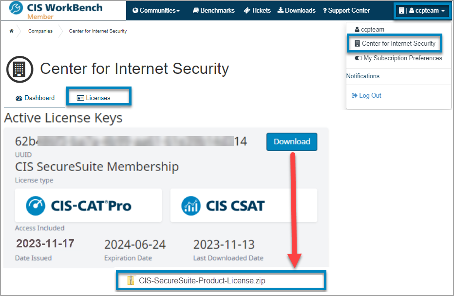
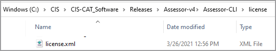

# CIS-CAT Pro Assessor SecureSuite License

------------

## License 
To unlock full feature and content access for CIS-CAT Pro Assessor, Members are required to download and apply their organization’s SecureSuite license from [https://workbench.cisecurity.org](https://workbench.cisecurity.org "CIS WorkBench").

If a valid license is not present in the defined location, CIS-CAT Pro Assessor will be limited to [Lite](https://learn.cisecurity.org/cis-cat-lite) functionality where the following restrictions apply:

- Outputs only HTML format. Other formats such as csv, post to Dashboard, json, and txt are blocked. Commands utilized requesting this output will be ignored.
- Assessment allowed only for limited set of CIS Benchmark automated assessment content, even if additional content is present. Allowed assessments:
	- Google Chrome
	- Microsoft Windows 10, domain joined
	- Microsoft Windows 10, standalone
	- Ubuntu

**Steps to Download Your SecureSuite License**

1. Login to [CIS WorkBench](https://workbench.cisecurity.org/dashboard)
2. Navigate to the [Downloads](https://workbench.cisecurity.org/files) menu item
3. Select `Download License` button

4. From the “Licenses” tab, select the `Download` button next to your key
	- NOTE: Ensue that JavaScript is unblocked on your browser if you do not see that the file has downloaded.
5. Navigate to the downloaded files and extract/unzip the contents
6. Open the folder where the extracted files were stored, and copy 
all of the extracted files in the "license" folder of CIS-CAT Pro Assessor v4.  This file location can be overridden by the "ciscat.license.filepath" property in the [assessor-cli.properties](https://ccpa-docs.readthedocs.io/en/latest/Configuration%20Guide/#properties) file. 

See example of where the files should be placed within the CIS-CAT folder structure.

### License Verification Method 

CIS-CAT Assessor v4 validate a Member’s license at the beginning of each command execution performed from the GUI or the command line. The license will attempt to validate against a CIS-hosted location via SSL port 8883 first. If the host machine is unable to validate online, CIS-CAT will validate the license from the key that is present in the specified location. By default, the location is in the “License” folder. To modify this location, specify a different location using the ciscat.license.filepath property in the assessor-cli.properties (v4 Assessor).

The method utilized to validate the license will be present in the assessor-cli.log when producing an INFO level log. 

### License Renewal 

The license file will expire when your SecureSuite Membership expires. Once your SecureSuite Membership renewal has been processed, a new license file bundle will be available in WorkBench. Download an updated license by following the initial license installation instructions, replacing the existing license files.
