CIS-CAT Pro Assessor V4 User Guide
=====================================

Introduction
------------
The CIS-CAT Pro Assessor v4 is a command-line and graphical user interface, allowing users to assess target systems against various forms of machine-readable content.  CIS-CAT Pro Assessor is designed primarily to assess CIS Benchmark configuration recommendations but can also assess content written in conformance with the Security Content Automation Protocol (SCAP), as well as plain OVAL definition content.

## Remote Assessment Capability ##
Arguably the most important feature to be included in CIS-CAT Pro Assessor v4 is the ability to assess remote endpoints.  Providing appropriate connection information allows CIS-CAT Pro Assessor to establish a "session", execute commands, run scripts, and perform collection and evaluation for the remote endpoint.  For Microsoft Windows endpoints, this "session" is established through the use of WinRM.  For Unix/Linux and Cisco network device endpoints, CIS-CAT Pro Assessor establishes the "session" via SSH.

Endpoints to be assessed must be configured appropriately to allow for remote access.  Please see the [CIS-CAT Pro Assessor Configuration Guide](./Configuration%20Guide) for more information.

## Benchmark Coverage ##
See the [CIS-CAT Pro Assessor Coverage Guide](./Coverage%20Guide) for the most up-to-date information regarding platform and application coverage.

## CIS-CAT Pro Assessor GUI ##

CIS-CAT Assessor Pro and Lite versions 4.1.0+ includes a graphical user interface (GUI) as part of the downloaded bundle. The GUI is compatible with a Microsoft Windows operating system. Open the application by running the Assessor-GUI.exe. The GUI provides a method to execute a configuration assessment in an easy, quick, and simple setup process. The interface offers a simple workflow for the basic, local system configuration scan as well as advanced workflows where multiple combinations of remote and local scanning can be performed.

The size of the downloaded application has increased from approximately 100MB to 175MB. If an organization's assessment workflows do not require use of a GUI and the additional space is a concern, it is safe to delete the executable file after downloading.

When using the GUI, there's no need to setup additional software components (no Java Runtime Environment (JRE) is needed. Command line and centralized assessment processes continue to require a suitable JRE.

The GUI does not currently support initialization from a network location. The Assessor v4 must reside on a machine's local drive in order for the GUI functions and content to operate successfully.

**NOTE: Assessor-GUI.exe must be executed by the Administrator or an equivalently privileged principal.**

### Benchmarks and GUI ###

The Assessor v4 GUI is primarily designed to work with official CIS Benchmarks. The application can also assess with tailored benchmarks if all the necessary files are placed in the Benchmark folder within the same folder structure as the GUI. Benchmarks are loaded on application start. It is important to restart the application if benchmarks were added to the folder while the GUI was open.

Tailored benchmarks must contain a portion of the original file name in order for the contents of the benchmark folder to appear in the benchmark selection window.

For example, if your organization tailors a Microsoft Windows 10 Benchmark, we recommend placing organization -specific descriptions at the beginning of the file. See the example below. Ensure that all files associated with the benchmark contain the original file name. It is important to ensure that `CIS` appears somewhere in the file name.

MyOrganization_CIS_Microsoft_Windows_10_Enterprise_Release_1909_Benchmark_v1.8.0-xccdf.xccdf

### Basic Workflow ###
The basic workflow option accommodates a local system scan only. 

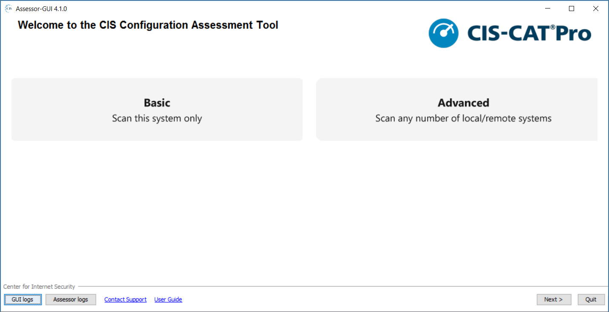

### Add a benchmark ###

The list of benchmarks will populate with the benchmark files located in the `benchmark` folder. Filter the list for easier selection by entering characters in the "Search" field. CIS-CAT Lite is restricted to a subset of CIS Benchmark selections.

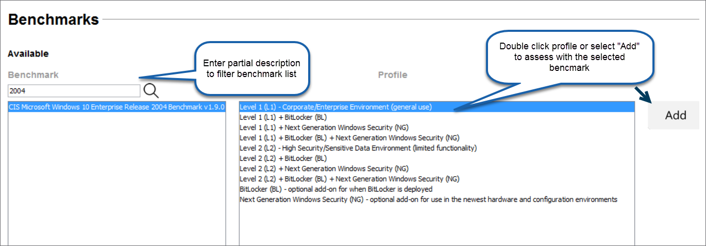

Benchmarks selected that require an interactive value will popup an entry box.

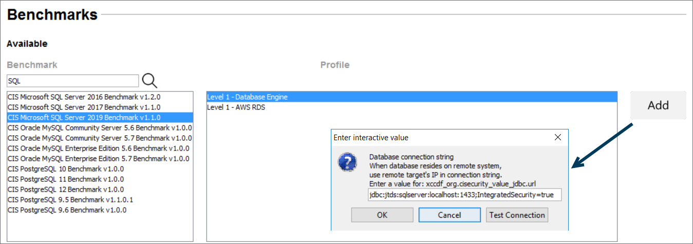

For testing connection strings, select the `Test` button.

### Advanced Options ###

The assessment process requires read/write access to a temporary folder. The system's default temporary folder will automatically be selected. As an option, modify the folder selected for use during the assessment process.

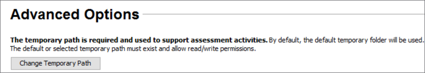

### Advanced Workflow ###
The advanced workflow option accommodates any combination of local or remote configuration assessments. With this option, it is also possible to upload a configuration XML or sessions.properties file to support remote or local configuration assessments.

#### Add remote or local target system ####

Select this option to begin adding one or many targets for assessment. Required fields contain an asterisk. Help text is available within the application for each field of entry by hovering over the green question mark icon.

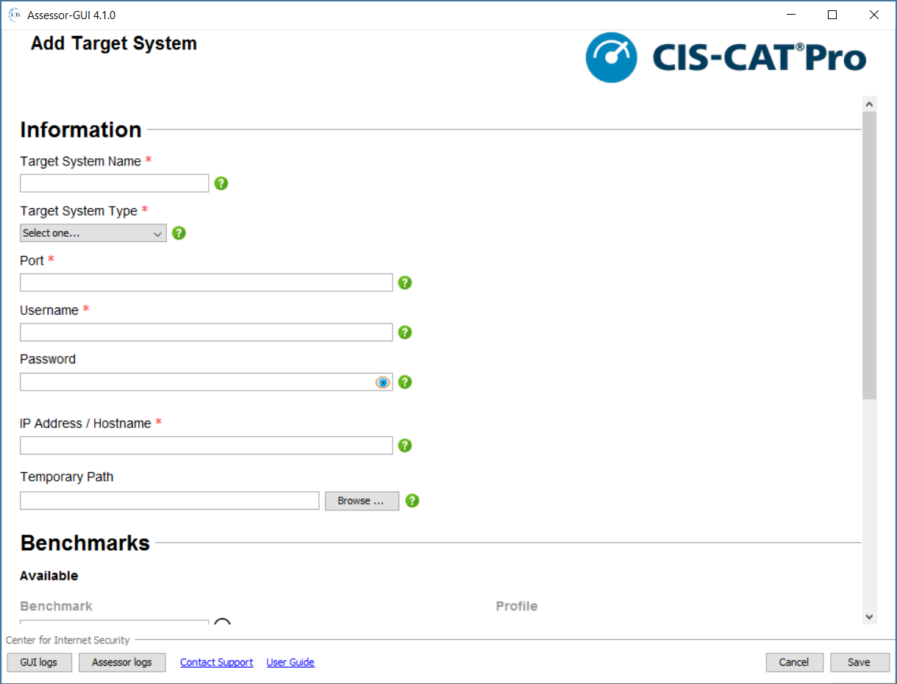 

#### Load a configuration or sessions file ####

Select `Load a configuration or sessions file` to utilize an existing file list of systems to scan. The application will only load *.xml or *.properties files with correct schema.

When an encrypted file has been selected, the application will prompt for the encryption password. If the correct password is provided, the file's contents are decrypted only in memory. The original file will remain encrypted and unaltered. The GUI will provide options to save the newly created file within the workflow

When utilizing the Advanced workflow and selecting to remotely scan a target for Windows, Unix/Linux, or Cisco IOS connection types, please remember to properly configure your endpoint to allow a successful communication between the CIS-CAT Pro host and the target.

### Assessment Options ###

Select reporting options in this screen. CIS-CAT Lite is restricted to producing only HTML.

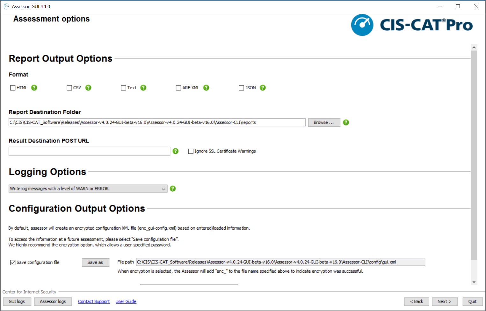

Logging options, by default, are set to `WARN or ERROR`.  For support issues, ensure to capture a log of `WARN, ERROR, or INFO` and provide this as an attachment to a [technical support ticket](https://www.cisecurity.org/support/).

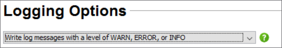

### Saving a configuration file and encryption ###

By default, the GUI creates an file in the `config` directory titled `enc_gui-config.xml`. For security purposes, the file is automatically encrypted with a complex, variable password. In order to utilize the created file in subsequent assessments, it is required to save a new file. Optionally, select to encrypt the file with a provided password.

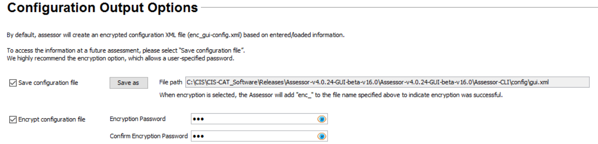

### Configuration Assessment ###

The top area of the screen of the screen tracks the progress of each individual assessment. Each step represents a distinct part of the assessment process.

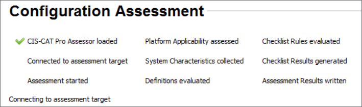

**Platform mismatch**

If a benchmark has been selected that does not match the operating system intended to assess, a platform mismatch error will occur and be displayed. If this occurs, determine if the correct benchmark was selected for the target system. If the benchmark selected was correct, it is possible to turn off this platform check in the assessor-cli.properties file by setting the property `ignore.platform.mismatch=TRUE`.

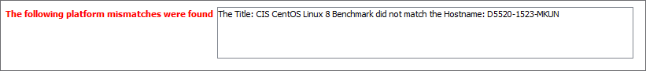

**Reports**

The "reports" area shows the only the generated HTML. The HTML output must be selected prior to the assessment process for this type of format to generate. Select the report to view and select `View HTML`. By default, all reports are shown in the "reports" folder. This can be modified in the "Assessment Options" screen prior to assessment. Navigate to the report folder by selecting `Show reports folder`. 

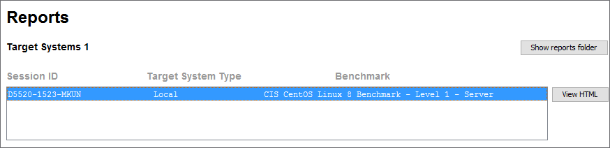

## Using CIS-CAT Pro Assessor CLI ##
Bundled with the application are two script files; a Microsoft Windows batch script, `Assessor-CLI.bat` and a Unix/Linux shell script, `Assessor-CLI.sh`.  These scripts serve as the entry point to the application.  Any examples included in this user's guide will utilize the Microsoft Windows batch script, but usage of the Unix/Linux shell script can be substituted.

**NOTE: These CIS-CAT scripts must be executed from the command line using root, Administrator, or an equivalently privileged principal.**

## Command Line Options ##
CIS-CAT Pro Assessor CLI can perform a variety of functions related to both benchmark and vulnerability assessments.  The myriad command-line options allow for combined usage to initiate these functions.

### Basic Options ###

Basic operation of CIS-CAT Pro Assessor CLI allows a user to get help, list available content, or to interactively step through the selection of a benchmark and profile prior to executing an assessment.

| Short Option  | Long Option   |  Argument(s)      | Description                    |
| ------------- | ------------- | ------------|---------------------------------- |
| `-h`          | `--help`      | N/A | Display CIS-CAT Pro Assessor help output. |
| `-l`          | `--list`      | N/A | List the benchmarks available for assessment.|
| `-lv`          | `--list-verbose` | N/A |Enable more verbose output when combined with the `-l` option, specifically displaying the full filepath to the benchmark, for later assessment using the `-b` option.|
| `-i`          | `--interactive` | N/A | Execute the Assessor in "interactive" mode specifically for benchmark assessments, allowing the user to manually select a benchmark and profile for assessment.  Based on the selected benchmark, the user may be required to enter "interactive values" which are then used by the assessment engine. |
| `-o`          | `--definitions` | N/A | Execute the Assessor in "interactive" mode specifically for the manual selection and evaluation of OVAL Definitions files, and (optionally) selecting and associating an OVAL Variables file as well. Must be used in conjunction with the `-i` option.|
| `-d`          | `--startingDir` | `<DIRECTORY>` | Configure the relative root folder from which other options, such as benchmarks, can be found. |
| `-cfg` |`--config-xml`|`<CONFIGURATION XML FILE>`| Execute CIS-CAT Pro Assessor using configuration information found in the `<CONFIGURATION XML FILE>`.  This file allows users to override user properties, configure interactive values, setup sessions and outline the various assessments to be performed.  See the "Using a Configuration XML File" section below for more information and examples regarding the structure and options for the XML configuration file.  Configuration files can be encrypted in order to help protect sensitive data (see the "File Encryption Options" section for details).|

#### Examples ####

Simply display the CIS-CAT Pro Assessor help information:

	> Assessor-CLI.bat -h

List all available benchmarks:

	> Assessor-CLI.bat -l

List all available benchmarks relative to a specific folder:

	> Assessor-CLI.bat -l -d C:\CIS\My-Benchmarks

List All Available Benchmarks (including path information for use with the `-b` option)

	> Assessor-CLI.bat -l -v

Execute an assessment of a benchmark/data-stream in "interactive" mode:

	> Assessor-CLI.bat -i

Execute an assessment of a benchmark/data-stream in "interactive" mode, selecting a benchmark from a location relative to a specific folder:

	> Assessor-CLI.bat -i -d C:\CIS\My-Benchmarks

Execute an assessment of an OVAL Definitions file in "interactive" mode:

	> Assessor-CLI.bat -i -o

Execute an assessment of an OVAL Definitions file in "interactive" mode, selecting the definitions file from a location relative to a specific folder:

	> Assessor-CLI.bat -i -o -d C:\CIS\My-Benchmarks

Execute an assessment or set of assessments using information found in a saved configuration XML file:

	> Assessor-CLI.bat -cfg C:\CIS\assessment-configuration.xml

### Benchmark/Data-Stream Collection Options ###
The benchmark and data-stream collection options provide users the ability to select specific content for assessment.  The `-b` option gives the user the choice to specify the path to either the XCCDF file (containing the `<Benchmark>` element) or the Data-stream collection file.  Using the `-p` option, users can select a specific configuration profile to assess, using either the profile's ID or the profile's title/name.

| Short Option  |  Long Option  |   Argument   | Description                      |
| ------------- | ------------- | -------------|--------------------------------- |
| `-b`          | `--benchmark` | `<BMK-OR-DSC>` | Specify either the full filepath to the assessment content or a path relative to the starting directory.  The `<BMK-OR-DSC>` argument represents either a Benchmark XCCDF file, or the SCAP 1.2-formatted Data-stream Collection file.|
| `-dm`         | `--data-stream` | `<DATA-STREAM>` | Used only when the `-b` option selects a data-stream-collection document, the `-dm` option specifies, within the collection, the ID of the data-stream to be assessed. |
| `-cl` | `--checklist` | `<CHECKLIST>` | Used only in conjunction with the `-dm` option, the `-cl` option specifies, within the data-stream, the ID of the checklist (benchmark) to be assessed.|
| `-p` | `--profile` | `<PROFILE>` | Specify either a profile name, such as `Level-1`, or the profile ID, such as `xccdf_org.cisecurity.benchmarks_profile_Level_1`.  Note that when using the profile name, if any spaces occur, the entire profile name must be wrapped in double-quotes, such as `"Level 2"`|
| `-bi` | `--benchmark-info` | N/A | When used in conjunction with the `-b` option, this option displays information about the selected content, including (for data-stream collections) data-streams, checklists, and (for all content) profile information. When used by itself, this options creates a text file listing all of the Benchmarks available in the benchmarks folder along with the profiles available for each Benchmark.  This list is generated in the folder where the Assessor is installed. |

#### Examples ####

Execute an assessment against the CIS Microsoft Windows 10 benchmark, using the relative path to the benchmark file, automatically selecting the first profile:

	> Assessor-CLI.bat -b benchmarks\CIS_Microsoft_Windows_10_Enterprise_Release_1703_Benchmark_v1.3.0-xccdf.xml

Execute an assessment against the CIS Microsoft Windows 10 benchmark, using the relative path to the benchmark file, selecting a specific profile by name:

	> Assessor-CLI.bat -b benchmarks\CIS_Microsoft_Windows_10_Enterprise_Release_1703_Benchmark_v1.3.0-xccdf.xml -p "Level 1 + BitLocker"

Execute an assessment against the CIS Microsoft Windows 10 benchmarks, using an absolute path to the benchmark file, automatically selecting the first profile:

	> Assessor-CLI.bat -b C:\CIS\MyBenchmarks\CIS_Microsoft_Windows_10_Enterprise_Release_1703_Benchmark_v1.3.0-xccdf.xml

Execute an assessment against the CIS Microsoft Windows Server 2016 data-stream collection, using the default first data-stream, default first checklist, and default first profile:

	> Assessor-CLI.bat -b benchmarks\CIS_Microsoft_Windows_Server_2016_Benchmark_v1.0.0-datastream.xml

Execute an assessment against the CIS Microsoft Windows Server 2016 data-stream collection, using a specific data-stream, the default first checklist, and default first profile:

	> Assessor-CLI.bat -b benchmarks\CIS_Microsoft_Windows_Server_2016_Benchmark_v1.0.0-datastream.xml -dm scap_org.cisecurity_datastream_1.0.0_CIS_Microsoft_Windows_Server_2016_Benchmark

Execute an assessment against the CIS Microsoft Windows Server 2016 data-stream collection, using a specific data-stream, a specific checklist, and the default first profile:

	> Assessor-CLI.bat -b benchmarks\CIS_Microsoft_Windows_Server_2016_Benchmark_v1.0.0-datastream.xml -dm scap_org.cisecurity_datastream_1.0.0_CIS_Microsoft_Windows_Server_2016_Benchmark -cl xccdf_org.cisecurity.benchmarks_benchmark_1.0.0_CIS_Microsoft_Windows_Server_2016_Benchmark

Execute an assessment against the CIS Microsoft Windows Server 2016 data-stream collection, using a specific data-stream, a specific checklist and a specific profile:

	> Assessor-CLI.bat -b benchmarks\CIS_Microsoft_Windows_Server_2016_Benchmark_v1.0.0-datastream.xml -dm scap_org.cisecurity_datastream_1.0.0_CIS_Microsoft_Windows_Server_2016_Benchmark -cl xccdf_org.cisecurity.benchmarks_benchmark_1.0.0_CIS_Microsoft_Windows_Server_2016_Benchmark -p "Level 1 - Member Server"

Display extensive information about a specific benchmark:

	> Assessor-CLI.bat -b benchmarks\CIS_Microsoft_Windows_Server_2016_Benchmark_v1.0.0-datastream.xml -bi

Create a text file listing all available Benchmarks and their profiles:

	> Assessor-CLI.bat -bi

### OVAL Definitions Assessment Options ###
CIS-CAT Pro Assessor also has the ability to assess OVAL definitions files, such as vulnerability definitions downloaded from the OVAL repository.  Using an OVAL Variables file also allows for the injection of "external" variable values into the assessment of OVAL definitions content.

| Short Option  |  Long Option  |   Argument   | Description                      |
| ------------- | ------------- | -------------|--------------------------------- |
| `-od     ` | `--oval-definitions` | `<OVAL_DEFINITIONS>` | Specify either the full filepath to an OVAL Definitions XML file, or a path relative to the starting directory.|
| `-ov` | `--oval-variables` | `<OVAL_VARIABLES>` | Only used in conjunction with the `-od` option, the `-ov` option specifies either the full filepath to an OVAL Variables XML file, or a path relative to the starting directory.|

#### Examples ####

Execute an assessment against the Microsoft Windows 10 vulnerability definitions:

	> Assessor-CLI.bat -od vulnerabilities\microsoft_windows_10.xml

Execute an assessment against the Microsoft Windows 10 vulnerability definitions, producing both an OVAL Result XML file, and an HTML report:

	> Assessor-CLI.bat -od vulnerabilities\microsoft_windows_10.xml -html

Execute an assessment against an OVAL Definitions file containing "external" variables, using an OVAL Variables file to provide those variable values:

	> Assessor-CLI.bat -od C:\CIS\oval_definitions.xml -ov C:\CIS\oval_variables.xml

Execute an assessment against an OVAL Definitions file containing "external" variables, using an OVAL Variables file to provide those variable values, producing both an OVAL Results XML file, and an HTML report:

	> Assessor-CLI.bat -od C:\CIS\oval_definitions.xml -ov C:\CIS\oval_variables.xml -html

### Reporting Options ###
A number of options exist for generating assessment results.  When a benchmark or data-stream collection is assessed, the Asset Reporting Format (ARF) results are generated.  The ARF report is an XML document containing Asset Information for the endpoint under assessment, the benchmark/data-stream that was assessed, system characteristics, and assessment results.  When OVAL Definitions are assessed, an "OVAL results with system characteristics" XML document is produced by default.  These reports are automatically generated and cannot be disabled.  These XML documents are designed to be either uploaded directly to CIS-CAT Pro Dashboard, or transformed into more human-readable HTML, CSV or plain-text documents.

The following table summarizes a number of options controlling which reports to generate, naming of reports, and functionality allowing users to upload reports to a URL, such as CIS-CAT Pro Dashboard.

| Short Option  |   Long Option   |    Argument   | Description                       |
| ------------- | --------------- | --------------|---------------------------------- |
| `-rd`         | `--reports-dir` | `<DIRECTORY>` | Configure the report destination folder, allowing users to configure the location to which result reports are written.|
| `-rp`         | `--report-prefix` | `<PREFIX>` | Configure the "front" portion of the report name generated by the tool.  Every report will automatically be of the format `[report-prefix]-[timestamp].[extension]` such as `CIS-CAT-TEST-Windows10-20171218T173220Z.xml`, unless the `-nts` option is used to eliminate the timestamp portion.|
| `-nts`        | `--no-timestamp`  | N/A | When provided, do NOT include a timestamp in the generated report names.|
| `-html` | N/A | N/A | Generate an HTML report.  The report name will be of the format `[report-prefix]-[timestamp].html`|
| `-csv` | N/A | N/A | Generate a CSV report.  The report name will be of the format `[report-prefix]-[timestamp].csv`|
| `-txt` | N/A | N/A | Generate a plain text report.  The report name will be of the format `[report-prefix]-[timestamp].txt`|
| `-json` | N/A | N/A | Generate a full JSON report for all configuration assessment results.  The report name will be of the format `[report-prefix]-[timestamp].json`|
| `-npr` | N/A | N/A | Generate a JSON report for non-pass configuration assessment results.  The report name will be of the format `[report-prefix]-[timestamp]-[NonPassing].json`|
| `-u` | `--url`| `<REPORTS-URL>` | Specify a URL to which Assessor results are uploaded, using HTTP(S) POST.|
| `-ui` | `--ignore-warnings` | N/A | Indicate that, when uploading results to a URL via the `-u` option, any SSL certificate warnings should be ignored.|
| `-narf` | `--no-arf` | N/A| This option disables the generation of Asset Reporting Format (ARF) XML results.  The ARF report is the default report generated by the Assessor.|
| `-nrf` | `--no-report-file` | N/A | This option disables generation of a results report file.  When utilizing the `-u` option, Assessor results are uploaded to the supplied URL.  In that use-case, report files are generally not needed.|

#### Examples ####
Execute CIS-CAT Pro Assessor CLI interactively, generating both an Asset Reporting Format result (by default) and an HTML report, saving them to the default reports folder:

	> Assessor-CLI.bat -i -html
	> 

Execute an assessment against the CIS Microsoft Windows 10 benchmark, using the relative path to the benchmark file, automatically selecting the first profile.  Generate both the Asset Reporting Format (ARF) by default and an HTML report.  Save the reports to a specific reports folder:

	> Assessor-CLI.bat -b benchmarks\CIS_Microsoft_Windows_10_Enterprise_Release_1703_Benchmark_v1.3.0-xccdf.xml -html -rd C:\CIS\custom\reports

Execute an assessment against the CIS Microsoft Windows 10 benchmark, using the relative path to the benchmark file, automatically selecting the first profile.  Generate both the Asset Reporting Format (ARF) by default and an HTML report.  Save the reports to the default reports folder, but name the reports in a custom format:

	> Assessor-CLI.bat -b benchmarks\CIS_Microsoft_Windows_10_Enterprise_Release_1703_Benchmark_v1.3.0-xccdf.xml -html -rp "CCPA-Windows10"

Execute an assessment against the CIS Microsoft Windows 10 benchmark, using the relative path to the benchmark file, automatically selecting the first profile.  Configure the application to not generate any physical report files, but to upload the results to CIS-CAT Pro Dashboard, ignoring any SSL certificate warnings:

	> Assessor-CLI.bat -b benchmarks\CIS_Microsoft_Windows_10_Enterprise_Release_1703_Benchmark_v1.3.0-xccdf.xml -nrf -u https://ccpd.example.org/CCPD/api/reports/upload -ui
**Note:** This command will only work if you follow the instructions from [Direct command line usage](./Configuration%20Guide/#cis-cat-pro-dashboard-integration) section.

### Logging Options ###
The following table describes the various options to control the application log file generation.  By default, the Assessor-CLI application is configured to log at the WARN level.

| Short Option  |   Long Option   |    Argument   | Description                       |
| ------------- | --------------- | --------------|---------------------------------- |
| -nl           | --no-logging    | N/A | Disable all logging.
| -v            | --error         | N/A | Only write log messages with a level of ERROR.|
| -vv           | --warn          | N/A | Write log messages with a level of WARN or ERROR.|
| -vvv          | --info          | N/A | Write log messages with a level of WARN, ERROR, or INFO.|
| -vvvv         | --debug         | N/A | Write log messages with a level of WARN, ERROR, INFO, or DEBUG.|
| -vvvvv        | --trace         | N/A | Write log messages with a level of WARN, ERROR, INFO, DEBUG, or TRACE.|
| -vvvvvv       | --all           | N/A | Write all log messages.|

#### Examples ####
Execute an "interactive" assessment at the INFO log level:

	> Assessor-CLI.bat -i -vvv

Execute an assessment against the CIS Microsoft Windows 10 benchmark, using the Level 2 profile, writing log messages at the DEBUG log level:

	> Assessor-CLI.bat -b benchmarks\CIS_Microsoft_Windows_10_Enterprise_Release_1703_Benchmark_v1.3.0-xccdf.xml -p "Level 2" -vvvv

### Miscellaneous Options ###

| Short Option  |   Long Option   |    Argument   | Description                       |
| ------------- | --------------- | --------------|---------------------------------- |
| `-vdd` | `--vulnerability-definitions` | N/A | Download the latest supported vulnerability definitions.  See the [CIS-CAT Pro Assessor Coverage Guide](./Coverage%20Guide) for the most up-to-date information regarding vulnerability definitions platform coverage.  Vulnerability definitions files are saved into the application's `vulnerabilities` folder, i.e. `C:\CIS\Assessor-CLI\vulnerabilities`.|
| `-sessions`| `--sessions`| `<SESSIONS.PROPERTIES>`| The `-sessions` option allows users to configure multiple endpoints for assessment of a benchmark.  The `sessions.properties` file configures CIS-CAT Pro Assessor for the assessment of remote endpoints by specifying remote hosts, ports, and credentials which the application will use for connection, collection and evaluation of benchmark recommendations and/or vulnerabilities.  See "Remote Assessment Capability" below for more information.    If no `sessions.properties` file exists or no connections are configured in the file, CIS-CAT Pro Assessor CLI will assess the local machine.  Sessions.properties files can be encrypted in order to help protect sensitive data (see the "File Encryption Options" section for details).|
| `-props`| `--properties`| `<PROPERTIES-FILE>`| The CIS-CAT Pro Assessor CLI user properties file defaults many runtime properties used during the assessment process.  These properties may be customized per assessment or per endpoint, by creating individual properties files, and specifying either the full filepath or a path relative to the working directory.  If this option is not specified, CIS-CAT Pro Assessor CLI will load a default properties file named `assessor-cli.properties` located in the `config` folder of the application installation.|
| `-D`| N/A| `<Property=Value>`| Instead of creating a new properties file for unique assessments, individual user properties may be specified using the `-D` option together with a `property=value` pair.  This allows an assessment to only override specific user properties when only a small number differ from the defaults.|
| `-test` | `--test`| N/A | The `-test` option allows the user to perform connection tests on any sessions configured to execute during the assessments.  These sessions may be loaded from a configuration XML file (`-cfg`) or from a sessions.properties file (`-sessions`).  When specified, connectivity tests are performed and reported to the user on the CIS-CAT Pro Assessor console.  Once completed, CIS-CAT Pro Assessor exits.  When the `-test` option is supplied, no assessments take place; only the connectivity tests.|
| `-q`| `--quiet`| N/A | Enable the Assessor to execute in "quiet mode", causing the suppression of any assessment status information from being written to the console.|

#### Examples ####
Download the latest vulnerability definitions:

	> Assessor-CLI.bat -vdd

Download the latest vulnerability definitions when using an HTTPS Proxy:

	> Assessor-CLI.bat -vdd -D https.proxyHost=PROXY_HOSTNAME_OR_IP -D https.proxyPort=PROXY_PORT

Download the latest vulnerability definitions when using an HTTP Proxy:

	> Assessor-CLI.bat -vdd -D http.proxyHost=PROXY_HOSTNAME_OR_IP -D http.proxyPort=PROXY_PORT

Execute a vulnerability assessment for the Microsoft Windows Server 2012 R2 platform, producing both an OVAL Result XML file, and an HTML report:

	> Assessor-CLI.bat -od vulnerabilities\microsoft_windows_server_2012_r2.xml -html

Execute an assessment against the CIS Microsoft Windows 10 benchmark, using the relative path to the benchmark file, automatically selecting the first profile, assessing a number of remote machines, configured in a specific session configuration file:

	> Assessor-CLI.bat -b benchmarks\CIS_Microsoft_Windows_10_Enterprise_Release_1703_Benchmark_v1.3.0-xccdf.xml -sessions C:\CIS\sessions\windows_10_machines.properties

Execute an assessment against the CIS Oracle Database 11g R2 benchmark, selecting the Windows Server Host OS profile, and configuring the required "interactive" values:

	> Assessor-CLI.bat -b benchmarks\CIS_Oracle_Database_11g_R2_Benchmark_v2.2.0-xccdf.xml -p "Level 1 - Windows Server Host OS" -D xccdf_org.cisecurity_value_jdbc.url=jdbc:oracle:thin:user/s3cr3t@DBHOST:1521:devdb -D xccdf_org.cisecurity_value_listener.ora=C:\product\oracle\network\admin\listener.ora

Using a customized properties file defining session connections, test the connectivity of each session and exit:

	> Assessor-CLI.bat -sessions config\test-sessions.properties -test

Execute the Assessor, against the CIS Microsoft Windows 10 benchmark, in "quiet mode"

	> Assessor-CLI.bat -b benchmarks\CIS_Microsoft_Windows_10_Enterprise_Release_1703_Benchmark_v1.3.0-xccdf.xml -q

### File Encryption Options ###
To help protect sensitive data, such as target system login credentials, configuration XML files and sessions.properties files used to drive the assessment process can be encrypted via use of a password.  An encrypted copy of the source file is created and written to the `config` folder, preserving the plaintext source file for possible future updates and as a backup in case the password used to encrypt the file is forgotten or lost.  The name of the encrypted file will be **"enc_"** followed by the source file's name.  The plaintext source files should be stored in a secure location after creating an encrypted copy of them.  The same password used to encrypt a particular file is also used by the Assessor to decrypt that file in memory for use in the assessment process.

Encryption passwords can include special characters.  Many special characters do not need to be escaped when they are used within a quoted string, but certain characters may cause unanticipated consequences.  For example, the percent (%) character has a special meaning for command line parameters in Windows and should be escaped if you intend to use it in a password.  To help ensure passwords are processed appropriately, **it is recommended to enclose passwords in quotes both when encrypting a file and when using an encrypted file in the assessment process.**  The quotes handle most special characters without having to escape those characters and are necessary to preserve any blank spaces in a password.  **Use double quotes on the Windows command line and single quotes for Unix/Linux.**

| Short Option  |   Long Option   |    Argument   | Description                       |
| ------------- | --------------- | --------------|---------------------------------- |
| `-e` | `--encrypt` | `<FILE TO ENCRYPT>` | The full path to the sessions.properties file or configuration.xml file to be encrypted, including the file name and its extension.|
| `-ep`| `--encryption-password`| `<ENCRYPTION PASSWORD>`| The password that will be used to encrypt a sessions.properties file or configuration.xml file.  It is recommended to enclose this password in quotes.|
| `-fp`| `--file-password`| `<FILE PASSWORD>`| The password originally used to encrypt a sessions.properties file or configuration.xml file.  This command line option is used in conjunction with the `-cfg` and `-sessions` options when utilizing an encrypted configuration XML file or sessions.properties file.  It is recommended to enclose this password in quotes.|

#### Examples ####
Encrypt a configuration XML file:

	> Assessor-CLI.bat -e C:\Test\config_file.xml -ep "MyP@ssword$@!*&"

Use an encrypted configuration XML file in the assessment process:

	> Assessor-CLI.bat -cfg C:\Test\enc_config_file.xml -fp "MyP@ssword$@!*&"

## Configuring Interactive Values for Select Benchmarks##
A number of benchmarks supported by/bundled with CIS-CAT Pro Assessor require manual interaction by the user in order to configure specific values used during the assessment.  These "interactive values" will be required to complete some assessments. If the values are not available, the assessor will prompt the user to enter the values on the command line or in the GUI.

Absence of these values will block the completion of the assessment if it is being executed off-hours, or as part of an automated script.  

CIS-CAT Pro Assessor provides various mechanisms for entry of interactive values. In order to configure the value properly, it's important to utilize the value's `id` attribute within the benchmark or data-stream collection component.  The [CIS-CAT Pro Assessor Coverage Guide](./Coverage%20Guide) provides a listing, for each applicable benchmark, for any "interactive value" `id` attributes.

- **Properties File:** To accommodate a single assessment, modify the `assessor-cli.properties` file to specify the value, for example:

	xccdf_org.cisecurity_value_jdbc.url=jdbc:oracle:thin:system/manager@dbhost:1521:orcl

	When CIS-CAT Pro Assessor executes, the program will (by default) attempt to load properties contained in the `config\assessor-cli.properties`. If a Benchmark is selected on the command line that requires an interactive value, assessor will look in the assessor-cli.properties for the `id` attribute it requires to complete the assessment. The first value for the necessary `id` will be selected.

- **Command Line (-D Option):** Use in multiple commands. Specify the interactive value using `-D <Property=Value>` in the command to execute an assessment. If provided, you won't be prompted to enter the value. This allows the user to configure a single property at a time when executing. Configuring this option on the command-line is straightforward, where the property name is the `id` attribute of the "interactive value" and the property value is configured:

	> Assessor-CLI.bat -b benchmarks\CIS_Oracle_Database_11g_R2_Benchmark_v2.2.0-xccdf.xml -p "Level 1 - Windows Server Host OS" -D xccdf_org.cisecurity_value_jdbc.url=jdbc:oracle:thin:user/s3cr3t@DBHOST:1521:devdb

- **GUI:** The interactive value can be specified in the GUI in the Basic or Advanced workflow. When a Benchmark is selected that requires an interactive value, you will be prompted to enter the value. For multiple endpoints with different interactive values, a separate target must be entered for each target even if they exist on the same host. See the below example.

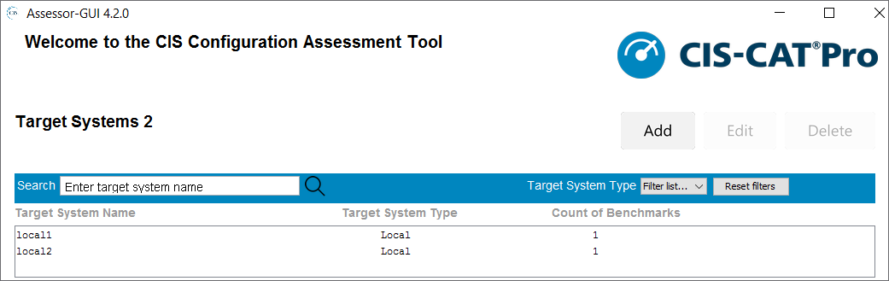

- **Configuration XML:** This is the best option for assessment of multiple benchmarks. A configuration file can contain multiple targets. The interactive value can be specified on each target. The GUI can be used to help create configuration files, which can then be used on the command line. See [information on using a configuration XML file.](https://ccpa-docs.readthedocs.io/en/latest/User%20Guide%20for%20CLI/#using-cis-cat-pro-assessor-cli)

## Using a Configuration XML File ##
CIS-CAT Pro Assessor can be executed using the `-cfg` option, and specifying a configuration XML file.  This XML file allows user to configure sessions, assessments, interactive values, user properties, and reporting options all in a single file.  This configuration XML file essentially allows for multiple benchmark assessments against multiple endpoints both local and/or remote.

An XML schema is included in the CIS-CAT Pro Assessor CLI bundle, along with a sample configuration file.

### Using Special Characters in XML Elements ###
Some user-entered characters in the XML configuration file may need to be replaced with their numeric character reference equivalent to work properly.  For example, an ampersand (&) character to be used in a password for the credentials element should be replaced with the decimal character reference `&#38;`.  See the full list of decimal character references at [https://en.wikipedia.org/wiki/Numeric_character_reference](https://en.wikipedia.org/wiki/Numeric_character_reference "Numeric Character References").

### Configuration XML Elements ###
The root element of the configuration XML file is `<configuration>`, and utilizes a default namespace URI of `http://cisecurity.org/ccpa/config`.  This namespace URI must be specified or else validation of the configuration XML file will fail.  The root of any XML configuration file should appear as follows:

	<configuration xmlns="http://cisecurity.org/ccpa/config">

All other elements must be contained within the `<configuration>` element.

The following sections describe the elements that are available for configuration through the XML file:

#### CIS-CAT Pro Assessor "starting directory" ####
	<starting_dir>C:\Projects\CIS-CAT\Assessor-CLI</starting_dir>
The `starting_dir` element is optional and contains a value noting the base directory from which any relative paths are specified (such as the location of an XCCDF benchmark).  This element is the equivalent of the `-d` command-line option.  If this element is not present in the configuration file, the default starting directory, the folder in which CIS-CAT Pro Assessor is installed, is used.

#### Vulnerability Definitions Download ####
	<vulnerability_definitions download="(true|false)"/>
The `vulnerability_definitions` element contains a single attribute, `download`.  If this attribute's value is `true`, CIS-CAT Pro Assessor will download the latest vulnerability definitions.  This element/attribute is equivalent to the `-vdd` command-line option.  If this element is not present in the configuration file, or the `download` attribute is set to `false`, vulnerability definitions will not be downloaded.

#### Sessions ####
The `sessions` element configures each individual connection to either the local host or a remote endpoint.  An attribute of the `sessions` element, `test` indicates whether this configuration file is meant to test the connectivity of each session only.  When the `test` attribute is `true`, connectivity tests will take place, and CIS-CAT Pro Assessor will then exit.  No other assessment processing will take place.

	<!-- Session configurations referenced by the assessments -->
	<sessions test="(true|false)">
		
		<!-- A "connection" to the local host -->
		<session id="local">
			<type>local</type>
			<tmp_path>C:\Temp</tmp_path>
		</session>
		
		<!-- A connection to a remote Ubuntu instance using a private key file -->
		<session id="aws-ubuntu">
			<type>ssh</type>
			<host>11.22.33.44</host>
			<port>22</port>
			<user>ubuntu</user>
			<identity>C:\Path\To\aws-ubuntu.ppk</identity>
			<tmp_path>/path/to/temp/folder</tmp_path>
		</session>
		
		<!-- A connection to a remote CentOS instance using a private key file secured with a passphrase -->
		<session id="aws-centos">
			<type>ssh</type>
			<host>1.2.3.4</host>
			<port>22</port>
			<user>centos</user>
			<identity>C:\Path\To\aws-centos.ppk</identity>
			<identity_passphrase>P@55phr@s3!</identity_passphrase>
			<tmp_path>/path/to/temp/folder</tmp_path>
		</session>
		
		<!-- A connection to a remote Windows instance using credentials -->
		<session id="aws-2012r2">
			<type>windows</type>
			<host>AWS-WIN2012R2-AMI</host>
			<port>5986</port>
			<user>Administrator</user>
			<credentials>P@ssw0rd12345</credentials>
		</session>
		
		<!-- A connection to a Cisco IOS device, using a private key file -->
		<session id="cisco-ios1">
			<type>ios</type>
			<host>55.66.77.88</host>
			<port>22</port>
			<user>ciscoprivd</user>
			<identity>C:\Path\To\cisco-ios-private-key.ppk</identity>
			<enable_password>3n@bl3mePlz</enable_password>
		</session>
	</sessions>

Each `session` consists of a number of elements configuring the connection to the target endpoint:

- `id`: Each session must have a unique id.
- `type`:  The session `type` indicates a "flavor" of the connection to the endpoint being assessed.  A number of options exist for the `type` value, as noted in the [CIS-CAT Pro Assessor Configuration Guide](./Configuration%20Guide).
	- **`local`**:  The "local" session type indicates that the assessment(s) will be performed in a host-based manner.  No further session information is required when using a "local" session.
	- **`ssh`**:  The "ssh" session type indicates the connection is to a remote Unix/Linux/Mac endpoint.  This session type allows CIS-CAT Pro Assessor to utilize the `host`, `port`, `user`, and either `credentials` and/or `identity` (and optionally an `identity_passphrase`) to create a SSH connection to the endpoint and use that SSH connection to execute the assessment.
	- **`windows`**:  The "windows" session type indicates (obviously) a connection to a remote Microsoft Windows endpoint.  This session type allows CIS-CAT Pro Assessor to utilize the `host`, `port`, `user`, `credentials` to initiate a WinRM connection to the remote endpoint.
	- **`ios`**:  The "ios" session type indicates a connection to a remote Cisco IOS device, such as a router or switch.  This session type allows CIS-CAT Pro Assessor to utilize the `host`, `port`, `user`, and either `credentials` and/or `identity` (and optionally an `identity_passphrase`) to create a SSH connection to the endpoint and use that SSH connection to execute the assessment.
- `host`:  The "host" element value is either the hostname or IP address of the endpoint to which this session will connect/assess.
- `port`:  The "port" element value is the port number on which communication takes place.  For `ssh` or `ios` connections, the default value for `port` is 22.  For `windows` sessions, the default value is 5986.
- `user`:  The "user" element value specifies the username used to log on to the remote endpoint.  For `ssh` sessions, this user should be either `root` or a username with the ability to `sudo`, in order to elevate privileges to execute the required commands.  For `windows` sessions, the user must be either an Administrator or a member of the Administrators group.  For `ios` sessions, the user must be privileged and able to enter into "enable" mode on that device, using the `enable_password` value below.
- `credentials`:  The "credentials" element identifies the user's password for logging on to the remote endpoint.  Note that this XML file will then be storing users and passwords for remote endpoints, and should thus be secured as much as possible on the machine hosting CIS-CAT Pro Assessor.  When the session type is either `ssh` or `ios`, the `credentials` element can be bypassed by logging into the remote endpoint using a private key file, the path of which is configured in the `identity` element.  If a private key is used for authentication, the `credentials` element can either be left out of the `session` configuration, or included for use when commands must be executed with elevated privileges using `sudo`, and the credentials are required for that user.
- `identity`:  The `identity` element specifies the full filepath to a private key file to be used for authenticating the `user` to the remote endpoint.  When configuring a `session`, the `identity` may require the specification of the `identity_passphrase` in order for authentication to complete successfully.  Note that for `windows` sessions, private key authentication is not currently supported.
- `identity_passphrase`: The `identity_passphrase` element contains credentials required to complete authentication using the private key specified in the `identity` element. If this element exists for a session, but its value is left blank in the file, the user will be prompted to enter the passphrase for that session on the command line as part of initializing all of the sessions at the beginning of an assessment.
- `enable_password`:  When authenticating a privileged user for `ios` sessions, the `enable_password` is mandatory.  This element specifies the credentials which allow the privileged user to enter "enable" mode on the Cisco IOS device.
- `tmp_path`: Configure a custom "temp" directory location for use in creating the "ephemeral" directory on the target endpoint.  The "ephemeral" directory is named `ccpa-temp-TIMESTAMP` and is created as a sub-folder of the directory specified in this setting.  For example, if `tmp_path` is specified as `C:\Temp`, the "ephemeral" directory will be created at `C:\Temp\ccpa-temp-TIMESTAMP`.  **NOTE**: When specifying a value for `tmp_path`, this directory MUST ALREADY EXIST on the target endpoint.  In the above example, if the `C:\Temp` folder does not exist, the connection from CIS-CAT Pro Assessor v4 will not succeed.  If this property is left blank or not included, the Assessor will use the default "temp" folder as defined for the operating system, such as `/tmp` or `C:\Windows\Temp`.  Further information regarding the `tmp_path` and considerations for Unix/Linux environments can be found in the [CIS-CAT Pro Assessor Configuration Guide](./Configuration%20Guide).
- `path_to_tech_support` property is REQUIRED when assessing the exported configuration of a network device. This property specifies the full path to the exported configuration file.

When assessing non-network device endpoints, or assessing a network devices' current running configuration via SSH, the path_to_tech_support property is unnecessary.

The path_to_tech_support property is not needed when the session type is local.

#### Assessments ####
The `assessments` element configures which assessment content will be evaluated, against which `session` that content will be assessed, any User properties specific to that assessment, and/or any "interactive" values to be applied to that assessment.

	<assessments>
		<!-- XCCDF COLLECTIONS -->
		<benchmark xccdf="benchmarks\CIS_Ubuntu_Linux_16.04_LTS_Benchmark_v1.0.0-xccdf.xml" profile="Level 1 - Workstation" session-ref="aws-ubuntu"/>
		<benchmark xccdf="benchmarks\CIS_Ubuntu_Linux_16.04_LTS_Benchmark_v1.0.0-xccdf.xml" profile="Level 1 - Server" session-ref="aws-ubuntu"/>
		
		<benchmark xccdf="benchmarks\CIS_Microsoft_Windows_Server_2012_R2_Benchmark_v2.2.1-xccdf.xml" profile="Level 1 - Member Server" session-ref="aws-2012r2">
			<properties>
				<property name="ignore.platform.mismatch">true</property>
			</properties>
		</benchmark>
		
		<benchmark xccdf="benchmarks\CIS_Oracle_Database_11g_R2_Benchmark_v2.2.0-xccdf.xml" profile="Level 1" session-ref="aws-ubuntu">
			<interactive_values>
				<value id="xccdf_org.cisecurity_value_jdbc.url">jdbc:oracle:thin:sys/passw0rd1@DB-SERVER:1521:ORCL</value>
				<value id="xccdf_org.cisecurity_value_listener.ora">/opt/oracle/product/oracle11g/network/admin/listener.ora</value>
			</interactive_values>
		</benchmark>
		
		<!-- DATA-STREAM COLLECTIONS -->
		<data-stream-collection collection="dsc-id" data-stream="ds-id" checklist="benchmark-id" profile="profile-id-or-name" session-ref="local"/>
		
		<!-- OVAL DEFINITIONS COLLECTIONS -->
		<oval_definitions definitions="vulnerabilities\microsoft_windows_10.xml" session-ref="local"/>
		<oval_definitions definitions="definitions\defs.xml" variables="definitions\vars.xml" session-ref="local"/>
	</assessments>

A number of elements may be configured, allowing various assessments against a number of different sessions:

**Assess an XCCDF `<Benchmark>`, selecting the first Profile**:

	<benchmark xccdf="benchmarks\CIS_Ubuntu_Linux_16.04_LTS_Benchmark_v1.0.0-xccdf.xml" session-ref="aws-ubuntu"/>
- `xccdf`: The "xccdf" attribute defines the path (relative to the `starting_dir` or absolute) to the XCCDF file being assessed.
- `session-ref`: The "session-ref" attribute specifies the `id` of a `session` configured in the `sessions` configuration, described above.

**Assess an XCCDF `<Benchmark>`, selecting a named Profile**:

	<benchmark xccdf="benchmarks\CIS_Ubuntu_Linux_16.04_LTS_Benchmark_v1.0.0-xccdf.xml" profile="Level 1 Workstation" session-ref="aws-ubuntu"/>
- `xccdf`: The "xccdf" attribute defines the path (relative to the `starting_dir` or absolute) to the XCCDF file being assessed.
- `profile`: The "profile" attribute defines the configuration Profile, within the XCCDF, selected for assessment.  The value of this attribute may be either the Profile `<title>` or `id` specified in the Benchmark XCCDF.
- `session-ref`: The "session-ref" attribute specifies the `id` of a `session` configured in the `sessions` configuration, described above.

**Assess an XCCDF `<Benchmark>`, selecting a named Profile, and configuring specific assessment properties**:

	<benchmark xccdf="benchmarks\CIS_Microsoft_Windows_Server_2012_R2_Benchmark_v2.2.1-xccdf.xml" profile="Level 1 Member Server" session-ref="aws-2012r2">
		<properties>
			<property name="ignore.platform.mismatch">true</property>
		</properties>
	</benchmark>
- `xccdf`: The "xccdf" attribute defines the path (relative to the `starting_dir` or absolute) to the XCCDF file being assessed.
- `profile`: The "profile" attribute defines the configuration Profile, within the XCCDF, selected for assessment.  The value of this attribute may be either the Profile `<title>` or `id` specified in the Benchmark XCCDF.
- `session-ref`: The "session-ref" attribute specifies the `id` of a `session` configured in the `sessions` configuration, described above.
- `properties`: The "properties" element serves as a container for individual `property` elements.  A `properties` element must contain 1..n `property` element(s).
- `property`: A "property" defines a name/value pair, configuring a single user property named by the value of the `name` attribute.  The value of the `property` is the content of the element.  An individual `property` is the equivalent of using the `-D name=value` command-line option, or a property defined in the "assessor-cli.properties" file, located in the `config` folder.

**Assess an XCCDF `<Benchmark>`, selecting a named Profile, configuring specific values normally requested from the user**:

	<benchmark xccdf="benchmarks\CIS_Oracle_Database_11g_R2_Benchmark_v2.2.0-xccdf.xml" profile="Level 1" session-ref="aws-ubuntu">
		<interactive_values>
			<value id="xccdf_org.cisecurity_value_jdbc.url">jdbc:oracle:thin:sys/passw0rd1@DB-SERVER:1521:ORCL</value>
			<value id="xccdf_org.cisecurity_value_listener.ora">/opt/oracle/product/oracle11g/network/admin/listener.ora</value>
		</interactive_values>
	</benchmark>
- `xccdf`: The "xccdf" attribute defines the path (relative to the `starting_dir` or absolute) to the XCCDF file being assessed.
- `profile`: The "profile" attribute defines the configuration Profile, within the XCCDF, selected for assessment.  The value of this attribute may be either the Profile `<title>` or `id` specified in the Benchmark XCCDF.
- `session-ref`: The "session-ref" attribute specifies the `id` of a `session` configured in the `sessions` configuration, described above.
- `interactive_values`: The "interactive_values" element serves as a container for individual `value` elements.  An `interactive_values` element must contain 1..n `value` element(s).
- `value`: A "value" defines an id/value pair, configuring a single interactive value identified by the `id` attribute.  This `id` attribute should match the `id` of a `<Value>` element in the XCCDF that is noted as `interactive="true"`.  The value of the `value` is the content of the element.  An individual `value` is the equivalent of using the `-D name=value` command-line option, or a property defined in the "assessor-cli.properties" file, located in the `config` folder.

**Assess a SCAP `<data-stream-collection>`, selecting the first data-stream, checklist, and profile**:

	<data-stream-collection collection="collections\collection.xml" session-ref="local"/>
- `collection`: The "collection" attribute defines the path (relative to the `starting_dir` or absolute) to the SCAP 1.2 data-stream collection file being assessed.
- `session-ref`: The "session-ref" attribute specifies the `id` of a `session` configured in the `sessions` configuration, described above.

**Assess a SCAP `<data-stream-collection>`, selecting a named data-stream, the first checklist, and first profile**:

	<data-stream-collection collection="collections\collection.xml" data-stream="ds-id" checklist="benchmark-id" profile="profile-id-or-name" session-ref="local"/>
- `collection`: The "collection" attribute defines the path (relative to the `starting_dir` or absolute) to the SCAP 1.2 data-stream collection file being assessed.
- `data-stream`: The "data-stream" attribute specifies the `id` of the `data-stream`, contained in the collection, to be selected for assessment.
- `session-ref`: The "session-ref" attribute specifies the `id` of a `session` configured in the `sessions` configuration, described above.

**Assess a SCAP `<data-stream-collection>`, selecting a named data-stream, a named checklist, and the first profile**:

	<data-stream-collection collection="collections\collection.xml" data-stream="ds-id" checklist="benchmark-id" profile="profile-id-or-name" session-ref="local"/>
- `collection`: The "collection" attribute defines the path (relative to the `starting_dir` or absolute) to the SCAP 1.2 data-stream collection file being assessed.
- `data-stream`: The "data-stream" attribute specifies the `id` of the `data-stream`, contained in the collection, to be selected for assessment.
- `checklist`: The "checklist" attribute specifies the `id` of the checklist to be assessed.  A checklist is a component in the data-stream collection representing an XCCDF `<Benchmark>`.
- `session-ref`: The "session-ref" attribute specifies the `id` of a `session` configured in the `sessions` configuration, described above.

**Assess a SCAP `<data-stream-collection>`, selecting a named data-stream, a named checklist, and a named profile**:

	<data-stream-collection collection="collections\collection.xml" data-stream="ds-id" checklist="benchmark-id" profile="profile-id-or-name" session-ref="local"/>
- `collection`: The "collection" attribute defines the path (relative to the `starting_dir` or absolute) to the SCAP 1.2 data-stream collection file being assessed.
- `data-stream`: The "data-stream" attribute specifies the `id` of the `data-stream`, contained in the collection, to be selected for assessment.
- `checklist`: The "checklist" attribute specifies the `id` of the checklist to be assessed.  A checklist is a component in the data-stream collection representing an XCCDF `<Benchmark>`.
- `profile`: The "profile" attribute defines the configuration Profile, within the checklist, selected for assessment.  The value of this attribute may be either the Profile `<title>` or `id` specified in the Benchmark XCCDF.
- `session-ref`: The "session-ref" attribute specifies the `id` of a `session` configured in the `sessions` configuration, described above.

**Assess an `<oval_definitions>` file that does not include an `<oval_variables>` file**:

	<oval_definitions definitions="vulnerabilities\microsoft_windows_10.xml" session-ref="local"/>
- `definitions`: The "definitions" attribute defines the path (relative to the `starting_dir` or absolute) to the OVAL Definitions file being assessed.

**Assess an `<oval_definitions>` file that includes an `<oval_variables>` file**:

	<oval_definitions definitions="definitions\defs.xml" variables="definitions\vars.xml" session-ref="local"/>
- `definitions`: The "definitions" attribute defines the path (relative to the `starting_dir` or absolute) to the OVAL Definitions file being assessed.
- `variables`: The "variables" attribute defines the path (relative to the `starting_dir` or absolute) to the OVAL Variables file used in the assessment.

#### Report Output Options ####
The `reports` element contains a number of attributes controlling the output report formats, and sub-elements controlling report output directory, POST URL, and report naming.  The `html` attribute value controls the generation of HTML reports, the `csv` attribute controls the generation of CSV reports, and the `txt` attribute controls the generation of plain-text reports.  The `no-arf` attribute, when `true`, disables the generation of the Asset Reporting Format XML results.  The `no-report-file` attribute, when `true`, overrides the other 3 attributes and disables the generation of any report files.  Setting this attribute to `true` is intended to be used in conjunction with the `reports_url` element, which identifies a URL to which report output should be POST'ed.  If the reports are POST'ed to the URL, they may not need to be generated and saved in file format.
	<reports html="(true|false)" csv="(true|false)" txt="(true|false)" no-arf="(true|false)" no-report-file="(true|false)">
        
        <!-- Customize the folder to which CIS-CAT reports are saved.  If not present, CIS-CAT will use the default reports location. -->
        <reports_dir>C:\Projects\CIS\reports</reports_dir>
        
        <!-- POST the Asset Reporting Format or OVAL Results XML to a URL, ignoring SSL certificate warnings if specified -->
        <reports_url ignore_certificate_warnings="true">https://example.cisecurity.org/CCPD/api/reports/upload</reports_url>
        
        <!-- Override the default report name.  Timestamp information will always be appended to the report_prefix -->
        <reports_prefix>CIS-CAT-DEV</reports_prefix>
    </reports>

Various sub-elements are available to configure the destination folder for report files to be saved, URL's to which reports can be uploaded, and naming of reports:

	<reports_dir>C:\Projects\CIS\reports</reports_dir>
The `reports_dir` element is optional and contains a value noting the directory to which reports are saved.  This element is equivalent to the `-rd` command-line option.

	<reports_url ignore_certificate_warnings="(true|false")>
The `reports_url` element is optional and contains a value noting the URL to which reports are POST'ed.  This element is the equivalent to the `-u` command-line option.  The optional `ignore_certificate_warnings` attribute, when `true`, indicates to CIS-CAT that any SSL certificate warnings should be ignored.  This attribute is the equivalent to the `-ui` command-line option.

	<reports_prefix>CIS-CAT-DEV</reports_prefix>
The `reports_prefix` element is optional and contains a value defining a prefix, essentially naming the reports that are generated by the assessments.  When reports are generated, the name of the report is created by concatenating the reports prefix, the report type (such as ARF or OVALResults) and the timestamp of report generation.  If this element is not present, the default reports prefix is the assessment target's hostname plus the benchmark's title, such as `CIS-CAT-DEV-CIS_Microsoft_Windows_10_Enterprise_Release_1703_Benchmark`.

## Report Customization ##
Many organizations utilizing CIS-CAT Pro Assessor would like to include their own specific organizational logos and/or styling to the HTML reports generated from an assessment.  Functionality exists to substitute both custom graphics on the HTML report cover page, as well as custom cascading style sheets (CSS) applied to the entire HTML report.

Configuring the use of custom graphics or CSS files is accomplished using the `custom` folder of the Assessor installation as well as the `assessor-cli.properties` file, located in the `config` folder of the Assessor installation.  First, simply save any custom graphics and/or CSS files to the `custom` folder, and note the names of the files.  Once noted, open the `assessor-cli.properties` file in any text editor.  Utilizing the following properties will configure the use of custom graphics/CSS:

- `custom.html.coverpage.background`: This property specifies the graphics file to be generated as the background of the HTML report cover page.  Note that the dimensions of the default cover page background graphic is 210x1280 px.
- `custom.html.coverpage.logo`: This property specifies the graphics file to be generated as the organizational logo in the top right-hand corner of the HTML report cover page.  By default, this graphic is represented by the "CIS Benchmarks" logo and has dimensions of 433x62 px.
- `custom.html.coverpage.subtitle.background`: This property specifies the graphics file to be generated which serves as the background to the title text of the HTML report, which displays the name and version of the assessed benchmark, the assessed profile, and time of the assessment.  Note that by default, the styling of the text fronting this graphic is set to white, so a dark, high-contrast graphic is recommended, unless the CSS is customized for this text as well.  By default, the dimensions of this graphic are 885x190 px.
- `include.default.html.coverpage.footer`:  This property specifies whether or not the default footer is displayed on the coverpage of the HTML report.  If this property is not set or is commented out, the default value of "true" will be used for this property. If you want to display a custom graphic for the coverpage footer, utilize the custom.html.coverpage.footer property.
- `custom.html.coverpage.footer`:  This property specifies the name of the graphics file, saved to the "custom" folder, to be generated as the footer of the HTML coverpage. Note that default coverpage footer covers an area of approximately 725x64 px.
- `custom.html.css`: This property specifies the name of a custom CSS file to be applied to the HTML report.  Note that the default CSS will still be applied to the HTML report and any properties contained in the custom CSS will override the defaults.  This allows organizations to customize only those components which are necessary to brand the reports appropriately.

## Report - About the HTML Report ##

###Configuration Assessment Report

The configuration assessment HTML report is the most detailed output of a single configuration assessment. 

The report is separated into 4 sections:

- Summary
- Profiles
- Assessment Results
- Assessment Details

Below is an example CIS Ubuntu Linux 18.04 LTS Benchmark configuration assessment.

**Summary**

The Summary section provides an overall view of each section within the benchmark that contributes to the overall score. Recommendations are organized into categories and sub-categories. Each recommendation, when included in the CIS-CAT Pro automated assessment process, may consist of one or more "checks", also referred to as "tests". In order for a recommendation to reach an overall "Pass" result, all checks/tests must result in a "Pass".  The summary is separated into a few columns. An explanation of each column can be found in the table below.

The totals in each highlighted major section in the Tests area are composed of the next level heading counts respective to each section.

|Header Section| Test Result Type | Value                                              |
|--------------|------------------|-------------------------------------------------------------|
|Tests         |Pass           | Count of checks or tests meeting the criteria specified by the recommendation.  |
|Tests         |Fail           | Count of checks or tests not meeting the criteria specified by the recommendation.                                              |
|Tests         |Error          | Count of checks or tests that resulted in an error.                                                                     |
|Tests         |Unkn.          | Count of checks or tests where CIS-CAT was unable to determine if the criteria of the test was met.                                                                     |
|Tests         |Man.          | Count of recommendations that cannot be fully automated and require manual evaluation.                                                                     |
|Scoring       |Score          | Count of recommendations with a result of "pass" in a given section.               |
|Scoring       |Max            | Total count of recommendations that could result in a pass or fail.                                |
|Scoring       |Percent        | Percent of recommendations passed in a given section ((Score/Max)*100)   |

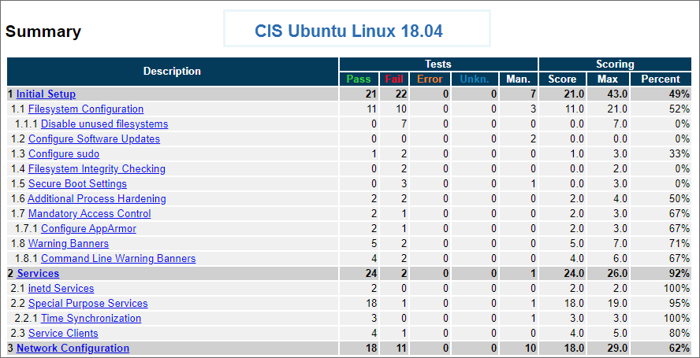

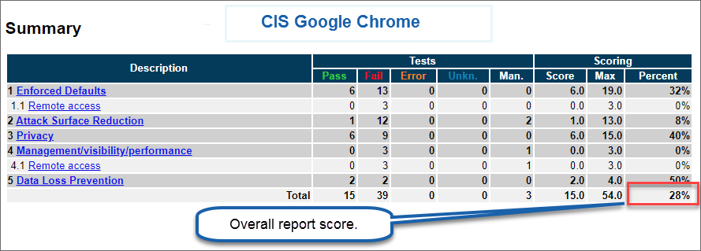

**Note:** This area will result in multiple 0's when the selected Benchmark does not match the selected target system's operating system and `ignore.platform.mismatch=false`. The command line console will show the results as "Not Applicable" in cases, for example, where a Windows Benchmark was selected to scan a Linux platform. The command line console will also show "The checklist does not match the target platform." If `ignore.platform.mismatch=true`, the report may show a combination of failed results and 0 results in the same scenario.

**Profiles**

The profile section shows the available selections when performing an automated assessment. Profiles represent a pre-defined tailoring of the recommendations applicable to a particular security level. It is advisable to download and review the published version of the CIS Benchmark that coordinates with the machine readable assessment content to determine the best profile to utilize with each target system. Consult with organizational security policy to determine whether Level 1 or Level 2 is the best fit. 

The intent of the Level 1 profile Benchmark is to lower the attack surface of your organization while keeping endpoints usable and not hindering business functionality. The Level 2 profile is an extension of the Level 1 profile, including all Level 1 recommendations with additional recommendations. The Level 2 profile is considered to be a more "defense in depth" posture, intended for environments where security is paramount. The recommendations associated with the Level 2 profile can have an adverse effect on your organization if not implemented appropriately or without due care.

Every recommendation within each CIS Benchmark is associated with at least one profile. Regardless of which level profile you plan to implement in your environment, we recommend applying CIS Benchmark guidance in a test environment first, to determine potential impact.

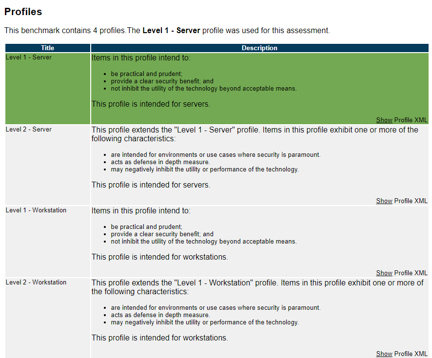

**Assessment Results**

All rules with at least one automated check or test will be included in this section. Some CIS Benchmark recommendations cannot be reliably automated by default, and therefore, require each organization to carefully complete a manual review.

All scored recommendations currently have a weight of 1. This is reflected in the column titled "w".

Possible values are listed in the below table:

|Value|Included in Scoring?|Description|
|-----|--------------------|-----------|
|Pass|Yes|The target system or component state satisfied all the conditions of the check(s)/rule(s) for the recommendation.|
|Fail|Yes|The target system or component state did not satisfy at least one condition of the check(s)/rule(s) for the recommendation.|
|Error|Yes|The assessor checking engine encountered a system error and could not complete the test. The status of the target's compliance is not certain.|
|Unknown|Yes|Assessor was unable to collect, interpret, or evaluate against the check/rule conditions associated with the recommendation.|
|Manual|No|This recommendation cannot be fully automated and requires manual evaluation. On CIS Benchmarks, a recommendation is deemed important during the consensus process but cannot be fully and reliably verified without organizational manual verification. Corresponds to xccdf terminology of "Informational". |

**Assessment Details**

The details section consists of the following:

|Section Name|  Description                                              |
|--------------|-------------------------------------------------------------|
|Description        |  Provides additional information regarding the recommendation.         |
|Rationale         |Articulates the reason the recommendation is made. May include the threat model addressed by the recommendation.           |
|Remediation         |   Steps used to correct a target system resulting in a score of "Fail".        |
|Impact         |   States unexpected, adverse consequences that may occur by implementing the recommendation.        |
|Assessment         |  Shows the scanned target system's state information that was collected and the benchmark expected conditions for a passing score.        |
|References         | May include CCE (Common Configuration Enumeration) identifiers or URLS to documentation supporting the recommendation.          |
|CIS Controls         | If applicable, represents the CIS Control that this recommendation supports. The CIS Control represented will be the latest available at the time the CIS Benchmark version was made available. Not all recommendations within a Benchmark can be mapped to a CIS Control. The CIS Controls version 7 on this report maps to all CIS Controls 7 series.   |

To view the XCCDF constructs, click the `Show Rule Result XML` link below the "Assessments" section. This information is primarily used for debugging purposes.

## Console Assessment Results ##
At the end of each configuration assessment, the command line console or the GUI will display a summary of the assessment. The results will include a few more entries than results displayed on the HTML report. The additional results are defined below. The result terminology presented on the console is inline with xccdf specifications.

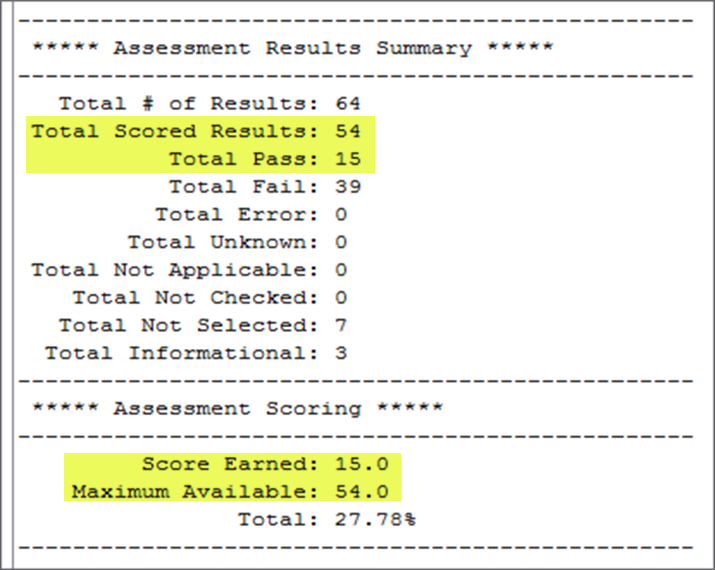

The additional values are defined below and do not contribute to the score. Informational is the same as `Manual` that appears on the HTML report format.

|Value|Included in Scoring?|Description|
|-----|--------------------|-----------|
|Not Applicable|No|The rule(s)/check(s) were not applicable to the target. This typically occurs when the wrong benchmark is selected for the platform ie: platform mismatch.|
|Not Checked |No|The recommendation was not evaluated as there are no rule/check properties.|
|Not Selected|No|This recommendation was not part of the profile selected for the configuration assessment.|
|Informational|No|This is the same result that is displayed as `Manual` on the HTML report. The recommendation cannot be fully automated and requires manual evaluation. |

## Exit Codes ##
A number of scenarios exist which could cause CIS-CAT Pro Assessor to terminate prior to completing its work.  Various errors could occur, such as the inability to ingest assessment content, session connectivity problems, etc.  The following table describes the set of CIS-CAT Pro Assessor's exit codes:

| Exit Code | Description                                                              |
|-----------|--------------------------------------------------------------------------|
|0          | CIS-CAT Pro Assessor Exited Successfully.                                |
|100        | Invalid starting directory                                               |
|101        | No valid assessment content was found.                                   |
|102        | CIS-CAT Pro Assessor could not find custom properties file.              |
|103        | CIS-CAT Pro Assessor could not parse custom properties.                  |
|104        | CIS-CAT Pro Assessor could not find custom session properties file.      |
|105        | CIS-CAT Pro Assessor could not find the specified OVAL Definitions file. |
|106        | CIS-CAT Pro Assessor could not find the specified OVAL Variables file.   |
|107        | CIS-CAT Pro Assessor encountered invalid assessment content.             |
|108        | CIS-CAT Pro Assessor could not find Benchmark content.                   |
|109        | CIS-CAT Pro Assessor encountered an invalid data-stream.                 |
|110        | CIS-CAT Pro Assessor encountered an invalid checklist.                   |
|111        | CIS-CAT Pro Assessor encountered an invalid profile.                     |
|112        | CIS-CAT Pro Assessor encountered an invalid interactive value.           |
|113        | CIS-CAT Pro Assessor could not parse an XML file required for assessment.|
|114        | CIS-CAT Pro Assessor could not find an XML file required for assessment. |
|115        | An XML file was parsed, but contained an invalid XML Signature.           |
|116        | Process not executing with elevated privileges.  When executing the Assessor in "host-based" mode (using a "local" session only), it must be launched with elevated privileges.  When executing on Windows, this requires the user to launch a command prompt "As an Administrator".  When executing on any Unix or Linux OS, the user must either be logged in as `root` or have the ability to launch the Assessor using `sudo`.                        |
|117        | CIS-CAT Pro Assessor could not encrypt a sessions or configuration file. |
|118        | A required command line option for encrypting a sessions or configuration file was missing.          |
|119        | CIS-CAT Pro Assessor could not decrypt a sessions or configuration file. |
|500        | An XML file was parsed, but contained XML Schema validation errors.                 |

## Troubleshooting and Support ###
CIS-CAT Pro Assessor v4 is generally available, and member support is available through the normal CIS SecureSuite channels:

- For CIS support, enter a support request at our [online support portal](https://www.cisecurity.org/support/).
- Start a discussion on the [CIS-CAT Discussion Group](https://workbench.cisecurity.org/communities/30) (login required).  These discussions are a great way for members to use their experience to support each other.
